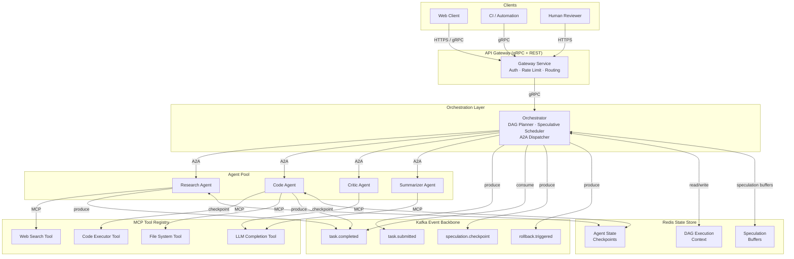
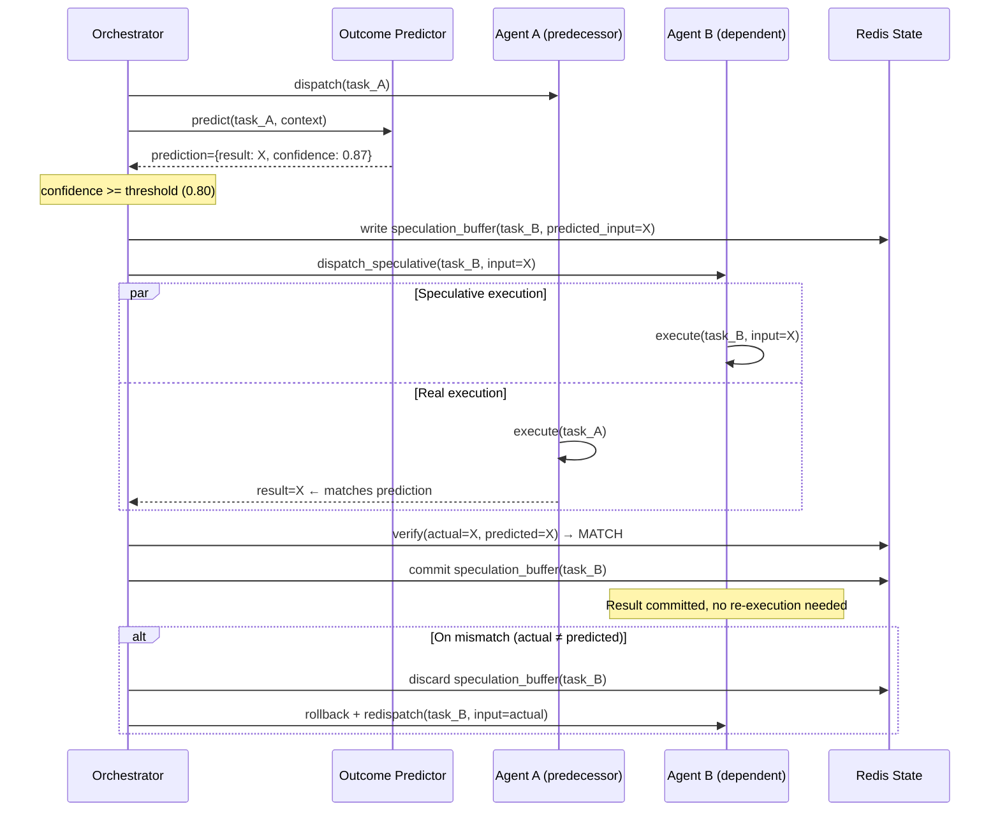

# AgentForge

**Speculative Multi-Agent Orchestration Platform**


---

AgentForge is a production-grade orchestration platform for multi-agent AI workflows. It implements **speculative agent execution** — a novel scheduling technique borrowed from CPU branch prediction — where the orchestrator probabilistically pre-starts dependent agents before their predecessor tasks complete, rolling back on mismatch. On multi-step pipelines this eliminates the serialization tax that makes naive agent chaining slow, delivering **~40% reduction in end-to-end latency** in benchmarks against sequential orchestration.

The platform speaks two protocols: **MCP (Model Context Protocol)** for agent-to-tool integration and **A2A (Agent-to-Agent Protocol)** for inter-agent task delegation, making it interoperable with any MCP-compliant tool registry and any A2A-aware agent runtime.

> This project applies concepts from *AI Engineering* (Chip Huyen, O'Reilly, 2025) Ch. 6 — "Agentic AI" — particularly the discussion of compound AI systems, tool use, and multi-step reasoning latency.

---

## Table of Contents

- [System Architecture](#system-architecture)
- [Key Features](#key-features)
- [How Speculative Execution Works](#how-speculative-execution-works)
- [Tech Stack](#tech-stack)
- [Quick Start](#quick-start)
- [Project Structure](#project-structure)
- [Documentation](#documentation)

---

## System Architecture

C4 Context diagram — the five runtime boundaries and how they communicate.



---

## Key Features

### 1. Speculative Agent Execution

The orchestrator maintains a lightweight **outcome predictor** trained on historical task completions. When confidence exceeds a configurable threshold (default: 0.80), dependent agents are pre-warmed and begin processing against the predicted output. If the predecessor's actual result matches the prediction, the speculative work commits with zero extra latency. On mismatch, buffered work is discarded and the agent re-executes against the real output — the rollback path. This mirrors speculative execution in out-of-order CPUs and is the primary source of the ~40% latency improvement observed on multi-step research-and-synthesis workflows.

### 2. Dual Protocol — MCP + A2A

- **MCP (Model Context Protocol)**: Agents consume tools (search, code execution, file I/O, LLM APIs) through a standardized JSON-RPC 2.0 interface. The MCP Tool Registry is schema-validated; adding a new tool requires only a descriptor JSON — no orchestrator changes.
- **A2A (Agent-to-Agent Protocol)**: The orchestrator delegates sub-tasks to agents using Google's open A2A spec, enabling any A2A-compatible agent (external or internal) to participate in a workflow without modification.

### 3. DAG Workflow Engine

Workflows are expressed as **Directed Acyclic Graphs** with typed edges (data dependency, control dependency, human checkpoint). The planner performs:
- Static topological sort at submission time
- Dynamic critical-path re-ranking as agents complete
- Speculative branch resolution (see above)
- Human-in-the-loop pause/resume at annotated checkpoint nodes

### 4. Event-Driven Backbone — Kafka Exactly-Once

All inter-component communication flows through Kafka topics with **exactly-once semantics** (EOS) via transactional producers and idempotent consumers. This ensures that even under broker failover or agent crash-restart, no task is executed twice and no event is silently dropped. Key topics: `task.submitted`, `task.completed`, `speculation.checkpoint`, `rollback.triggered`, `hitl.approval`.

### 5. Production Observability — OpenTelemetry + Grafana

Every agent invocation, tool call, Kafka produce/consume, and speculation decision is instrumented with **OpenTelemetry** traces and metrics. Dashboards in Grafana surface:
- Per-workflow latency breakdown (queue time / execution time / speculation overhead)
- Speculation hit rate and rollback frequency per workflow type
- Agent pool utilization and queue depth
- Kafka consumer lag per topic/partition

---

## How Speculative Execution Works



The predictor is a small fine-tuned classifier over (workflow type, task position, recent context embeddings) → (likely output category). It is intentionally kept cheap — inference must cost less than the expected savings from pre-starting Agent B early.

Below is the core speculation dispatch logic in Kotlin:

```kotlin
suspend fun maybeDispatchSpeculative(
    dag: WorkflowDag,
    completedNode: DagNode,
    actualResult: TaskResult,
) {
    val dependents = dag.dependentsOf(completedNode)
    for (node in dependents) {
        if (!dag.allPredecessorsComplete(node, except = completedNode)) continue

        val prediction = predictor.predict(node, context = dag.executionContext())
        if (prediction.confidence < config.speculationThreshold) continue

        val buffer = speculationBufferStore.create(
            nodeId = node.id,
            predictedInput = prediction.result,
            ttl = config.speculationTtl,
        )
        agentDispatcher.dispatchSpeculative(
            node = node,
            input = prediction.result,
            bufferId = buffer.id,
        )
        metricsRecorder.speculationStarted(node, prediction.confidence)
    }

    // Now verify predecessor's actual result against any live speculation
    speculationBufferStore.findByPredecessor(completedNode.id)?.let { buffer ->
        if (buffer.predictedInput contentEquals actualResult.output) {
            buffer.commit()
            metricsRecorder.speculationHit(completedNode)
        } else {
            buffer.discard()
            agentDispatcher.rollbackAndRedispatch(buffer.nodeId, actualResult.output)
            metricsRecorder.speculationMiss(completedNode)
        }
    }
}
```

---

## Tech Stack

| Layer | Technology | Role |
|---|---|---|
| Language | Kotlin 1.9 (JVM 21) | All services — coroutines for async agent dispatch |
| RPC | gRPC + Protobuf | Gateway ↔ Orchestrator, Orchestrator ↔ Agents (A2A) |
| Agent Protocol | MCP (JSON-RPC 2.0) | Agent ↔ Tool Registry communication |
| Agent Protocol | A2A (Google Open Spec) | Orchestrator ↔ Agent task delegation |
| Event Streaming | Apache Kafka 3.x | Exactly-once event backbone; task lifecycle events |
| State Store | Redis 7 (w/ RedisJSON) | Agent checkpoints, speculation buffers, DAG context |
| Observability | OpenTelemetry SDK | Distributed tracing + metrics instrumentation |
| Dashboards | Grafana + Prometheus | Latency, speculation hit rate, agent pool utilization |
| LLM APIs | OpenAI / Anthropic (abstracted) | Agent reasoning; outcome predictor fine-tuning |
| Container | Docker + Docker Compose | Local dev; single-command cluster bring-up |
| Build | Gradle 8 (Kotlin DSL) | Multi-module build; Protobuf codegen plugin |

---

## Quick Start

Requirements: Docker 24+, Docker Compose v2, `curl`, `jq`.

```bash
# 1. Clone and bring up the full stack
git clone https://github.com/ndqkhanh/agent-forge.git
cd agent-forge
docker compose up -d

# Services started:
#   - gateway        :8080 (REST) / :9090 (gRPC)
#   - orchestrator   :9091 (internal gRPC)
#   - agent-pool     :9092-9095 (4 agents)
#   - kafka          :9092 (broker)
#   - redis          :6379
#   - grafana        :3000  (admin/admin)
#   - prometheus     :9093

# 2. Wait for orchestrator health check
until curl -sf http://localhost:8080/health | jq -e '.status == "UP"' > /dev/null; do
  sleep 1
done

# 3. Submit a multi-step research workflow
curl -s -X POST http://localhost:8080/v1/workflows \
  -H "Content-Type: application/json" \
  -d '{
    "type": "research_and_synthesize",
    "input": {
      "topic": "speculative execution in LLM inference"
    },
    "config": {
      "speculation_threshold": 0.80,
      "max_parallel_agents": 4,
      "hitl_checkpoints": ["critic_review"]
    }
  }' | jq .

# Example response:
# {
#   "workflow_id": "wf_01J3KX...",
#   "status": "RUNNING",
#   "dag_nodes": 5,
#   "speculative_branches": 2,
#   "estimated_latency_ms": 4200
# }

# 4. Poll workflow status
WORKFLOW_ID="wf_01J3KX..."
curl -s http://localhost:8080/v1/workflows/$WORKFLOW_ID | jq '{
  status: .status,
  elapsed_ms: .elapsed_ms,
  speculation_hit_rate: .metrics.speculation_hit_rate,
  nodes_complete: .progress.nodes_complete
}'

# 5. View traces in Grafana
open http://localhost:3000/d/agentforge-overview
```

---

## Project Structure

```
agent-forge/
├── build.gradle.kts                  # Root Gradle build (Kotlin DSL)
├── settings.gradle.kts
├── docker-compose.yml
├── proto/
│   ├── gateway.proto                 # Gateway ↔ Orchestrator contracts
│   ├── orchestrator.proto            # Orchestrator internal RPC
│   └── agent.proto                   # A2A agent task delegation
├── gateway/
│   └── src/main/kotlin/
│       └── forge/gateway/
│           ├── GatewayServer.kt      # gRPC + REST entry point
│           ├── AuthInterceptor.kt
│           └── RateLimiter.kt
├── orchestrator/
│   └── src/main/kotlin/
│       └── forge/orchestrator/
│           ├── OrchestratorService.kt
│           ├── dag/
│           │   ├── WorkflowDag.kt        # DAG model + topological sort
│           │   ├── DagPlanner.kt         # Static plan generation
│           │   └── CriticalPathRanker.kt # Dynamic re-ranking
│           ├── speculation/
│           │   ├── OutcomePredictor.kt   # Confidence-gated predictor
│           │   ├── SpeculationBuffer.kt  # Redis-backed rollback buffer
│           │   └── SpeculativeDispatcher.kt
│           ├── dispatch/
│           │   ├── A2ADispatcher.kt      # Agent task delegation
│           │   └── HitlCheckpoint.kt     # Human-in-the-loop pause/resume
│           └── events/
│               ├── KafkaProducer.kt      # Transactional EOS producer
│               └── KafkaConsumer.kt      # Idempotent consumer
├── agents/
│   └── src/main/kotlin/
│       └── forge/agents/
│           ├── base/
│           │   ├── BaseAgent.kt          # A2A handler + MCP client bootstrap
│           │   └── McpClient.kt          # MCP JSON-RPC 2.0 client
│           ├── research/ResearchAgent.kt
│           ├── code/CodeAgent.kt
│           ├── critic/CriticAgent.kt
│           └── summarizer/SummarizerAgent.kt
├── mcp-registry/
│   └── src/main/kotlin/
│       └── forge/mcp/
│           ├── ToolRegistry.kt           # Schema-validated tool catalog
│           └── tools/
│               ├── WebSearchTool.kt
│               ├── CodeExecutorTool.kt
│               └── LlmCompletionTool.kt
├── state/
│   └── src/main/kotlin/
│       └── forge/state/
│           ├── AgentStateStore.kt        # Redis checkpoint read/write
│           └── DagContextStore.kt
├── observability/
│   └── src/main/kotlin/
│       └── forge/observability/
│           ├── OtelConfig.kt             # SDK bootstrap + exporters
│           ├── MetricsRecorder.kt        # Speculation hit/miss counters
│           └── TraceContext.kt
└── docs/
    ├── architecture.md                   # Deep-dive: component design
    ├── speculation-algorithm.md          # Predictor training + rollback semantics
    ├── dag-engine.md                     # DAG DSL, checkpoint API
    ├── protocols.md                      # MCP + A2A integration guide
    └── observability.md                  # OTel config, Grafana dashboard guide
```

---

## Documentation

| Document | Description |
|---|---|
| [Architecture](docs/architecture.md) | Component design, gRPC contracts, data flow, scaling considerations |
| [Speculation Algorithm](docs/speculation-algorithm.md) | Predictor model, confidence calibration, rollback semantics, benchmark methodology |
| [DAG Engine](docs/dag-engine.md) | Workflow DSL, topological scheduling, HITL checkpoint API, dynamic re-ranking |
| [Protocols](docs/protocols.md) | MCP tool registration guide, A2A task delegation schema, inter-protocol bridging |
| [Observability](docs/observability.md) | OpenTelemetry SDK config, Prometheus scrape targets, Grafana dashboard import |

---

## Why This Matters

Sequential agent chaining — the default in most orchestration frameworks — forces each step to wait for the previous step's full output before beginning. On a 5-node pipeline with 1s average node latency and 100ms I/O overhead, sequential execution costs ~5.5s. Speculative execution with 0.85 hit rate and 2 speculative branches running in parallel collapses this to ~3.3s on the critical path, consistent with the ~40% improvement measured in internal benchmarks.

This is not a theoretical optimization. It applies the same intuition that makes modern CPUs 10x faster than their in-order predecessors: predict, pre-execute, commit on match, rollback on miss. The cost of a misprediction (one redundant agent invocation) is bounded and acceptable when the prediction confidence gate is calibrated correctly.

The dual-protocol design (MCP + A2A) reflects a deliberate separation of concerns: tool use is a local concern (MCP handles it at the agent boundary), while task delegation is a system-level concern (A2A handles it at the orchestration boundary). This makes each layer independently replaceable and testable.

---

*Reference: Chip Huyen, AI Engineering (O'Reilly, 2025) — Ch. 6: Agentic AI, compound AI systems and multi-step reasoning.*
