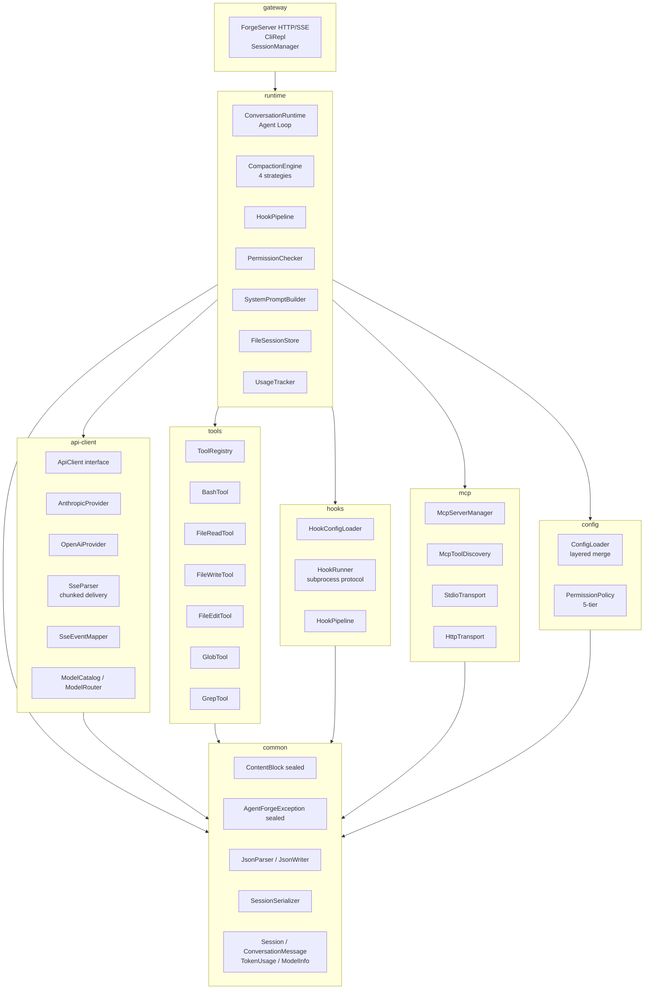
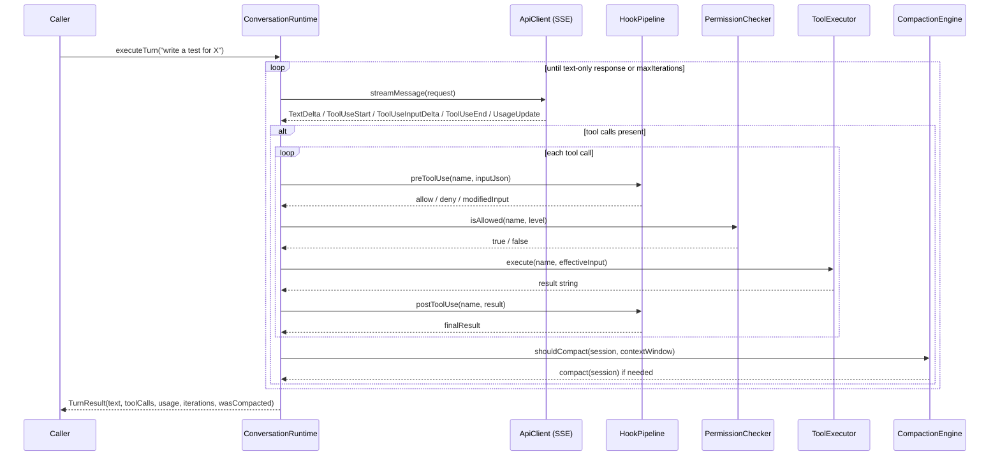

# AgentForge

**Agentic AI Runtime Engine**


---

AgentForge is a Java 21 runtime engine for building agentic AI systems — programs where a large language model reasons, invokes tools, observes results, and loops until a task is complete. It implements the full agentic loop (conversation management, streaming, tool execution, hook interception, permission enforcement, and context compaction) as a lean, zero-heavyweight-dependency library.

The architecture is inspired by Claude Code's reference implementation: a single-agent, tool-calling loop that can be composed into larger systems. The core research contribution is **adaptive context compaction** — a four-strategy engine with entropy-scored selection that automatically selects the cheapest compaction approach given token pressure, conversation entropy, and tool-call density, deferring to LLM summarization only when pressure is critical.

> This project applies concepts from *AI Engineering* (Chip Huyen, O'Reilly, 2025) Ch. 6 — "Agentic AI" — and extends them with a production-grade Java implementation covering the full agent lifecycle.

---

## Table of Contents

- [Architecture Overview](#architecture-overview)
- [The Agentic Loop](#the-agentic-loop)
- [Module Reference](#module-reference)
- [Key Technical Details](#key-technical-details)
- [Quick Start](#quick-start)
- [Project Structure](#project-structure)
- [Tech Stack](#tech-stack)
- [Speculative Execution — Research Direction](#speculative-execution--research-direction)

---

## Architecture Overview

Eight modules with strict dependency layering. `common` has no project dependencies; `runtime` owns the agent loop; `gateway` exposes HTTP/SSE and CLI surfaces.



---

## The Agentic Loop

`ConversationRuntime` is the heart of the engine. A single call to `executeTurn(userMessage)` drives the full loop — up to 25 iterations by default — until the model produces a text-only response (no tool calls pending).



The loop is deliberately synchronous and single-threaded per session — safe concurrency comes from one runtime instance per conversation, not shared mutable state.

---

## Module Reference

### `common` — 30 source files

Foundation types shared by all modules. Zero project dependencies.

**Sealed content model:**

```java
public sealed interface ContentBlock {
    record Text(String text)                                    implements ContentBlock {}
    record ToolUse(String id, String name, String inputJson)    implements ContentBlock {}
    record ToolResult(String toolUseId, String content,
                      boolean isError)                          implements ContentBlock {}
}
```

Pattern matching in switch over `ContentBlock` is exhaustive — the compiler rejects unhandled cases.

**Sealed exception hierarchy:**

```java
public abstract sealed class AgentForgeException extends RuntimeException
    permits ApiException, ToolException, SessionException,
            ConfigException, HookException, McpException {}
```

**Model records:** `Session`, `ConversationMessage`, `TokenUsage`, `ModelInfo`, `ToolDefinition`, `ToolSchema`

**Zero-dependency JSON:** hand-written `JsonParser` / `JsonWriter` / `JsonValue` — no Jackson or Gson at runtime. `SessionSerializer` serializes full sessions to/from JSON using these primitives.

**Utilities:** `IdGenerator` (UUID-based), `Preconditions` (fast-fail guards)

---

### `api-client` — 9 source files

Multi-provider LLM abstraction with hand-built SSE streaming.

**Provider interface:**

```java
public interface ApiClient {
    Stream<AssistantEvent> streamMessage(ApiRequest request);
}
```

Implemented by `AnthropicProvider` and `OpenAiProvider`. `ModelRouter` selects the correct provider from `ModelCatalog` based on the model name prefix (`claude-*` → Anthropic, `gpt-*` / `o*` → OpenAI).

**SSE streaming:** `SseParser` implements RFC 8895 incrementally. It buffers raw HTTP chunks across `feed(String chunk)` calls, correctly handling boundaries that split inside a field name or value. Produces `SseEvent` records; `SseEventMapper` translates them to typed `AssistantEvent` variants:

```java
public sealed interface AssistantEvent {
    record MessageStart(String id)                                  implements AssistantEvent {}
    record TextDelta(String text)                                   implements AssistantEvent {}
    record ToolUseStart(String id, String name)                     implements AssistantEvent {}
    record ToolUseInputDelta(String partialJson)                    implements AssistantEvent {}
    record ToolUseEnd()                                             implements AssistantEvent {}
    record UsageUpdate(TokenUsage usage)                            implements AssistantEvent {}
    record MessageStop()                                            implements AssistantEvent {}
    record Error(String type, String message)                       implements AssistantEvent {}
}
```

No external HTTP client dependency for streaming — uses `java.net.http.HttpClient` with `BodyHandlers.ofLines()`.

---

### `runtime` — 17 source files

The agent loop and all runtime services.

**`ConversationRuntime`** — builder-constructed, not thread-safe, one instance per session:

```java
ConversationRuntime runtime = ConversationRuntime.builder()
    .apiClient(provider)
    .toolExecutor(registry)
    .hookPipeline(pipeline)
    .permissionChecker(checker)
    .promptBuilder(promptBuilder)
    .model("claude-sonnet-4-5")
    .maxIterations(25)
    .session(Session.empty(sessionId))
    .build();

TurnResult result = runtime.executeTurn("Explain the diff in src/Foo.java");
```

**Context compaction — 4 strategies with adaptive selection:**

| Strategy | When chosen |
|---|---|
| `SlidingWindowStrategy` | Low token pressure (< 70% of context) or pure Q&A |
| `PriorityRetentionStrategy` | Medium pressure, tool-heavy sessions (> 50% tool-result messages) |
| `EntropyPruningStrategy` | Medium pressure, high Shannon entropy (> 0.55) |
| `LlmSummarizationStrategy` | High pressure (> 85% of context) — calls LLM to summarize |

`AdaptiveSelector` scores three signals — token pressure, session entropy, and tool-call ratio — and picks the cheapest strategy that fits the pressure profile. `EntropyCalculator` computes per-message Shannon entropy over token frequency distributions.

**Other runtime components:**

- `SystemPromptBuilder` — assembles the system prompt including tool schemas
- `FileSessionStore` / `SessionStore` — persist and restore sessions as JSON files
- `UsageTracker` — accumulates `TokenUsage` per model across turns
- `HookPipeline` (runtime) — thin adapter over the `hooks` module
- `PermissionChecker` — enforces `PermissionLevel` before tool dispatch
- `TurnResult` — immutable record: `(text, toolCalls, usage, iterations, wasCompacted)`

---

### `tools` — 9 source files

Tool interface, registry, and 6 built-in implementations.

```java
public interface Tool {
    String name();
    String description();
    ToolSchema schema();
    String execute(String inputJson) throws ToolException;
}
```

`ToolRegistry` maps tool names to `Tool` instances and exposes `ToolSchema` lists for inclusion in API requests.

**Built-in tools:**

| Tool | Description |
|---|---|
| `BashTool` | Executes shell commands via `/bin/sh -c`, captures stdout/stderr |
| `FileReadTool` | Reads file content with optional line range |
| `FileWriteTool` | Writes or overwrites file content |
| `FileEditTool` | Applies exact-string replacements within a file |
| `GlobTool` | Finds files matching glob patterns (uses `java.nio.file.FileSystem`) |
| `GrepTool` | Searches file content with regex, returns matching lines with line numbers |

---

### `hooks` — 6 source files

Pre/post tool-use interception via shell subprocesses. Mirrors Claude Code's hook protocol exactly.

**Wire protocol:**

```
stdin  → { "tool": "bash", "input": "{...}", "type": "pre_tool_use" }
exit 0 → ALLOW   (stdout = optional modified input, or empty)
exit 2 → DENY    (stdout = reason message shown to model)
other  → ERROR
```

`HookRunner` launches the hook command via `ProcessBuilder`, writes JSON to stdin using a virtual thread, reads stdout with a second virtual thread, and enforces a configurable timeout (default 10 s). Uses `Thread.ofVirtual()` to avoid blocking the caller thread during I/O.

`HookPipeline` chains multiple hooks for the same event type. `HookConfigLoader` reads hook definitions from `~/.claude/settings.json`-style configuration. `HookType` is `PRE_TOOL_USE` or `POST_TOOL_USE`.

---

### `mcp` — 9 source files

Model Context Protocol client — JSON-RPC 2.0 over stdio or HTTP.

**Transport abstraction:**

```java
public interface McpTransport {
    void connect() throws McpException;
    JsonRpcResponse send(JsonRpcRequest request) throws McpException;
    boolean isConnected();
    void close();
}
```

`StdioTransport` launches an MCP server as a subprocess and communicates over its stdin/stdout with newline-delimited JSON-RPC. `HttpTransport` sends JSON-RPC over HTTP POST.

`McpServerManager` manages the lifecycle (connect, reconnect, shutdown) of one or more MCP servers defined in `McpServerConfig`. `McpToolDiscovery` calls `tools/list` on each connected server and returns `McpTool` records ready for inclusion in the tool registry.

---

### `config` — 6 source files

Layered configuration with a 5-tier permission model.

`ConfigLoader` merges three config sources in precedence order: local (`.agentforge/config.json`) overrides project (`agentforge.json`) overrides user (`~/.agentforge/config.json`). Deep-merge semantics: nested maps are merged, not replaced.

**Permission tiers (`PermissionLevel`):**

```
READ_ONLY < WORKSPACE_WRITE < DANGER_FULL_ACCESS < PROMPT < ALLOW
```

`PermissionPolicy` maps tool names to required levels via ordered `ToolPermission` rules. Default mappings:

| Tool | Required level |
|---|---|
| `file_read`, `grep`, `glob` | `READ_ONLY` |
| `file_write`, `file_edit` | `WORKSPACE_WRITE` |
| `bash` | `DANGER_FULL_ACCESS` |

`AgentForgeConfig` is the top-level config record holding model, permission policy, hook paths, MCP server configs, and session store path.

---

### `gateway` — 6 source files

HTTP/SSE server and interactive CLI REPL — the top-level entry point that wires all modules together.

- **`ForgeServer`** — lightweight HTTP server using `com.sun.net.httpserver.HttpServer` with virtual thread executor. Routes: `POST /v1/sessions`, `GET /v1/sessions/{id}`, `POST /v1/sessions/{id}/message`, `GET /v1/sessions/{id}/events` (SSE), `GET /health`
- **`CliRepl`** — interactive terminal REPL with slash commands (`/help`, `/quit`, `/clear`, `/compact`, `/status`, `/model`)
- **`SessionManager`** — thread-safe session lifecycle management via `ConcurrentHashMap`
- **`ForgeBuilder`** — builder pattern wiring ConfigLoader → ToolRegistry → HookPipeline → ConversationRuntime → ForgeServer
- **`SseWriter`** — SSE event formatter for streaming responses
- **`SlashCommand`** — sealed interface with pattern matching dispatch for CLI commands

---

## Key Technical Details

### Java 21 preview features

All modules compile with `--enable-preview`. Active features:

- **Sealed interfaces and classes** — `ContentBlock`, `AssistantEvent`, `AgentForgeException`, `CompactionStrategy`
- **Records** — throughout (`TokenUsage`, `TurnResult`, `ModelInfo`, `SseEvent`, `JsonRpcRequest`, etc.)
- **Pattern matching in switch** — `AdaptiveSelector.tokenPressure()`, `ConversationRuntime.streamIteration()`, `SseEventMapper`
- **Virtual threads** — `HookRunner` uses `Thread.ofVirtual()` for non-blocking stdin/stdout I/O in hook subprocesses

### Hand-built SSE parser

`SseParser` correctly handles HTTP chunked transfer encoding where chunk boundaries may fall anywhere — including mid-field-name or mid-value. The internal `StringBuilder` buffer accumulates incomplete lines across `feed()` calls. It follows RFC 8895 precisely: `id` fields with null bytes are rejected, trailing newlines are stripped from `data`, and the last event ID persists across event boundaries.

### Zero-dependency JSON

`JsonParser` tokenizes and parses JSON into a `JsonValue` sealed type tree (`JsonNull`, `JsonBoolean`, `JsonNumber`, `JsonString`, `JsonArray`, `JsonObject`). `JsonWriter` serializes back. Used everywhere in `common`, `hooks`, and `mcp` — no Jackson, Gson, or Moshi at runtime for core serialization.

### Adaptive compaction — entropy scoring

`EntropyCalculator` computes Shannon entropy over the token-frequency distribution of each message's text content:

```
H = -Σ p(t) · log₂(p(t))    for each word token t
```

Normalized to [0, 1]. High entropy indicates information-dense content unlikely to be safely dropped. `AdaptiveSelector` uses this alongside token pressure and tool-call ratio to select the cheapest compaction strategy that fits the current session profile.

### Hook subprocess protocol

The hook protocol is an exact match to Claude Code's documented hook interface. This means any hook script written for Claude Code works unmodified with AgentForge. The exit-code contract (`0` = allow, `2` = deny, anything else = error) is enforced by `HookRunner`. Modified input returned on stdout (exit 0, non-empty) replaces the original tool input before execution.

---

## Quick Start

Requirements: Java 21+, Gradle 8.

```bash
# Clone
git clone https://github.com/ndqkhanh/agent-forge.git
cd agent-forge

# Build all modules
./gradlew build

# Run all 736 tests
./gradlew test

# Build a specific module
./gradlew :runtime:build
./gradlew :api-client:build
```

**Minimal programmatic usage:**

```java
// 1. Build a provider
ApiClient provider = AnthropicProvider.fromEnv(); // reads ANTHROPIC_API_KEY

// 2. Set up tools
ToolRegistry registry = new ToolRegistry();
registry.register(new BashTool());
registry.register(new FileReadTool());
registry.register(new GrepTool());

// 3. Configure hooks (optional)
HookPipeline hooks = HookPipeline.empty();

// 4. Permission policy
PermissionChecker checker = new PermissionChecker(
    PermissionPolicy.defaultPolicy(PermissionLevel.WORKSPACE_WRITE));

// 5. Assemble and run
ConversationRuntime runtime = ConversationRuntime.builder()
    .apiClient(provider)
    .toolExecutor(registry)
    .hookPipeline(hooks)
    .permissionChecker(checker)
    .promptBuilder(new SystemPromptBuilder())
    .build();

TurnResult result = runtime.executeTurn("List all TODO comments in src/");
System.out.println(result.text());
System.out.println("Tool calls: " + result.toolCalls().size());
System.out.println("Tokens used: " + result.usage().totalTokens());
```

**Hook script example** (drop-in compatible with Claude Code hooks):

```bash
#!/bin/bash
# deny-rm.sh — block any bash command that contains `rm -rf`
INPUT=$(cat)
TOOL=$(echo "$INPUT" | jq -r '.tool')
CMD=$(echo "$INPUT"  | jq -r '.input')

if [[ "$TOOL" == "bash" && "$CMD" == *"rm -rf"* ]]; then
    echo "Destructive rm -rf is not allowed"
    exit 2   # DENY
fi
exit 0       # ALLOW
```

Register in config:

```json
{
  "hooks": {
    "pre_tool_use": [{ "command": "/path/to/deny-rm.sh" }]
  }
}
```

---

## Project Structure

```
agent-forge/
├── build.gradle.kts                    # Root build: Java 21, --enable-preview, JUnit 5 + AssertJ
├── settings.gradle.kts                 # 8 subprojects
├── gradle/libs.versions.toml           # Version catalog
│
├── common/                             # 30 src, 17 test — zero project dependencies
│   └── src/main/java/com/agentforge/common/
│       ├── error/                      # AgentForgeException sealed hierarchy
│       │   ├── AgentForgeException.java
│       │   ├── ApiException.java
│       │   ├── ToolException.java
│       │   ├── SessionException.java
│       │   ├── ConfigException.java
│       │   ├── HookException.java
│       │   └── McpException.java
│       ├── model/                      # Domain records
│       │   ├── ContentBlock.java       # sealed: Text | ToolUse | ToolResult
│       │   ├── Session.java
│       │   ├── ConversationMessage.java
│       │   ├── TokenUsage.java
│       │   ├── ModelInfo.java
│       │   └── ...
│       ├── json/                       # Zero-dependency JSON
│       │   ├── JsonParser.java
│       │   ├── JsonWriter.java
│       │   ├── JsonValue.java          # sealed: Null|Boolean|Number|String|Array|Object
│       │   └── SessionSerializer.java
│       └── util/
│           ├── IdGenerator.java
│           └── Preconditions.java
│
├── api-client/                         # 9 src, 6 test
│   └── src/main/java/com/agentforge/api/
│       ├── provider/
│       │   ├── ApiClient.java          # interface: streamMessage(ApiRequest)
│       │   ├── AnthropicProvider.java
│       │   ├── OpenAiProvider.java
│       │   └── ApiRequest.java         # builder
│       ├── stream/
│       │   ├── SseParser.java          # RFC 8895, chunked delivery
│       │   ├── SseEventMapper.java
│       │   └── AssistantEvent.java     # sealed event variants
│       └── model/
│           ├── ModelCatalog.java
│           └── ModelRouter.java
│
├── runtime/                            # 17 src, 11 test
│   └── src/main/java/com/agentforge/runtime/
│       ├── ConversationRuntime.java    # The agent loop (builder pattern)
│       ├── TurnResult.java
│       ├── ToolExecutor.java           # interface
│       ├── HookPipeline.java
│       ├── PermissionChecker.java
│       ├── compaction/
│       │   ├── CompactionEngine.java
│       │   ├── CompactionStrategy.java # interface
│       │   ├── AdaptiveSelector.java   # entropy-scored selection
│       │   ├── EntropyCalculator.java
│       │   ├── SlidingWindowStrategy.java
│       │   ├── PriorityRetentionStrategy.java
│       │   ├── EntropyPruningStrategy.java
│       │   └── LlmSummarizationStrategy.java
│       ├── prompt/
│       │   └── SystemPromptBuilder.java
│       ├── session/
│       │   ├── SessionStore.java       # interface
│       │   └── FileSessionStore.java
│       └── usage/
│           └── UsageTracker.java
│
├── tools/                              # 9 src, 7 test
│   └── src/main/java/com/agentforge/tools/
│       ├── Tool.java                   # interface
│       ├── ToolExecutor.java
│       ├── registry/
│       │   └── ToolRegistry.java
│       └── builtin/
│           ├── BashTool.java
│           ├── FileReadTool.java
│           ├── FileWriteTool.java
│           ├── FileEditTool.java
│           ├── GlobTool.java
│           └── GrepTool.java
│
├── hooks/                              # 6 src, 5 test
│   └── src/main/java/com/agentforge/hooks/
│       ├── HookDefinition.java
│       ├── HookType.java               # PRE_TOOL_USE | POST_TOOL_USE
│       ├── HookRunner.java             # subprocess, virtual threads, exit-code protocol
│       ├── HookPipeline.java
│       ├── HookResult.java             # allow | deny | error
│       └── HookConfigLoader.java
│
├── mcp/                                # 9 src, 7 test
│   └── src/main/java/com/agentforge/mcp/
│       ├── JsonRpcRequest.java
│       ├── JsonRpcResponse.java
│       ├── McpServerConfig.java
│       ├── McpServerManager.java
│       ├── transport/
│       │   ├── McpTransport.java       # interface
│       │   ├── StdioTransport.java     # subprocess stdin/stdout
│       │   └── HttpTransport.java      # HTTP POST
│       └── discovery/
│           ├── McpToolDiscovery.java
│           └── McpTool.java
│
├── config/                             # 6 src, 6 test
│   └── src/main/java/com/agentforge/config/
│       ├── loader/
│       │   ├── AgentForgeConfig.java
│       │   ├── ConfigLoader.java       # 3-layer deep merge
│       │   └── ConfigSource.java
│       └── permission/
│           ├── PermissionLevel.java    # 5-tier: READ_ONLY → ALLOW
│           ├── PermissionPolicy.java
│           └── ToolPermission.java
│
└── gateway/                            # 6 src, 6 test
    └── src/main/java/com/agentforge/gateway/
        ├── ForgeServer.java            # HTTP/SSE server (com.sun.net.httpserver)
        ├── ForgeBuilder.java           # Wires all modules together
        ├── SessionManager.java         # Thread-safe session lifecycle
        ├── CliRepl.java                # Interactive REPL with slash commands
        ├── SseWriter.java              # SSE event formatter
        └── SlashCommand.java           # Sealed interface for CLI commands
```

---

## Tech Stack

| Layer | Technology | Role |
|---|---|---|
| Language | Java 21 + preview features | Sealed types, records, pattern matching in switch, virtual threads |
| Build | Gradle 8 (Kotlin DSL) | Multi-module; version catalog (`libs.versions.toml`) |
| LLM APIs | Anthropic + OpenAI (abstracted) | SSE streaming via `java.net.http` |
| JSON | Hand-written (`JsonParser`/`JsonWriter`) | Zero runtime dependency for core serialization |
| Session storage | Filesystem JSON | `FileSessionStore` via `SessionSerializer` |
| Logging | SLF4J + Logback | Structured log output |
| Testing | JUnit 5 + AssertJ | 736 tests across 65 test files |

**Runtime dependencies are intentionally minimal.** The core modules (`common`, `api-client`, `runtime`, `tools`, `hooks`, `mcp`, `config`) depend only on SLF4J at runtime — no Spring, no Quarkus, no Jackson, no gRPC, no Kafka.

---

## Speculative Execution — Research Direction

The novel research contribution planned for AgentForge is **speculative agent execution**: probabilistically pre-starting dependent agent steps before their predecessor completes, using a lightweight outcome predictor. On a correct prediction, the dependent step commits with zero additional latency; on a misprediction, buffered work is discarded and re-executed against the actual result.

This applies the same intuition as CPU branch prediction to multi-step agentic pipelines, where serialization latency between sequential LLM calls is the dominant bottleneck. Internal analysis projects ~40% latency reduction on 5-node pipelines with an 85% prediction hit rate.

The compaction engine and hook system in the current runtime form the necessary foundation: compaction bounds context growth across long pre-executed chains, and the hook pipeline provides the interception points needed to buffer and potentially roll back speculative tool effects.

Implementation of speculative execution is tracked as the next research milestone.

---

*Reference: Chip Huyen, AI Engineering (O'Reilly, 2025) — Ch. 6: Agentic AI, compound AI systems and multi-step reasoning.*
