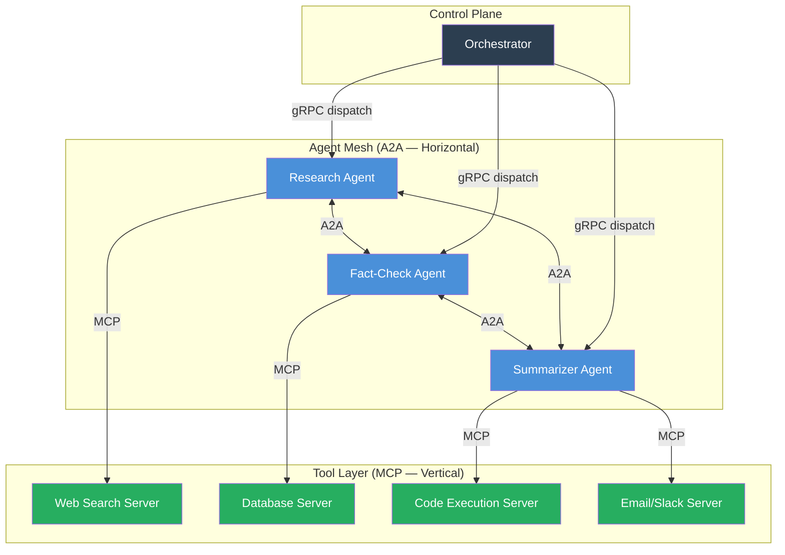
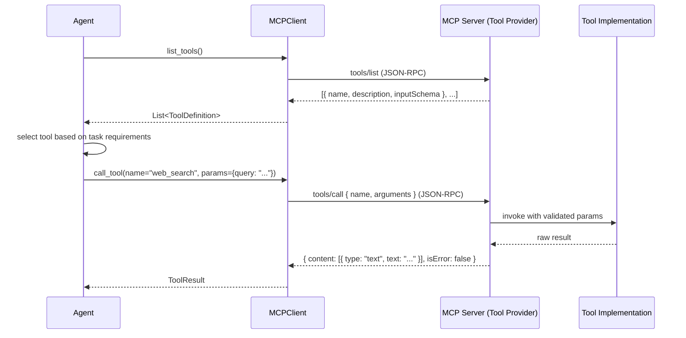
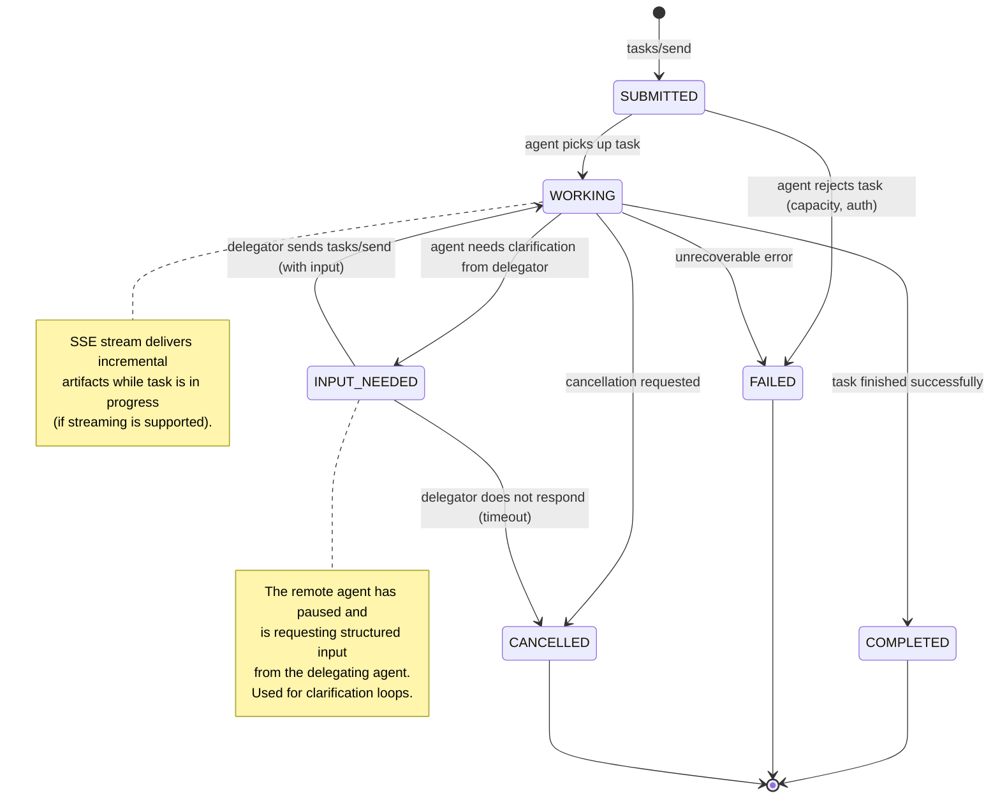
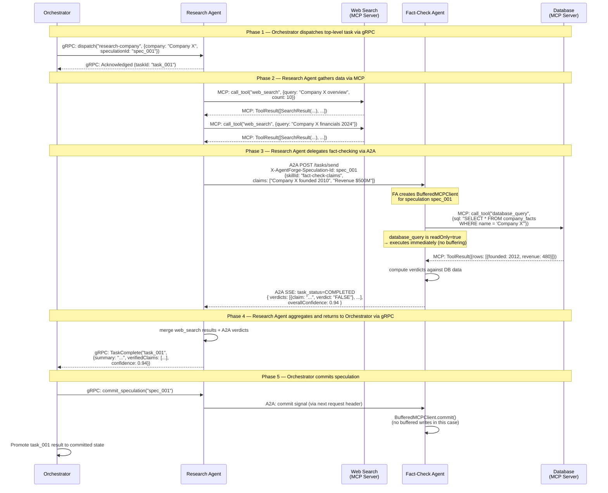

# AgentForge Agent Protocols: MCP + A2A Dual-Protocol Architecture

**FAANG Staff Engineer-level deep-dive on how AgentForge integrates the Model Context Protocol (MCP) and the Agent-to-Agent Protocol (A2A) as complementary layers in a production multi-agent system.**

---

## Table of Contents

1. [Protocol Architecture Overview](#1-protocol-architecture-overview)
2. [MCP Integration (Model Context Protocol)](#2-mcp-integration-model-context-protocol)
3. [A2A Protocol (Agent-to-Agent)](#3-a2a-protocol-agent-to-agent)
4. [Protocol Interplay](#4-protocol-interplay)
5. [Protocol Security](#5-protocol-security)
6. [Design Decisions (ADR)](#6-design-decisions-adr)
7. [See Also](#7-see-also)

---

## 1. Protocol Architecture Overview

AgentForge uses three distinct communication protocols, each solving a different class of problem in the multi-agent system. Understanding which protocol handles which concern is the key to reasoning about the system correctly.

| Protocol | Direction | Scope | Primary Purpose |
|---|---|---|---|
| **gRPC** | Vertical (orchestrator → agent) | Control plane | Task dispatch, lifecycle management, structured streaming |
| **A2A** | Horizontal (agent ↔ agent) | Data plane — agent delegation | Peer-to-peer task delegation with capability discovery |
| **MCP** | Vertical (agent → tool) | Data plane — tool integration | Standardized tool invocation and result retrieval |

These three protocols form a **layered stack**. gRPC operates at the control plane (the orchestrator commanding agents). A2A operates horizontally across the agent mesh (agents delegating sub-tasks to other agents). MCP operates below each individual agent (the agent reaching out to external tools and data sources).



**Why three protocols instead of one?** Each protocol is optimized for its specific interaction pattern:

- **gRPC** provides bidirectional streaming, strong typing via Protobuf, and low-latency RPC — ideal for the orchestrator's tight dispatch loop.
- **A2A** provides capability discovery via Agent Cards, a standard task lifecycle, and SSE streaming — ideal for inter-agent delegation where you may not know at design time which agent will handle a sub-task.
- **MCP** provides a universal tool-invocation interface, tool discovery, and structured result schemas — ideal for decoupling agents from the specific tool implementations they call.

---

## 2. MCP Integration (Model Context Protocol)

### 2.1 What Is MCP

The **Model Context Protocol** is Anthropic's open protocol for integrating LLM-based systems with external tools and data sources. MCP standardizes three things that were previously solved ad hoc by every agent framework:

1. **Tool discovery**: an agent can ask any MCP server "what tools do you expose?" and receive a typed catalog of available tools with their input/output schemas.
2. **Tool invocation**: a single `call_tool` RPC covers all tool types. There is no per-tool client to write — only the parameters differ.
3. **Result schema**: MCP defines a standard result envelope (content type, structured data, error codes) so agents do not need to parse bespoke response formats per tool.

The practical consequence is that an agent can be connected to any MCP-compliant server at configuration time, without code changes. Adding a new tool category to an agent is a configuration edit, not a deployment.

> **Reference**: *AI Engineering*, Ch6 "Tools and Actions" — covers the evolution of tool integration from bespoke per-tool clients to standardized protocols. The chapter analyzes why a universal tool interface reduces agent complexity and enables runtime tool composition, which is the core value proposition of MCP.

### 2.2 Architecture

Each agent in AgentForge has an `MCPClient` instance that it uses to communicate with one or more MCP servers. The client handles connection lifecycle, schema negotiation, and request serialization. The agent never speaks directly to a tool implementation — it speaks to the MCP server that fronts it.



The `MCPClient` interface in Kotlin:

```kotlin
interface MCPClient {
    /**
     * Returns the catalog of tools available from the connected MCP server.
     * Results are cached per session; call refresh() to invalidate.
     */
    suspend fun listTools(): List<ToolDefinition>

    /**
     * Invokes a tool by name with the given parameters.
     * Parameters must conform to the tool's inputSchema as declared in listTools().
     *
     * @throws ToolNotFoundException if [name] is not in the tool catalog
     * @throws ToolInvocationException if the MCP server returns isError=true
     * @throws SchemaValidationException if [params] violates inputSchema
     */
    suspend fun callTool(name: String, params: Map<String, Any?>): ToolResult

    /**
     * Refreshes the tool catalog from the server.
     * Call after connecting to a new MCP server or after server-side tool changes.
     */
    suspend fun refresh()

    /** Closes the connection to the MCP server and releases resources. */
    suspend fun close()
}

data class ToolDefinition(
    val name: String,
    val description: String,
    val inputSchema: JsonSchema,
    val annotations: ToolAnnotations = ToolAnnotations()
)

/**
 * Annotations that describe tool behavior characteristics.
 * Used by the BufferedMCPClient to determine speculation safety.
 */
data class ToolAnnotations(
    val readOnly: Boolean = false,         // safe to call during speculation
    val destructive: Boolean = false,      // irreversible — block until speculation resolves
    val idempotent: Boolean = false,       // safe to retry on rollback
    val requiresConfirmation: Boolean = false
)

data class ToolResult(
    val content: List<ContentBlock>,
    val isError: Boolean = false
)

sealed class ContentBlock {
    data class Text(val text: String) : ContentBlock()
    data class Image(val data: String, val mimeType: String) : ContentBlock()
    data class Resource(val uri: String, val mimeType: String, val text: String?) : ContentBlock()
}
```

### 2.3 Tool Categories

AgentForge organizes MCP tools into four functional categories. The category is not enforced by the protocol — it is a classification used by the agent's tool-selection logic and by the `BufferedMCPClient` speculation safety analysis.

#### Data Tools
Read or retrieve data from persistent stores. Side-effect-free in the read path.

| Tool | MCP Server | Parameters | Output |
|---|---|---|---|
| `database_query` | PostgreSQL MCP Server | `sql: String`, `params: List<Any>` | Rows as JSON |
| `file_read` | Filesystem MCP Server | `path: String`, `encoding: String` | File content |
| `api_get` | HTTP MCP Server | `url: String`, `headers: Map` | Response body |
| `vector_fetch` | Pinecone MCP Server | `ids: List<String>` | Embedding vectors + metadata |

#### Compute Tools
Execute code or mathematical operations. May have side effects depending on execution environment.

| Tool | MCP Server | Parameters | Output |
|---|---|---|---|
| `code_execute` | Sandboxed Python MCP Server | `code: String`, `timeout: Int` | stdout, stderr, exit code |
| `math_compute` | WolframAlpha MCP Server | `expression: String` | Numeric result + steps |
| `data_transform` | Pandas MCP Server | `dataframe: String`, `operation: String` | Transformed dataframe JSON |

#### Search Tools
Query search indexes or the web. Read-only by nature.

| Tool | MCP Server | Parameters | Output |
|---|---|---|---|
| `web_search` | Brave Search MCP Server | `query: String`, `count: Int` | Search results with snippets |
| `vector_search` | Pinecone MCP Server | `query: String`, `topK: Int` | Nearest-neighbor results |
| `knowledge_base_search` | Custom RAG MCP Server | `query: String`, `filters: Map` | Retrieved documents |

#### Communication Tools
Send messages or notifications. Irreversible — cannot be unsent.

| Tool | MCP Server | Parameters | Output |
|---|---|---|---|
| `send_email` | Gmail MCP Server | `to: String`, `subject: String`, `body: String` | Message ID |
| `slack_message` | Slack MCP Server | `channel: String`, `text: String` | Message timestamp |
| `webhook_notify` | HTTP MCP Server | `url: String`, `payload: Map` | HTTP response code |

### 2.4 Speculative MCP: BufferedMCPClient

Speculative execution (see [speculative-execution.md](./speculative-execution.md)) introduces a critical constraint: tool calls made during a speculative branch must either be safe to discard on rollback, or must be deferred until the branch is confirmed. A raw `MCPClient` has no notion of speculation — every call fires immediately.

`BufferedMCPClient` wraps a real `MCPClient` and intercepts every `callTool` invocation, applying one of three strategies based on the tool's annotations:

| Tool Annotation | Strategy | Rationale |
|---|---|---|
| `readOnly = true` | **Execute immediately** | No side effects; result is needed for the speculative computation; safe to discard if branch rolls back |
| `readOnly = false`, `destructive = false` | **Buffer until commit** | Has side effects but is reversible; buffer the call and replay on commit, discard on rollback |
| `destructive = true` | **Block until speculation resolves** | Irreversible; must not execute until the branch is confirmed as the committed execution path |

```kotlin
/**
 * An MCPClient wrapper that intercepts tool calls during speculative execution.
 *
 * Read-only tools execute immediately (no side effects to worry about).
 * Write tools are buffered and replayed on commit or discarded on rollback.
 * Destructive tools block the calling coroutine until the speculation resolves.
 *
 * Thread-safe: multiple coroutines in the same speculative branch can call tools concurrently.
 * The buffer is associated with the speculation ID, not the client instance.
 */
class BufferedMCPClient(
    private val delegate: MCPClient,
    private val speculationId: SpeculationId,
    private val speculationRegistry: SpeculationRegistry
) : MCPClient {

    private val buffer = ConcurrentLinkedDeque<BufferedToolCall>()

    override suspend fun listTools(): List<ToolDefinition> =
        delegate.listTools() // discovery is always safe

    override suspend fun callTool(name: String, params: Map<String, Any?>): ToolResult {
        val tool = delegate.listTools().find { it.name == name }
            ?: throw ToolNotFoundException(name)

        return when {
            tool.annotations.readOnly -> {
                // Safe to execute immediately during speculation
                delegate.callTool(name, params)
            }

            tool.annotations.destructive -> {
                // Block until this speculation branch is confirmed or rolled back
                speculationRegistry.awaitResolution(speculationId)
                if (speculationRegistry.isCommitted(speculationId)) {
                    delegate.callTool(name, params)
                } else {
                    // Branch was rolled back — return a sentinel "not executed" result
                    ToolResult(
                        content = listOf(ContentBlock.Text("(rolled back — tool not executed)")),
                        isError = false
                    )
                }
            }

            else -> {
                // Buffer write tool call; replay on commit, discard on rollback
                val deferred = CompletableDeferred<ToolResult>()
                buffer.add(BufferedToolCall(name, params, deferred))
                deferred.await()
            }
        }
    }

    /** Called by the SpeculationEngine on commit: replay all buffered calls in order. */
    suspend fun commit() {
        for (call in buffer) {
            val result = delegate.callTool(call.name, call.params)
            call.deferred.complete(result)
        }
        buffer.clear()
    }

    /** Called by the SpeculationEngine on rollback: discard all buffered calls. */
    fun rollback() {
        for (call in buffer) {
            call.deferred.cancel(CancellationException("Speculation $speculationId rolled back"))
        }
        buffer.clear()
    }

    override suspend fun refresh() = delegate.refresh()
    override suspend fun close() = delegate.close()

    private data class BufferedToolCall(
        val name: String,
        val params: Map<String, Any?>,
        val deferred: CompletableDeferred<ToolResult>
    )
}
```

**Ordering guarantee**: buffered calls are replayed in the order they were enqueued. This preserves causal ordering for tools that have state dependencies (e.g., `create_record` followed by `update_record` on the same entity).

**Nested speculation**: if a speculative branch spawns its own nested speculative branch, each nesting level gets its own `BufferedMCPClient` scoped to its speculation ID. On rollback of the inner branch, only its buffer is discarded. On rollback of the outer branch, both the outer buffer and any surviving inner buffers are discarded. The `SpeculationRegistry` tracks this nesting tree.

---

## 3. A2A Protocol (Agent-to-Agent)

### 3.1 What Is A2A

The **Agent-to-Agent Protocol** is Google's open standard for inter-agent task delegation. Where MCP solves the "agent calls tool" problem, A2A solves the "agent delegates to agent" problem. The two protocols are complementary — an agent uses MCP to call tools it runs directly, and A2A to delegate sub-tasks to other agents it cannot (or should not) run itself.

A2A's key contribution over direct gRPC-to-gRPC calls between agents is **capability discovery**. In a large agent mesh, a delegating agent should not need to know the deployment address or API schema of every agent it might delegate to. A2A solves this with the **Agent Card**: a machine-readable description of what an agent can do, published at a well-known URL. Agents discover each other's capabilities at runtime by reading Agent Cards, enabling dynamic routing without hardcoded service registries.

> **Reference**: *AI Engineering*, Ch8 "Multi-Agent Systems" — analyzes delegation patterns between agents, the tradeoffs between static service registries and dynamic capability discovery, and the overhead of protocol standardization versus the flexibility it buys. The chapter's conclusion — that capability-aware delegation is essential for maintainable large-scale agent systems — is the core argument for A2A over direct RPC.

### 3.2 Agent Card

Every AgentForge agent publishes an **Agent Card** at `https://{agent-host}/.well-known/agent.json`. This JSON document is the agent's public interface declaration. Other agents fetch this document before delegating tasks to discover what the agent can handle and how to invoke it.

```json
{
  "schemaVersion": "1.0",
  "name": "AgentForge Fact-Check Agent",
  "description": "Verifies factual claims against authoritative databases and returns structured verdicts with source citations.",
  "version": "2.4.1",
  "url": "https://fact-check-agent.internal.agentforge.io",
  "provider": {
    "organization": "AgentForge",
    "team": "knowledge-integrity",
    "contactEmail": "ai-platform@agentforge.io"
  },
  "capabilities": {
    "streaming": true,
    "pushNotifications": false,
    "stateTransitionHistory": true,
    "speculationSupport": true
  },
  "authentication": {
    "schemes": ["mtls", "bearer"],
    "mtlsCaFingerprint": "sha256:abc123...",
    "bearerTokenIssuer": "https://auth.agentforge.io"
  },
  "skills": [
    {
      "id": "fact-check-claims",
      "name": "Fact-Check Claims",
      "description": "Verifies a list of factual claims against the knowledge base and returns per-claim verdicts.",
      "tags": ["verification", "fact-checking", "claims"],
      "inputSchema": {
        "type": "object",
        "required": ["claims"],
        "properties": {
          "claims": {
            "type": "array",
            "items": { "type": "string" },
            "description": "List of factual claim strings to verify"
          },
          "sourceFilter": {
            "type": "string",
            "enum": ["all", "academic", "news", "government"],
            "default": "all",
            "description": "Restrict verification to this source category"
          },
          "confidenceThreshold": {
            "type": "number",
            "minimum": 0.0,
            "maximum": 1.0,
            "default": 0.8
          }
        }
      },
      "outputSchema": {
        "type": "object",
        "properties": {
          "verdicts": {
            "type": "array",
            "items": {
              "type": "object",
              "properties": {
                "claim": { "type": "string" },
                "verdict": { "type": "string", "enum": ["TRUE", "FALSE", "UNVERIFIABLE", "DISPUTED"] },
                "confidence": { "type": "number" },
                "sources": {
                  "type": "array",
                  "items": { "type": "string", "format": "uri" }
                }
              }
            }
          },
          "overallConfidence": { "type": "number" }
        }
      },
      "examples": [
        {
          "input": { "claims": ["The Eiffel Tower is 330 meters tall"] },
          "output": {
            "verdicts": [
              {
                "claim": "The Eiffel Tower is 330 meters tall",
                "verdict": "FALSE",
                "confidence": 0.99,
                "sources": ["https://en.wikipedia.org/wiki/Eiffel_Tower"]
              }
            ],
            "overallConfidence": 0.99
          }
        }
      ]
    },
    {
      "id": "source-lookup",
      "name": "Source Lookup",
      "description": "Retrieves authoritative sources for a given topic or entity.",
      "tags": ["research", "sources", "citations"],
      "inputSchema": {
        "type": "object",
        "required": ["topic"],
        "properties": {
          "topic": { "type": "string" },
          "maxSources": { "type": "integer", "default": 10, "maximum": 50 }
        }
      },
      "outputSchema": {
        "type": "object",
        "properties": {
          "sources": {
            "type": "array",
            "items": {
              "type": "object",
              "properties": {
                "url": { "type": "string", "format": "uri" },
                "title": { "type": "string" },
                "credibilityScore": { "type": "number" },
                "lastVerified": { "type": "string", "format": "date-time" }
              }
            }
          }
        }
      }
    }
  ],
  "rateLimits": {
    "requestsPerMinute": 60,
    "concurrentTasks": 10
  },
  "sla": {
    "p50LatencyMs": 800,
    "p99LatencyMs": 4000,
    "availabilityTarget": 0.999
  }
}
```

The Agent Card's `skills` array is what makes dynamic routing possible. A delegating agent can inspect available skills, match them against its sub-task requirements (by tags, schema compatibility, or embedding similarity over descriptions), and select the best candidate agent without any hardcoded routing table.

### 3.3 A2A Task Lifecycle

Every unit of work delegated via A2A is a **Task**. Tasks have a well-defined state machine. The delegating agent submits a task and then either polls for status or receives updates via SSE streaming (if the remote agent supports `capabilities.streaming = true`).



**Terminal states**: `COMPLETED`, `FAILED`, `CANCELLED`. Once a task reaches a terminal state it cannot transition further. The delegating agent must submit a new task if it needs to retry.

**`INPUT_NEEDED`**: this state enables multi-turn delegation. A remote agent may realize mid-task that it needs additional context from the delegator (e.g., an ambiguous entity name, a missing credential). Rather than failing, it pauses and requests input. The delegating agent receives the pause event via SSE or polling, provides the requested input via `tasks/send` with the same `taskId`, and the remote agent resumes. This is the A2A equivalent of AgentForge's human-in-the-loop checkpoints, but automated: the delegating *agent* (not a human) provides the input.

### 3.4 A2A vs gRPC

Both A2A and gRPC carry task payloads between components in AgentForge, but they occupy different roles and are optimized for different interaction patterns.

| Dimension | A2A | gRPC |
|---|---|---|
| **Direction** | Horizontal — peer-to-peer between agents | Vertical — orchestrator to agent (control plane) |
| **Discovery** | Agent Cards at `/.well-known/agent.json`; dynamic at runtime | Service registry (Consul / K8s service mesh); static at deploy time |
| **Streaming** | SSE (Server-Sent Events) — unidirectional server push | Bidirectional streaming via HTTP/2; full duplex |
| **Schema definition** | JSON Schema in Agent Card; validated at call time | Protobuf — compiled, strongly typed, versioned |
| **Speculation** | `speculation-id` header propagated with every request | Built into dispatch payload; orchestrator sets speculation context |
| **Multi-turn** | Native: `INPUT_NEEDED` state + `tasks/send` on same task ID | Not native: requires separate RPC or workflow state management |
| **Error model** | Task state machine (`FAILED` with error artifact) | gRPC status codes + Protobuf error details |
| **Overhead** | HTTP/1.1 or HTTP/2 + JSON parsing; SSE reconnect overhead | HTTP/2 + Protobuf binary encoding; lower per-message overhead |
| **Use case** | Cross-team agent delegation; runtime capability discovery | Internal orchestration; tight latency requirements |
| **Versioning** | Agent Card `schemaVersion`; skill `inputSchema` evolution | Protobuf field numbering; backward-compatible by convention |

**Why not unify on one protocol?** gRPC's bidirectional streaming and Protobuf efficiency are essential for the orchestrator's high-frequency dispatch loop — converting that to JSON over HTTP would add measurable latency at scale. A2A's Agent Card discovery and `INPUT_NEEDED` multi-turn state are essential for cross-team agent delegation where the orchestrator does not know the remote agent's schema at compile time. The two protocols serve genuinely different needs, and collapsing them would require compromising on one set of requirements.

### 3.5 A2A Speculation Integration

When the AgentForge orchestrator initiates a speculative branch (see [speculative-execution.md](./speculative-execution.md)), speculation context must propagate across A2A task boundaries so that remote agents know their work is speculative and must buffer their own irreversible side effects.

**Header propagation**: every A2A request originating from a speculative context carries a `speculation-id` header:

```
POST /tasks/send HTTP/1.1
Host: fact-check-agent.internal.agentforge.io
Content-Type: application/json
Authorization: Bearer <jwt>
X-AgentForge-Speculation-Id: spec_7f3a2c1b-4d8e-4a9f-b012-c3d4e5f6a7b8
X-AgentForge-Speculation-Depth: 2
X-AgentForge-Speculation-Timeout: 1709856000

{
  "id": "task_abc123",
  "skillId": "fact-check-claims",
  "params": { "claims": ["..."] }
}
```

The receiving agent reads `X-AgentForge-Speculation-Id` and, if present:

1. Instantiates a `BufferedMCPClient` scoped to this speculation ID for all tool calls.
2. Records the task as speculative in its own state store.
3. Does not emit any irreversible side effects until speculation resolves.

**Cascading rollback**: when the orchestrator rolls back a speculative branch, it issues cancellation to every A2A task that was submitted under that speculation ID via `tasks/cancel`:

```
POST /tasks/cancel HTTP/1.1
Host: fact-check-agent.internal.agentforge.io

{
  "taskId": "task_abc123",
  "reason": "speculation_rollback",
  "speculationId": "spec_7f3a2c1b-4d8e-4a9f-b012-c3d4e5f6a7b8"
}
```

The remote agent receives the cancellation, transitions the task to `CANCELLED`, calls `BufferedMCPClient.rollback()` to discard any buffered write tool calls, and releases resources. If the task had itself delegated sub-tasks via A2A, it propagates cancellation to those tasks in turn, creating a cascading rollback wave that cleanly unwinds the entire speculative sub-graph.

**Commit path**: when the branch commits, the orchestrator sends a commit signal (via a dedicated AgentForge extension header on the next inter-agent message, or via an out-of-band commit notification). The remote agent calls `BufferedMCPClient.commit()` to replay buffered write tool calls and promotes its task result from speculative to committed state.

**Timeout guard**: every speculative A2A task carries `X-AgentForge-Speculation-Timeout` (Unix epoch). If the remote agent has not received a commit or rollback signal by this timestamp, it automatically rolls back its speculative state. This prevents speculative tasks from accumulating indefinitely in the case of orchestrator failures.

---

## 4. Protocol Interplay

### 4.1 Multi-Hop Scenario Walkthrough

The following sequence shows a real-world multi-hop request that exercises all three protocols simultaneously. The user has asked the system to "research Company X and produce a verified summary."



### 4.2 Protocol Boundary Responsibilities

Each protocol boundary carries a distinct set of responsibilities. Violating these responsibilities is the most common source of bugs in multi-protocol systems.

**gRPC boundary (Orchestrator → Agent)**:
- The orchestrator is responsible for setting the `speculationId` in the dispatch payload.
- The agent is responsible for propagating this ID to every downstream A2A call and every `BufferedMCPClient` instance it creates.
- Neither side is responsible for the other's retry logic — gRPC retries are the orchestrator's concern; A2A retries are the individual agent's concern.

**A2A boundary (Agent → Agent)**:
- The delegating agent is responsible for fetching the remote agent's Agent Card and validating that the target skill's input schema is satisfied before submitting.
- The delegating agent is responsible for issuing `tasks/cancel` on all its A2A sub-tasks when it receives a rollback signal.
- The remote agent is responsible for accepting the `speculation-id` header and scoping all its MCP calls accordingly.

**MCP boundary (Agent → Tool)**:
- The agent is responsible for selecting the correct `MCPClient` type (`raw` vs `Buffered`) based on whether it is currently in a speculative context.
- The MCP server is responsible for correctly annotating tools with `readOnly`, `destructive`, and `idempotent` flags — incorrect annotations are a security and correctness issue.
- The agent is responsible for not calling `destructive = true` tools speculatively — the `BufferedMCPClient` enforces this automatically, but agents that bypass `BufferedMCPClient` must enforce it manually.

---

## 5. Protocol Security

### 5.1 MCP Security

**Tool-level permission allowlists**: each agent definition in AgentForge's configuration declares an allowlist of MCP tool names it is permitted to call. The `MCPClient` factory enforces this at instantiation time — if an agent attempts to call a tool not on its allowlist, the call is rejected before it reaches the MCP server.

```yaml
# Agent configuration (simplified)
agents:
  research-agent:
    mcpServers:
      - url: "https://brave-search.mcp.internal"
        allowedTools: ["web_search"]                      # read-only search only
      - url: "https://filesystem.mcp.internal"
        allowedTools: ["file_read", "file_list"]          # no write access
  fact-check-agent:
    mcpServers:
      - url: "https://postgres.mcp.internal"
        allowedTools: ["database_query"]                  # read-only queries only
```

**Rate limiting per tool**: the `MCPClient` layer enforces per-tool rate limits using a token bucket algorithm. Limits are configured globally (per tool name) and can be overridden per agent. This prevents a runaway agent from exhausting a shared tool's capacity.

**TLS for all MCP connections**: all MCP server connections use TLS 1.3 minimum. MCP servers internal to the AgentForge cluster use mTLS with certificates issued by the internal CA. External MCP servers (e.g., third-party search APIs) use standard TLS with certificate pinning.

**Schema validation**: all tool call parameters are validated against the tool's `inputSchema` (from `listTools()`) before the call is dispatched. This prevents prompt injection attacks where an agent's LLM generates malformed tool parameters that exploit server-side parsing.

### 5.2 A2A Security

**Mutual TLS between agents**: all A2A traffic between agents uses mTLS. Each agent has a client certificate issued by the AgentForge internal CA. The remote agent's HTTP server validates the client certificate before processing any request. This means an agent cannot impersonate another agent, and rogue processes cannot inject A2A tasks.

**Task-level authorization**: the remote agent validates that the delegating agent's certificate identity (extracted from the mTLS client certificate) is authorized to invoke the requested skill. Authorization rules are defined per-skill in the agent's deployment configuration:

```yaml
skills:
  fact-check-claims:
    authorizedCallers:
      - "research-agent"
      - "editorial-agent"
      # any agent not in this list receives 403 Forbidden
```

**Speculation ID validation**: a remote agent accepting a `speculation-id` header validates that the ID was issued by the AgentForge orchestrator (not fabricated by a compromised delegating agent) by checking it against the orchestrator's speculation registry via a lightweight gRPC call. This prevents a compromised agent from faking speculation context to suppress a remote agent's side effects.

**Rate limiting**: each A2A endpoint enforces rate limits per calling agent identity. Circuit breaker state is tracked per (caller, skill) pair — if a particular caller is sending malformed or failing requests at high volume, its circuit opens to protect the remote agent from overload.

### 5.3 gRPC Security

**Mutual TLS**: the gRPC channel between orchestrator and agents uses mTLS. Orchestrator certificates are issued by the root CA; agent certificates are issued by an intermediate CA. Both sides validate the full certificate chain.

**JWT authorization**: in addition to mTLS (which proves identity), the orchestrator attaches a short-lived JWT to every gRPC call. The JWT carries the calling identity, the workflow ID, the permitted task types, and an expiry. Agents validate the JWT signature and claims before executing any dispatch. This provides a second authorization layer — an agent with a stolen certificate cannot execute arbitrary task types.

**gRPC metadata encryption**: speculation IDs, workflow IDs, and task payloads may contain sensitive business data. All gRPC metadata (headers) and message bodies are encrypted in transit via the TLS layer. No sensitive data is logged in plaintext in gRPC access logs — structured logging redacts fields marked `sensitive = true` in the Protobuf schema.

---

## 6. Design Decisions (ADR)

| Decision | Context | Choice | Consequences | Book Reference |
|---|---|---|---|---|
| **MCP over custom tool protocol** | Agents need to call dozens of external tools (search, databases, APIs, communication). Writing a bespoke integration layer per tool is an O(tools × agents) maintenance burden. | Adopt MCP as the universal tool-integration protocol. All tool providers expose an MCP server; all agents use the `MCPClient` interface exclusively. | Ecosystem compatibility: any tool with an MCP server can be plugged in without agent code changes. Protocol constraints: tool schemas must be expressible in JSON Schema; binary or streaming tool results require wrapping. The community MCP server ecosystem provides ready-made servers for common tools (GitHub, Slack, databases). | *AI Engineering*, Ch6 "Tools and Actions" — argues that standardized tool interfaces reduce integration complexity and enable runtime composition; the chapter's analysis of tool protocol tradeoffs directly supports this choice. |
| **A2A over direct gRPC for agent-to-agent delegation** | Agents need to delegate sub-tasks to other agents. Direct gRPC calls would require every delegating agent to have a compiled Protobuf client for every potential target agent — an O(agents²) coupling problem. | Adopt A2A for all inter-agent delegation. Agents discover each other via Agent Cards; the A2A task lifecycle is the only interface contract required. | Dynamic routing: new agent types can be added to the mesh without recompiling existing agents. Capability discovery: delegating agents can select the best available agent for a sub-task at runtime. SSE overhead: A2A streaming via SSE has higher per-event overhead than gRPC bidirectional streaming; acceptable for inter-agent delegation (low event frequency) but not for the orchestrator's tight dispatch loop. | *AI Engineering*, Ch8 "Multi-Agent Systems" — covers delegation pattern tradeoffs; recommends capability-aware delegation for agent meshes with more than ~5 agent types; matches AgentForge's scale. |
| **Dual protocol (MCP + A2A) rather than a single unified protocol** | The tool-integration and agent-delegation use cases have different requirements: tool calls are synchronous request/response with well-known schemas; agent delegation is asynchronous with dynamic capability discovery and multi-turn state. Forcing both onto one protocol either limits tool integration or overcomplicates delegation. | Use MCP for tool integration and A2A for agent delegation. Both protocols are open standards with growing ecosystems. | Clean separation of concerns: the tool layer and the agent mesh layer evolve independently. Two protocols to maintain: engineers must understand both. The `BufferedMCPClient` / speculation-ID-header integration must be kept in sync across both protocols' speculation semantics — a non-trivial ongoing maintenance responsibility. | *Building Microservices*, Ch4 "Communication Styles" — analyzes protocol selection for different service interaction patterns; recommends matching protocol to interaction semantics (synchronous vs. asynchronous, push vs. pull, typed vs. dynamic schema) rather than forcing one protocol to cover all cases. |

---

## 7. See Also

- [architecture.md](./architecture.md) — System-wide component overview: how the Orchestrator, Agent Runtime, Agent Router, and supporting infrastructure (Kafka, Redis, PostgreSQL) relate to each other and to the protocol stack described here.
- [speculative-execution.md](./speculative-execution.md) — Full SpeculationEngine design: confidence models, the `CompensationRegistry` for rollback handlers, confidence decay for nested speculation, and the interaction between speculation and the `BufferedMCPClient`.
- [workflow-engine.md](./workflow-engine.md) — DAG execution engine: how workflows are compiled from the Kotlin DSL, how the topological execution loop dispatches tasks, and how speculative branches are managed at the workflow level before they reach the protocol layer.
- [observability.md](./observability.md) — Distributed tracing across gRPC, A2A, and MCP boundaries: trace context propagation, per-protocol latency metrics, speculation hit/miss dashboards, and alerting on protocol-level anomalies.
