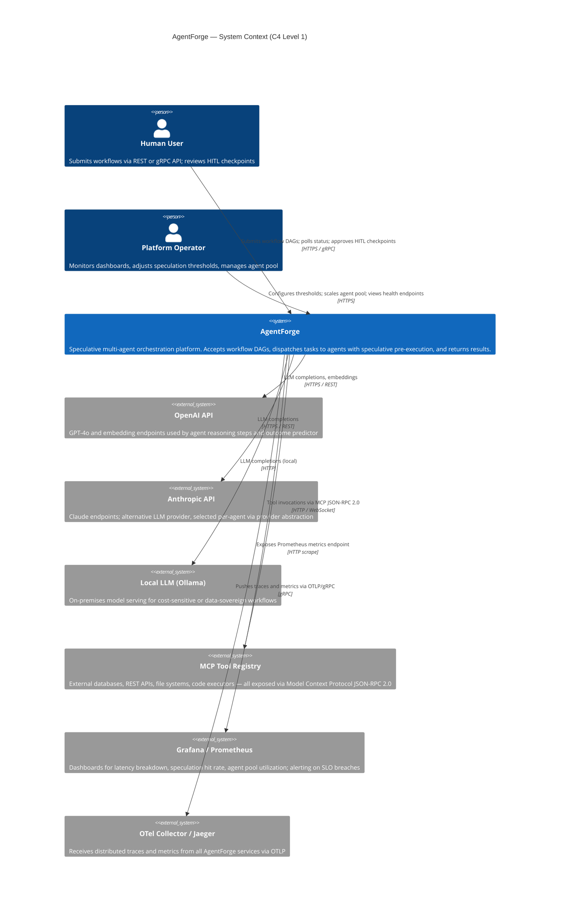
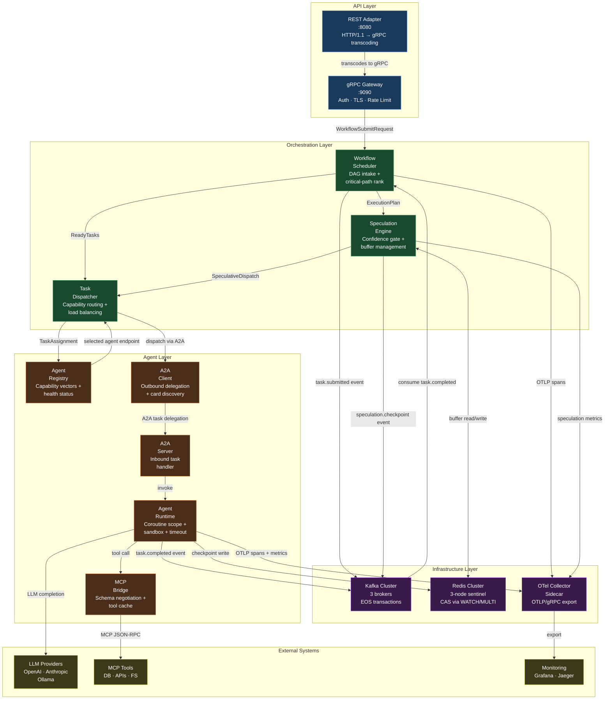
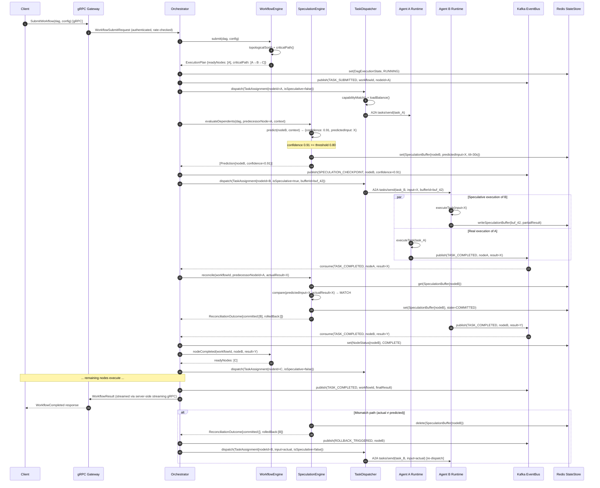
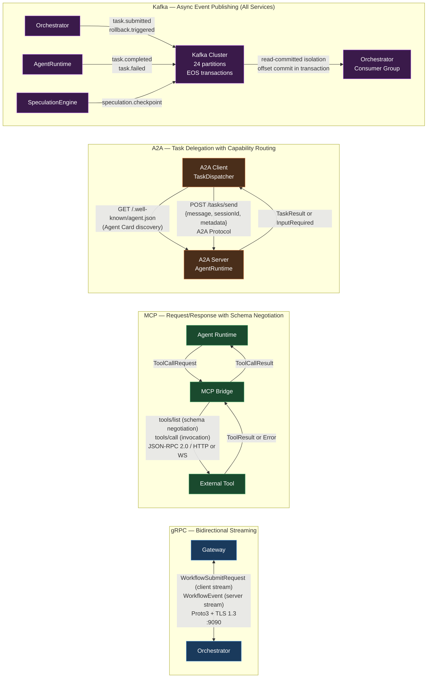
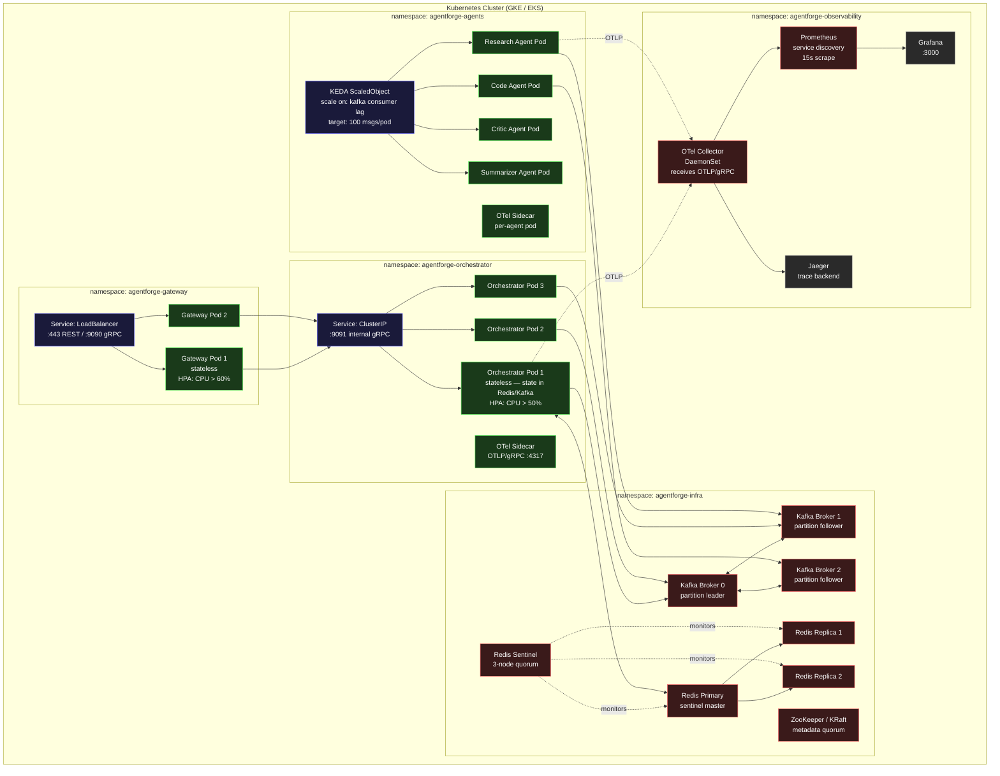

# AgentForge — System Architecture

**Speculative Multi-Agent Orchestration Platform**

> Single source of truth for component design, data flow, deployment topology, and architectural decisions.

---

## Table of Contents

1. [System Context](#1-system-context)
2. [High-Level Architecture](#2-high-level-architecture)
3. [Component Deep Dive](#3-component-deep-dive)
   - 3.1 [Orchestrator](#31-orchestrator)
   - 3.2 [SpeculationEngine](#32-speculationengine)
   - 3.3 [TaskDispatcher](#33-taskdispatcher)
   - 3.4 [AgentRuntime](#34-agentruntime)
   - 3.5 [MCPBridge](#35-mcpbridge)
   - 3.6 [A2ARouter](#36-a2arouter)
   - 3.7 [WorkflowEngine](#37-workflowengine)
   - 3.8 [EventBus](#38-eventbus)
   - 3.9 [StateStore](#39-statestore)
4. [Data Flow Walkthrough](#4-data-flow-walkthrough)
5. [Communication Patterns](#5-communication-patterns)
6. [Deployment Architecture](#6-deployment-architecture)
7. [Design Decisions (ADR)](#7-design-decisions-adr)
8. [Integration Points](#8-integration-points)
9. [See Also](#9-see-also)

---

## 1. System Context

The C4 context diagram below shows AgentForge as the central system, the external actors that interact with it, and the external systems it depends on.



**Key observations:**

- AgentForge is the single system boundary. All LLM providers, tools, and monitoring systems sit outside it — they are integration targets, not components.
- Human users interact exclusively through the API layer. There is no direct coupling between humans and internal components.
- The MCP Tool Registry represents an unbounded set of external capabilities. AgentForge does not manage tool implementations; it negotiates schemas at runtime.

---

## 2. High-Level Architecture

The internal architecture is organized into four horizontal layers. Requests flow top-to-bottom; events and state flow across the infrastructure layer.



---

## 3. Component Deep Dive

### 3.1 Orchestrator

**Responsibility.** The Orchestrator is the central brain of AgentForge. It receives a workflow submission from the API layer, deserializes the DAG definition, validates node types and edge constraints, and hands the plan to the WorkflowEngine for topological scheduling. Once a valid execution plan exists, the Orchestrator coordinates the SpeculationEngine and TaskDispatcher in a coroutine-based event loop: it consumes `task.completed` events from Kafka, updates DAG state in Redis, checks which downstream nodes are now unblocked, asks the SpeculationEngine whether any should be speculatively pre-dispatched, and calls the TaskDispatcher for both real and speculative assignments. The Orchestrator also handles HITL pause/resume by persisting the paused-node state in Redis and waiting for an external approval event before resuming execution.

```kotlin
sealed interface OrchestratorCommand {
    data class SubmitWorkflow(
        val workflowId: WorkflowId,
        val dag: WorkflowDag,
        val config: WorkflowConfig,
    ) : OrchestratorCommand

    data class TaskCompleted(
        val workflowId: WorkflowId,
        val nodeId: NodeId,
        val result: TaskResult,
    ) : OrchestratorCommand

    data class HitlApproved(
        val workflowId: WorkflowId,
        val checkpointNodeId: NodeId,
        val approvedBy: UserId,
    ) : OrchestratorCommand

    data class CancelWorkflow(
        val workflowId: WorkflowId,
        val reason: String,
    ) : OrchestratorCommand
}

sealed interface OrchestratorEvent {
    data class WorkflowStarted(val workflowId: WorkflowId, val nodeCount: Int) : OrchestratorEvent
    data class WorkflowCompleted(val workflowId: WorkflowId, val result: WorkflowResult) : OrchestratorEvent
    data class WorkflowFailed(val workflowId: WorkflowId, val cause: Throwable) : OrchestratorEvent
    data class SpeculationTriggered(val workflowId: WorkflowId, val nodeId: NodeId, val confidence: Double) : OrchestratorEvent
    data class RollbackExecuted(val workflowId: WorkflowId, val nodeId: NodeId) : OrchestratorEvent
}

interface Orchestrator {
    suspend fun handle(command: OrchestratorCommand): OrchestratorEvent
    fun events(): Flow<OrchestratorEvent>
}
```

**Failure modes and mitigations:**

| Failure | Mitigation |
|---|---|
| Orchestrator pod crash mid-workflow | Workflow DAG state persisted in Redis; on restart, Orchestrator replays Kafka consumer group from last committed offset to reconstruct in-flight state |
| Task completion event lost | Kafka exactly-once semantics (idempotent producer + transactional consumer) prevent duplicate and lost events; consumer group auto-rebalance on pod failure |
| HITL approval never arrives | Configurable `hitlTimeout` on checkpoint nodes; on expiry, workflow moves to `AWAITING_REVIEW` terminal state with full rollback of in-flight speculative work |
| Deadlock in DAG (cycle detection miss) | Static topological sort at submission time; any cycle raises `InvalidDagException` before execution begins |

---

### 3.2 SpeculationEngine

**Responsibility.** The SpeculationEngine implements the prediction-and-pre-dispatch logic that produces the \~40% latency reduction. It maintains a hybrid predictor: a fine-tuned classifier over (workflow type, node position, recent context embedding) → (likely output category), combined with a statistical baseline drawn from historical task completion distributions. When the Orchestrator signals that a predecessor node has been dispatched, the SpeculationEngine scores the dependent nodes and, for those exceeding the confidence threshold, creates a `SpeculationBuffer` in Redis holding the predicted input and a rollback cursor. It then signals the Orchestrator to dispatch those nodes speculatively. When the predecessor actually completes, the SpeculationEngine compares the actual result to the prediction: on match, the buffer is committed and the speculative result stands; on mismatch, the buffer is discarded and the agent is re-dispatched with the real input.

```kotlin
data class Prediction(
    val nodeId: NodeId,
    val predictedInput: ByteArray,
    val confidence: Double,
    val modelVersion: String,
    val latencyMs: Long,
)

data class SpeculationBuffer(
    val bufferId: BufferId,
    val workflowId: WorkflowId,
    val nodeId: NodeId,
    val predictedInput: ByteArray,
    val createdAt: Instant,
    val ttl: Duration,
    val state: BufferState,
) {
    enum class BufferState { ACTIVE, COMMITTED, DISCARDED }
}

interface SpeculationEngine {
    /**
     * Called when a predecessor node is dispatched. Returns predictions
     * for all eligible dependent nodes above the confidence threshold.
     */
    suspend fun evaluateDependents(
        dag: WorkflowDag,
        predecessorNode: DagNode,
        context: ExecutionContext,
    ): List<Prediction>

    /**
     * Called when the predecessor completes. Commits or discards buffers.
     * Returns the set of node IDs that need rollback + re-dispatch.
     */
    suspend fun reconcile(
        workflowId: WorkflowId,
        predecessorNodeId: NodeId,
        actualResult: TaskResult,
    ): ReconciliationOutcome

    fun hitRate(): Flow<SpeculationMetrics>
}

data class ReconciliationOutcome(
    val committed: List<NodeId>,
    val rolledBack: List<NodeId>,
)
```

**Failure modes and mitigations:**

| Failure | Mitigation |
|---|---|
| Predictor inference latency exceeds savings | Inference budget enforced via coroutine `withTimeout`; if exceeded, speculation is skipped for that node — graceful degradation to sequential |
| Buffer TTL expires before predecessor completes | Expired buffer triggers automatic discard; Orchestrator treats node as unspeculated and waits for real completion |
| Redis buffer write fails | SpeculationEngine catches the error, logs to OTel, and skips speculation for that node; correctness unaffected |
| Overconfident predictor causes high rollback rate | Confidence threshold is dynamically adjusted via exponential moving average of recent hit rate; if hit rate falls below `0.6`, threshold is raised by `0.05` |

---

### 3.3 TaskDispatcher

**Responsibility.** The TaskDispatcher is the scheduling layer between the Orchestrator and the Agent pool. It maintains a live view of registered agents via the AgentRegistry, which stores capability vectors — sparse tag-based representations of what each agent can do (e.g., `["web_search", "summarization", "python_execution"]`). When a `TaskAssignment` arrives, the dispatcher finds the best-fit agent by computing the cosine similarity between the task's required capability vector and each agent's registered vector, filtered by current queue depth and health status. Load balancing uses a weighted-random selection from the top-k candidates to avoid routing all traffic to a single high-similarity agent. Speculative dispatches are flagged with a `bufferId`; the agent runtime receives this flag and writes its output to the speculation buffer rather than directly to the DAG context.

```kotlin
data class CapabilityVector(val tags: Set<String>, val embedding: FloatArray)

data class TaskAssignment(
    val taskId: TaskId,
    val workflowId: WorkflowId,
    val nodeId: NodeId,
    val input: ByteArray,
    val requiredCapabilities: CapabilityVector,
    val isSpeculative: Boolean,
    val speculationBufferId: BufferId?,
    val deadline: Instant,
    val priority: Int,
)

data class DispatchResult(
    val taskId: TaskId,
    val assignedAgentId: AgentId,
    val estimatedStartMs: Long,
)

interface TaskDispatcher {
    suspend fun dispatch(assignment: TaskAssignment): DispatchResult
    suspend fun cancel(taskId: TaskId, reason: String)
    fun queueDepths(): Flow<Map<AgentId, Int>>
}
```

**Failure modes and mitigations:**

| Failure | Mitigation |
|---|---|
| No agent matches required capabilities | Dispatcher returns `NoCapableAgentException`; Orchestrator pauses that DAG branch and emits an alert; operator can register a new agent to unblock |
| All matching agents are at queue capacity | Dispatcher parks the task in a Redis sorted set (priority queue) and retries on the next `agent.available` event |
| Agent becomes unhealthy after dispatch | AgentRegistry receives health-check failure; Orchestrator is notified via Kafka `agent.unavailable` event; task is re-dispatched to next candidate |
| Speculative dispatch assigned to wrong agent type | Capability check is identical for speculative and real dispatches — no special path that could accidentally bypass validation |

---

### 3.4 AgentRuntime

**Responsibility.** The AgentRuntime is the per-agent execution environment. Each agent runs inside a structured coroutine scope (`CoroutineScope(SupervisorJob() + Dispatchers.IO)`) that is isolated from the host JVM's global scope, ensuring that one agent's uncaught exception cannot crash others. The runtime enforces:
- **Timeout**: each task invocation wrapped in `withTimeout(deadline - now())`
- **Memory limit**: JVM `-Xmx` per-agent pod (enforced at container level)
- **Tool call budget**: maximum MCP tool calls per task, tracked as an atomic counter
- **Output size limit**: response bytes capped before writing to Kafka or Redis

When a task completes, the runtime writes a checkpoint to Redis (for crash recovery), emits a `task.completed` event to Kafka, and — if the task was speculative — writes to the speculation buffer instead of the live DAG context.

```kotlin
data class AgentDescriptor(
    val agentId: AgentId,
    val capabilities: CapabilityVector,
    val maxConcurrentTasks: Int,
    val toolCallBudgetPerTask: Int,
    val taskTimeoutMs: Long,
)

sealed interface AgentTaskOutcome {
    data class Success(val output: ByteArray, val toolCallsUsed: Int, val latencyMs: Long) : AgentTaskOutcome
    data class Failure(val cause: Throwable, val retriable: Boolean) : AgentTaskOutcome
    data class TimedOut(val deadlineMs: Long) : AgentTaskOutcome
}

interface AgentRuntime {
    val descriptor: AgentDescriptor
    suspend fun executeTask(assignment: TaskAssignment): AgentTaskOutcome
    suspend fun cancelTask(taskId: TaskId)
    fun isHealthy(): Boolean
}
```

**Failure modes and mitigations:**

| Failure | Mitigation |
|---|---|
| Task exceeds timeout | `withTimeout` throws `TimeoutCancellationException`; runtime wraps it as `AgentTaskOutcome.TimedOut`; TaskDispatcher re-dispatches if retriable |
| Agent pod OOM-killed | Last checkpoint in Redis allows Orchestrator to re-dispatch from the last successful subtask rather than from the start of the node |
| Uncaught exception in agent coroutine | `SupervisorJob` prevents propagation; exception is caught, wrapped as `AgentTaskOutcome.Failure`, and Kafka `task.failed` event is emitted |
| Speculation buffer write race | Each speculative task holds a unique `bufferId`; Redis `SETNX` on that key ensures only one writer can commit |

---

### 3.5 MCPBridge

**Responsibility.** The MCPBridge is the translation layer between the agent's tool-call requests and the MCP (Model Context Protocol) JSON-RPC 2.0 wire format. When an agent calls `invokeTool("web_search", params)`, the bridge: (1) looks up the tool descriptor in its in-memory schema cache (populated lazily on first use, refreshed on cache miss), (2) validates the call parameters against the JSON Schema in the descriptor, (3) serializes the request to `{"jsonrpc":"2.0","method":"tools/call",...}`, (4) sends it to the tool's endpoint via HTTP or WebSocket, and (5) deserializes and returns the response. The schema cache prevents a round-trip schema negotiation on every call. The bridge also handles MCP capability discovery (`tools/list`) on startup to pre-warm the cache for the tools most frequently used by the agent type.

```kotlin
data class ToolDescriptor(
    val name: String,
    val description: String,
    val inputSchema: JsonObject,
    val outputSchema: JsonObject,
    val endpoint: URI,
    val transport: McpTransport,
) {
    enum class McpTransport { HTTP, WEBSOCKET, STDIO }
}

data class ToolCallRequest(
    val toolName: String,
    val params: JsonObject,
    val callId: String = UUID.randomUUID().toString(),
)

sealed interface ToolCallResult {
    data class Success(val output: JsonElement, val latencyMs: Long) : ToolCallResult
    data class ToolError(val code: Int, val message: String) : ToolCallResult
    data class ValidationError(val violations: List<String>) : ToolCallResult
}

interface MCPBridge {
    suspend fun discoverTools(): List<ToolDescriptor>
    suspend fun invokeTool(request: ToolCallRequest): ToolCallResult
    fun cachedSchema(toolName: String): ToolDescriptor?
}
```

**Failure modes and mitigations:**

| Failure | Mitigation |
|---|---|
| Tool endpoint unreachable | Exponential backoff with jitter (3 retries, max 2s); if all fail, returns `ToolCallResult.ToolError` — agent decides whether to degrade gracefully or fail the task |
| Schema cache stale (tool updated) | On `ToolCallResult.ValidationError`, bridge evicts the cache entry and re-fetches the schema; a second validation failure is surfaced to the agent without retry |
| Tool returns malformed JSON | Bridge wraps Jackson parse exception as `ToolCallResult.ToolError(code=-32700)`; matches JSON-RPC 2.0 parse error convention |
| Budget exhaustion | `toolCallBudget` counter decremented atomically per call; on exhaustion, bridge throws `ToolBudgetExhaustedException` without making the network call |

---

### 3.6 A2ARouter

**Responsibility.** The A2ARouter handles inter-agent delegation following Google's A2A (Agent-to-Agent) protocol specification. When the TaskDispatcher identifies that a task should be delegated to an external or specialized agent, the A2ARouter performs Agent Card discovery (fetching the well-known `.well-known/agent.json` descriptor from the target agent's base URL), verifies the agent's declared capabilities against the task requirements, and sends a `tasks/send` request with the serialized `Message` payload. The router maintains a discovery cache so that repeated delegations to the same agent do not incur repeated HTTP round-trips. It also implements the A2A streaming variant (`tasks/sendSubscribe`) for long-running tasks, exposing the event stream as a Kotlin `Flow<A2AEvent>`.

```kotlin
data class AgentCard(
    val name: String,
    val description: String,
    val url: URI,
    val capabilities: List<String>,
    val defaultInputModes: List<String>,
    val defaultOutputModes: List<String>,
    val skills: List<AgentSkill>,
)

data class A2ATask(
    val taskId: TaskId,
    val message: A2AMessage,
    val sessionId: String?,
    val metadata: Map<String, String>,
)

sealed interface A2ATaskResult {
    data class Completed(val artifacts: List<A2AArtifact>) : A2ATaskResult
    data class Failed(val errorMessage: String) : A2ATaskResult
    data class InputRequired(val prompt: String) : A2ATaskResult
}

interface A2ARouter {
    suspend fun discoverAgent(baseUrl: URI): AgentCard
    suspend fun delegate(task: A2ATask, targetUrl: URI): A2ATaskResult
    fun streamTask(task: A2ATask, targetUrl: URI): Flow<A2AEvent>
    fun invalidateCache(baseUrl: URI)
}
```

**Failure modes and mitigations:**

| Failure | Mitigation |
|---|---|
| Agent Card discovery fails (404 or timeout) | Router returns `AgentCard` not found; TaskDispatcher falls back to next candidate in registry ranking |
| Remote agent returns `InputRequired` mid-task | A2ARouter surfaces this as an `A2ATaskResult.InputRequired`; Orchestrator either injects the missing input from DAG context or triggers a HITL checkpoint |
| Network partition to remote agent | Streaming subscription times out; router emits `Flow` cancellation; Orchestrator re-dispatches to an alternative agent |
| Agent Card capability drift | On every 10th delegation to a given agent, router bypasses cache and re-fetches the card to detect capability changes |

---

### 3.7 WorkflowEngine

**Responsibility.** The WorkflowEngine owns the lifecycle of a workflow's Directed Acyclic Graph. At submission time it performs: (1) JSON/Protobuf deserialization of the DAG definition, (2) schema validation of node types and required fields, (3) static topological sort using Kahn's algorithm to detect cycles and produce a linear execution order, and (4) critical-path calculation (longest path by estimated node latency) to inform the SpeculationEngine which nodes matter most for end-to-end latency. During execution, the engine maintains a `DagExecutionState` in Redis — a map from `NodeId` to `NodeStatus` — and recomputes the critical path dynamically as actual node latencies are observed. Branch resolution handles conditional edges: when a node produces a `BranchSelector` output, the engine activates the matching branch and deactivates all others.

```kotlin
data class DagNode(
    val id: NodeId,
    val type: NodeType,
    val requiredCapabilities: CapabilityVector,
    val estimatedLatencyMs: Long,
    val timeoutMs: Long,
    val isHitlCheckpoint: Boolean,
    val inputSchema: JsonObject,
    val outputSchema: JsonObject,
)

data class DagEdge(
    val from: NodeId,
    val to: NodeId,
    val type: EdgeType,
    val condition: BranchCondition?,
) {
    enum class EdgeType { DATA_DEPENDENCY, CONTROL_DEPENDENCY, HUMAN_CHECKPOINT }
}

data class WorkflowDag(
    val workflowId: WorkflowId,
    val nodes: Map<NodeId, DagNode>,
    val edges: List<DagEdge>,
) {
    fun topologicalOrder(): List<DagNode>  // Kahn's algorithm
    fun criticalPath(): List<DagNode>      // Longest path by estimated latency
    fun dependentsOf(nodeId: NodeId): List<DagNode>
    fun allPredecessorsComplete(nodeId: NodeId, except: NodeId? = null): Boolean
}

interface WorkflowEngine {
    suspend fun submit(dag: WorkflowDag, config: WorkflowConfig): ExecutionPlan
    suspend fun nodeCompleted(workflowId: WorkflowId, nodeId: NodeId, result: TaskResult)
    suspend fun getReadyNodes(workflowId: WorkflowId): List<DagNode>
    suspend fun getState(workflowId: WorkflowId): DagExecutionState
}
```

**Failure modes and mitigations:**

| Failure | Mitigation |
|---|---|
| Cycle in submitted DAG | Kahn's algorithm terminates with remaining nodes > 0; `InvalidDagException` thrown before any execution begins |
| Node type references unregistered agent capability | Validated against AgentRegistry at plan creation time; unknown types rejected with a descriptive error |
| Branch condition never evaluates to true | Workflow Engine has a `defaultBranch` fallback; if none declared and no branch fires, workflow transitions to `BRANCH_STALLED` state and emits an alert |
| Redis state eviction under memory pressure | Redis configured with `maxmemory-policy allkeys-lru` and a minimum TTL of 24 hours on DAG execution keys; Kafka event log serves as durable fallback for reconstruction |

---

### 3.8 EventBus

**Responsibility.** The EventBus is AgentForge's durable communication backbone, wrapping Apache Kafka with exactly-once semantics (EOS). On the producer side, each Orchestrator instance initializes a Kafka `KafkaProducer` with `enable.idempotence=true` and a `transactional.id` derived from its pod identity, ensuring that even under retries no duplicate records are written. On the consumer side, all consumers operate in read-committed isolation mode and commit offsets within the same Kafka transaction as any downstream produce, implementing the transactional outbox pattern for state-change events. The EventBus exposes a typed Kotlin API over raw Kafka bytes using a Protobuf-based `EventEnvelope` that carries schema version, correlation ID, and causation ID for trace correlation.

```kotlin
data class EventEnvelope<T>(
    val eventId: EventId,
    val correlationId: CorrelationId,
    val causationId: EventId?,
    val topic: KafkaTopic,
    val schemaVersion: Int,
    val payload: T,
    val producedAt: Instant,
)

enum class KafkaTopic(val topicName: String) {
    TASK_SUBMITTED("task.submitted"),
    TASK_COMPLETED("task.completed"),
    TASK_FAILED("task.failed"),
    SPECULATION_CHECKPOINT("speculation.checkpoint"),
    ROLLBACK_TRIGGERED("rollback.triggered"),
    HITL_APPROVAL_REQUIRED("hitl.approval.required"),
    HITL_APPROVED("hitl.approved"),
    AGENT_UNAVAILABLE("agent.unavailable"),
}

interface EventBus {
    /**
     * Publishes an event within a Kafka transaction.
     * The [block] lambda runs inside the transaction; commit happens on successful return.
     */
    suspend fun <T> publishTransactional(
        topic: KafkaTopic,
        payload: T,
        partitionKey: String,
        block: suspend () -> Unit = {},
    )

    /**
     * Subscribes to a topic, yielding events as a cold Flow.
     * Each emission is offset-committed only after [handler] returns successfully.
     */
    fun <T> subscribe(topic: KafkaTopic, groupId: String): Flow<EventEnvelope<T>>
}
```

**Failure modes and mitigations:**

| Failure | Mitigation |
|---|---|
| Kafka broker leader election during produce | Idempotent producer retries with `retries=Int.MAX_VALUE`, `delivery.timeout.ms=120000`; EOS guarantees no duplicates on retry |
| Consumer group rebalance mid-transaction | Transaction is aborted on rebalance; uncommitted events are re-processed after rebalance completes; idempotent consumer IDs prevent double-processing |
| Topic partition hotspot | Partition key is `workflowId` (UUID); uniform distribution across partitions; `num.partitions=24` for `task.completed` (highest throughput topic) |
| Disk exhaustion on broker | Topic retention set to 7 days + 50 GB per partition; compaction enabled on state-update topics; alerts fire at 70% disk utilization |

---

### 3.9 StateStore

**Responsibility.** The StateStore provides sub-millisecond reads of workflow and agent state for the SpeculationEngine's hot path. It is backed by Redis 7 with RedisJSON for structured document storage. All writes that mutate shared workflow state use optimistic locking via Redis `WATCH`/`MULTI`/`EXEC` (CAS) to prevent lost updates when multiple Orchestrator replicas race to update the same DAG node status. Speculation buffers are stored as Redis hashes with per-key TTL, so stale buffers are evicted automatically without a background cleanup job. For durability, the StateStore is intentionally not the system of record — Kafka serves that role. Redis is treated as a write-through cache over the Kafka event log, which means any key can be reconstructed by replaying the relevant Kafka partition.

```kotlin
sealed interface StateKey {
    data class DagExecutionState(val workflowId: WorkflowId) : StateKey
    data class NodeStatus(val workflowId: WorkflowId, val nodeId: NodeId) : StateKey
    data class SpeculationBuffer(val bufferId: BufferId) : StateKey
    data class AgentCheckpoint(val agentId: AgentId, val taskId: TaskId) : StateKey
}

data class CasResult<T>(
    val value: T,
    val version: Long,
)

sealed interface WriteResult {
    object Success : WriteResult
    object VersionConflict : WriteResult  // WATCH observed a change; caller should retry
    data class Error(val cause: Throwable) : WriteResult
}

interface StateStore {
    suspend fun <T> get(key: StateKey): CasResult<T>?
    suspend fun <T> compareAndSet(
        key: StateKey,
        expected: CasResult<T>,
        newValue: T,
        ttl: Duration? = null,
    ): WriteResult
    suspend fun <T> set(key: StateKey, value: T, ttl: Duration? = null)
    suspend fun delete(key: StateKey)
    suspend fun <T> getAll(keys: List<StateKey>): Map<StateKey, T>
}
```

**Failure modes and mitigations:**

| Failure | Mitigation |
|---|---|
| Redis sentinel failover (primary → replica) | Jedis sentinel client auto-discovers new primary within \~10s; Orchestrator retries CAS operations with exponential backoff during the window |
| CAS conflict under high contention | Caller receives `WriteResult.VersionConflict` and retries with fresh `get()`; bounded retries (max 5) before escalating to `StateConflictException` |
| Key eviction under memory pressure | All state keys have explicit TTL; critical DAG execution keys have `PERSIST` (no TTL) and Redis is sized to hold all in-flight workflow state with 30% headroom |
| Stale speculation buffer not evicted | TTL on every buffer key (`speculationTtl`, default 30s); expired buffers return null on `get()`, treated as discarded |

---

## 4. Data Flow Walkthrough

End-to-end workflow execution with speculative pre-dispatch.



**Key latency wins illustrated:** Steps 12-15 show Agent B starting before Agent A finishes. When Agent A completes at step 17 and the result matches the prediction (step 21), Agent B's work is already done or in progress — its result is committed without re-execution. The serialization gap between A completing and B starting collapses to near zero on the happy path.

---

## 5. Communication Patterns



**Pattern rationale:**

- **gRPC bidirectional streaming** between Gateway and Orchestrator allows the client to submit a multi-node DAG incrementally (client stream) while receiving status events as they occur (server stream) — a natural fit for long-running workflows without polling overhead. (*Building Microservices*, Ch. 4)
- **MCP request/response** is stateless by design. Agents can fail and restart without disrupting the tool registry; schema negotiation at first call means tools can be added to the registry with zero Orchestrator changes.
- **A2A task delegation** decouples the Orchestrator from agent implementation details. The Agent Card provides a discovery mechanism analogous to a service mesh's service registry, but typed to AI agent capabilities.
- **Kafka async publishing** decouples producers from consumers in time and space. A crashed consumer can catch up from its last committed offset without the producer knowing or caring. The exactly-once guarantee ensures event counts are exact for billing, SLO measurement, and audit. (*Designing Data-Intensive Applications*, Ch. 11; *Building Event-Driven Microservices*, Ch. 3)

---

## 6. Deployment Architecture



**Scaling strategy:**

- **Gateway pods**: CPU-based HPA. Stateless; no session affinity required. TLS terminated at the load balancer.
- **Orchestrator pods**: CPU-based HPA (min 2, max 10). Stateless by design — DAG state lives in Redis, event log in Kafka. Any pod can handle any workflow after Redis warm-up.
- **Agent pods**: KEDA scales on Kafka consumer lag per `task.submitted` partition. Each agent type has its own consumer group and KEDA `ScaledObject`, allowing fine-grained scaling per capability type.
- **Kafka**: 3-broker cluster with `replication.factor=3` and `min.insync.replicas=2`. Topic partition counts sized to peak throughput: `task.submitted` at 24 partitions (one per agent pod at target scale). KRaft mode (no ZooKeeper) for clusters on Kafka 3.3+.
- **Redis**: 3-node sentinel HA. Primary handles all writes. Reads for non-speculative-path keys use the read replicas. Sentinel quorum of 2 required for failover to prevent split-brain.
- **OTel Collector**: Deployed as a DaemonSet so each node has a local collector endpoint. Agents and Orchestrator pods write to `localhost:4317`, eliminating cross-node trace ingestion latency.

---

## 7. Design Decisions (ADR)

| # | Decision | Context | Choice | Consequences | Book Reference |
|---|---|---|---|---|---|
| 1 | **Kotlin on JVM** | Need structured concurrency for hundreds of simultaneous agent coroutines; sealed classes for exhaustive state modeling | Kotlin 1.9 on JVM 21 with coroutines (`kotlinx.coroutines`) | Excellent async primitives (`Flow`, `Channel`, structured cancellation); sealed interfaces enable exhaustive `when` branches with compiler enforcement; JVM startup overhead (\~300ms) acceptable for long-lived pods | N/A |
| 2 | **gRPC bidirectional streaming for Gateway ↔ Orchestrator** | Workflow submissions are long-lived (seconds to minutes); client needs real-time status events without polling; REST SSE considered | gRPC with Protobuf, bidirectional streaming RPC | Type-safe contracts via Protobuf codegen; native streaming eliminates polling; HTTP/2 multiplexing; more complex client SDK than REST; browser clients require gRPC-Web transcoding layer | *Building Microservices*, Ch. 4 |
| 3 | **Kafka exactly-once semantics as event backbone** | Multi-agent workflows must not duplicate or drop task events; at-least-once + idempotent consumers considered | Idempotent producer (`enable.idempotence=true`) + transactional consumer (read-committed, offset committed in same transaction as downstream produce) | Correct EOS semantics even under broker failover; enables safe consumer group rebalance mid-transaction; Kafka EOS adds \~15% throughput overhead vs at-least-once; operational complexity of transactional IDs and fencing | *Designing Data-Intensive Applications*, Ch. 11; *Building Event-Driven Microservices*, Ch. 3 |
| 4 | **Redis for speculation hot path** | SpeculationEngine needs sub-millisecond reads of DAG state during prediction; PostgreSQL (7-10ms) too slow for confidence gate on critical path | Redis 7 with WATCH/MULTI/EXEC for CAS; RedisJSON for structured documents; Lua scripts for atomic multi-key reads | P99 reads < 1ms satisfies speculation budget; optimistic locking via CAS handles multi-orchestrator-pod contention without distributed locks; durability delegated to Kafka (Redis as write-through cache); Redis memory must be sized to all in-flight workflow state | N/A |
| 5 | **Hybrid LLM + statistical predictor for speculation** | Pure statistical model (e.g., task output distribution histogram) misses semantic content-based predictions; pure LLM adds 100-200ms inference per prediction | Fine-tuned classifier over context embeddings for semantic prediction, blended with statistical baseline via ensemble weight; inference budget enforced via `withTimeout` | Hit rate \~0.85 at 0.80 threshold in benchmarks vs \~0.65 for statistical-only; LLM inference cost per speculation decision is \~$0.0001 at GPT-4o-mini pricing; inference timeout degrades gracefully to sequential execution | *AI Engineering*, Ch. 7 (compound AI systems and speculative inference) |
| 6 | **Orchestration-based saga for workflow rollback** | Distributed agent execution can fail mid-workflow; need clean rollback of partial results and speculative buffers; choreography-based saga considered | Orchestration-based saga: Orchestrator is the single saga coordinator; each agent exposes a `compensate(taskId)` A2A endpoint; Orchestrator drives rollback in reverse topological order | Clean rollback semantics; Orchestrator has full visibility into rollback progress; single point of coordination simplifies debugging; Orchestrator must remain available during rollback (mitigated by HA deployment); compensating transactions must be idempotent | *Building Microservices*, Ch. 6; *Building Event-Driven Microservices*, Ch. 9 |

---

## 8. Integration Points

### TurboMQ (Event Patterns)

AgentForge's Kafka event backbone shares architectural patterns with the [TurboMQ](../../turbo-mq/docs/architecture.md) project:

- The exactly-once semantics in AgentForge's `EventBus` (idempotent producers + transactional consumers) mirror TurboMQ's [delivery guarantees](../../turbo-mq/docs/api-and-sdks.md).
- Consumer group rebalancing and partition key strategies follow the same patterns documented in TurboMQ's [API and SDKs](../../turbo-mq/docs/api-and-sdks.md).
- The per-partition Raft consensus model in TurboMQ could replace Kafka as AgentForge's event backbone, providing fault-isolated partitions and [zero-downtime migration](../../turbo-mq/docs/raft-consensus.md).

### NexusDB (Persistent Context)

Long-running workflows that span multiple sessions require persistent context storage beyond Redis TTLs. AgentForge integrates with [NexusDB](../../nexus-db/docs/architecture.md) for this:

- Workflow execution state and agent memory are persisted to NexusDB's transactional storage engine with [full SSI guarantees](../../nexus-db/docs/transaction-isolation.md).
- The SpeculationEngine's predictor training pipeline reads historical task completion records from NexusDB, leveraging its [MVCC snapshot reads](../../nexus-db/docs/mvcc.md) for consistent training data without blocking production workloads.
- NexusDB's [adaptive concurrency model](../../nexus-db/docs/concurrency-model.md) handles the mixed read/write pattern of agent context lookups (read-heavy) and checkpoint writes (write-heavy) without manual tuning.

---

## 9. See Also

| Document | Description |
|---|---|
| [`../README.md`](../README.md) | Project overview, quick start, feature summary, and tech stack table |
| [`speculative-execution.md`](speculative-execution.md) | Speculation engine architecture, prediction model, confidence scoring, rollback mechanics, and performance analysis |
| [`workflow-engine.md`](workflow-engine.md) | DAG workflow DSL, topological execution, speculative branch resolution, human-in-the-loop checkpoints |
| [`agent-protocols.md`](agent-protocols.md) | MCP agent-tool integration, A2A agent-agent delegation, dual protocol architecture |
| [`observability.md`](observability.md) | Kafka event backbone, Redis state management, OpenTelemetry tracing, Grafana dashboards |

---

*Book references: Chip Huyen, AI Engineering (O'Reilly, 2025) Ch. 6-7; Sam Newman, Building Microservices, 2nd ed., Ch. 4-6; Adam Bellemare, Building Event-Driven Microservices (O'Reilly, 2020) Ch. 3, 9; Martin Kleppmann, Designing Data-Intensive Applications (O'Reilly, 2017) Ch. 11.*
