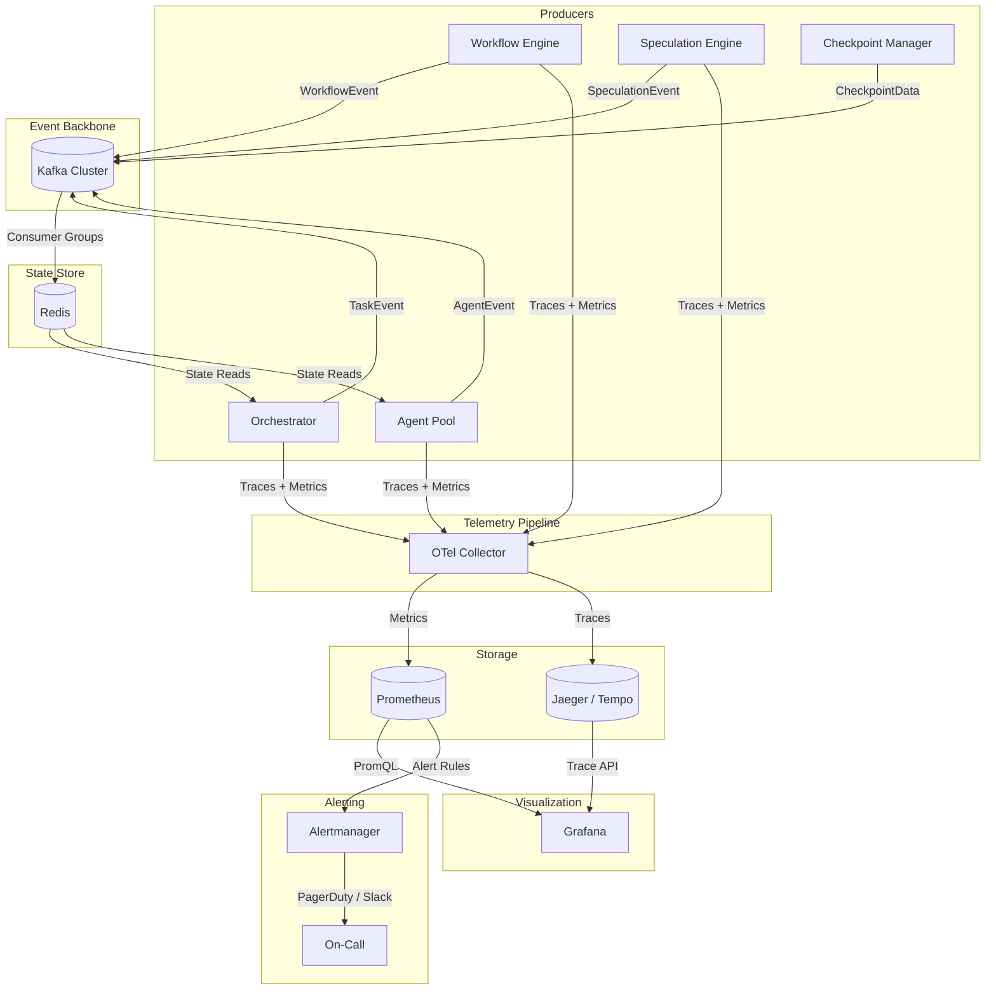
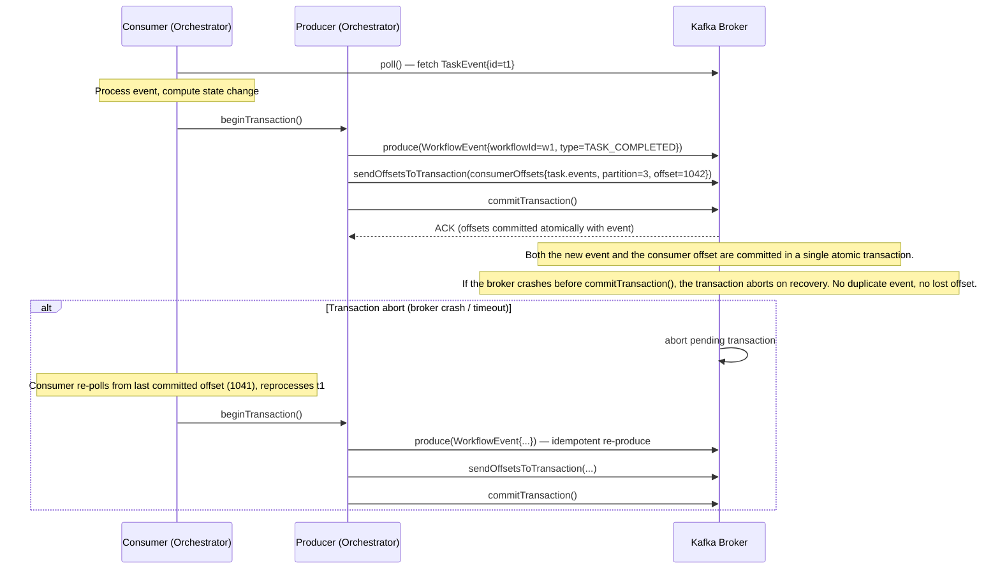
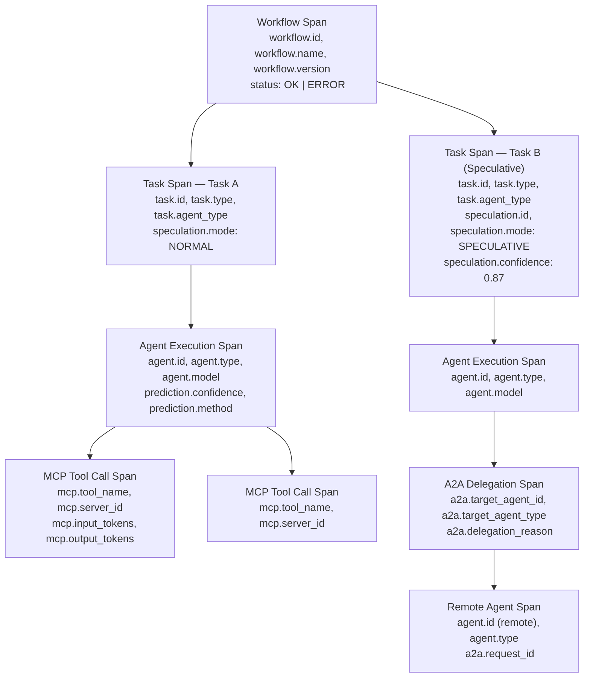

# AgentForge Observability Stack

Production observability for a distributed AI orchestration system requires instrumentation at every layer — from workflow lifecycle events down to individual MCP tool calls. This document describes AgentForge's observability architecture, covering the Kafka event backbone, Redis state management, distributed tracing with OpenTelemetry, metrics and alerting, and Grafana dashboard design.

---

## Table of Contents

1. [Observability Architecture Overview](#1-observability-architecture-overview)
2. [Kafka Event Backbone](#2-kafka-event-backbone)
3. [Redis State Management](#3-redis-state-management)
4. [Distributed Tracing with OpenTelemetry](#4-distributed-tracing-with-opentelemetry)
5. [Metrics and Alerting](#5-metrics-and-alerting)
6. [Grafana Dashboard Design](#6-grafana-dashboard-design)
7. [Design Decisions (ADR)](#7-design-decisions-adr)
8. [See Also](#8-see-also)

---

## 1. Observability Architecture Overview

Every component in AgentForge — the orchestrator, agents, the workflow engine, and the speculation subsystem — emits structured events and spans. These flow through a centralized pipeline where Kafka carries raw events, OpenTelemetry Collector aggregates trace and metric data, Prometheus stores time-series metrics, and Grafana visualizes the system state.



The key architectural principle: **Kafka is the source of truth; Redis is a materialized view.** Any Redis state can be reconstructed by replaying Kafka topics. Prometheus and Jaeger hold derived observability data that can likewise be reconstructed, but Redis reconstruction matters for production recovery.

---

## 2. Kafka Event Backbone

### Topic Architecture

| Topic | Key | Value Schema | Retention | Purpose |
|---|---|---|---|---|
| `workflow.lifecycle` | `workflowId` | `WorkflowEvent` | 30 days | Workflow start / complete / fail / timeout |
| `task.events` | `taskId` | `TaskEvent` | 30 days | Task dispatch / complete / fail / retry |
| `agent.lifecycle` | `agentId` | `AgentEvent` | 7 days | Agent register / heartbeat / deregister |
| `speculation.events` | `speculationId` | `SpeculationEvent` | 30 days | Predict / speculate / validate / commit / rollback |
| `checkpoint.events` | `checkpointId` | `CheckpointData` | 7 days | Redis state snapshots for recovery |
| `dlq` | `originalTopic` | `FailedEvent` | 90 days | Dead letter queue for failed event processing |

All topics use `workflowId` or a derivative as the partition key where applicable, ensuring all events for a given workflow land on the same partition and are processed in order by a single consumer.

### Exactly-Once Semantics

AgentForge uses Kafka's transactional API to guarantee exactly-once produce-consume semantics. This is non-negotiable for the speculation subsystem: a speculative branch that commits must produce exactly one `SpeculationEvent{type=COMMIT}`, not zero and not two.



**Producer configuration for exactly-once:**
```
enable.idempotence=true
transactional.id=orchestrator-instance-{instanceId}
acks=all
max.in.flight.requests.per.connection=5
```

**Consumer configuration:**
```
isolation.level=read_committed
```

`read_committed` ensures consumers never see events from aborted transactions — critical for the speculation subsystem, where a rolled-back speculation must not influence downstream consumers.

### Event Sourcing and Redis Reconstruction

Redis holds materialized views of current system state, built by consuming Kafka topics. The reconstruction procedure:

1. Spin up a fresh Redis instance (or flush the existing one).
2. Start a `StateRebuildConsumer` with `auto.offset.reset=earliest` on all state-bearing topics.
3. Replay `agent.lifecycle`, `workflow.lifecycle`, `task.events`, and `checkpoint.events` in order.
4. Apply each event as a state mutation (the same logic used in normal processing).
5. When all consumer groups reach the end of each partition, the materialized view is current.

The checkpoint topic snapshots full `AgentContext` blobs, enabling fast-forward recovery: replay from the most recent checkpoint rather than from offset 0.

> "The log is the database." — *Designing Data-Intensive Applications*, Ch11 (Kafka as a distributed log with exactly-once delivery semantics and log compaction as the durable state store).

### DLQ Strategy

When event processing fails after the configured retry limit (`max.retries=3`, exponential backoff up to 30 seconds), the event is routed to the `dlq` topic with the original topic name as the key and a `FailedEvent` wrapper containing:

- Original payload (verbatim)
- `failureReason` (exception class + message)
- `failureCount` (number of attempts)
- `firstFailureTimestamp`, `lastFailureTimestamp`
- `processorInstanceId` (which orchestrator instance failed)

Alertmanager fires a `DLQNonEmpty` critical alert (see Section 5) the moment `dlq_depth > 0`. The on-call engineer inspects the DLQ, fixes the root cause (typically a schema mismatch or downstream dependency outage), and replays using the `KafkaDLQReplayer` utility:

```
./dlq-replayer --topic dlq --filter originalTopic=speculation.events --since 2h --dry-run
./dlq-replayer --topic dlq --filter originalTopic=speculation.events --since 2h
```

> *Building Event-Driven Microservices*, Ch3: "The dead letter queue is not a graveyard; it is a staging area for events that require human intervention before reprocessing."

---

## 3. Redis State Management

### State Key Patterns

| Key Pattern | TTL | Purpose |
|---|---|---|
| `agent:{id}:state` | None (no expiry) | Current agent state: capabilities, status, current task |
| `workflow:{id}:state` | 24 hours | Full workflow execution state including DAG, task statuses, outputs |
| `speculation:{id}:checkpoint` | 1 hour | Serialized agent context snapshot for rollback on speculation failure |
| `task:{id}:result` | 24 hours | Cached task output for deduplication and dependency resolution |
| `lock:{resource}` | 30 seconds | Distributed lock for exclusive operations (agent assignment, speculation commit) |

Agent state has no TTL because agents are long-lived processes; their state is removed explicitly on `AgentEvent{type=DEREGISTER}`. Workflow and task state expire automatically after 24 hours, after which Kafka replay is the recovery path.

### Optimistic Locking with WATCH/MULTI

Concurrent orchestrator instances may attempt to assign the same agent to different tasks. AgentForge uses Redis optimistic locking via `WATCH` / `MULTI` / `EXEC` to detect conflicts without blocking:

```
WATCH agent:{id}:state
state = GET agent:{id}:state
if state.status != IDLE:
    UNWATCH
    return CONFLICT

MULTI
  SET agent:{id}:state {status: BUSY, taskId: t42, assignedAt: now}
  SADD workflow:{wId}:assigned_agents {id}
EXEC
-- EXEC returns nil if WATCH detected a concurrent modification; retry from WATCH
```

If `EXEC` returns nil (another instance modified the key between `WATCH` and `EXEC`), the orchestrator retries the assignment loop. This is correct under the assumption that contention is rare (agents are typically claimed quickly), so optimistic locking outperforms pessimistic locking for this workload.

### Speculation Checkpoint Management

Before launching a speculative branch, the speculation engine serializes the full `AgentContext` to Redis:

```
SET speculation:{speculationId}:checkpoint <serialized_AgentContext> EX 3600
```

On rollback (speculation miss), the engine reads this checkpoint and restores the agent to its pre-speculation state:

```
GET speculation:{speculationId}:checkpoint → AgentContext
-- Apply inverse mutations to workflow and task state
-- Resume normal execution from restored context
```

The 1-hour TTL is intentional: a speculation that has not committed or rolled back within 1 hour is considered stale and is garbage-collected. The `SpeculationGCJob` runs every 5 minutes, scanning for orphaned speculation keys whose parent `speculation.events` record shows no COMMIT or ROLLBACK within the TTL window, and forces a rollback.

### Redis HA Configuration

- **Sentinel**: 3-node Sentinel cluster for automatic failover. Promotion latency target: < 30 seconds.
- **Persistence**: Both RDB (hourly snapshots) and AOF (`appendfsync everysec`) are enabled.
- **Eviction policy**: `noeviction` — Redis must never silently drop state. If memory pressure occurs, Alertmanager fires before eviction can happen.
- **Replication**: 1 primary + 2 replicas. Reads are served from replicas for `task:{id}:result` cache lookups.

Critically, Redis HA provides availability, not durability guarantees beyond what Kafka provides. A total Redis failure is recoverable via Kafka replay. Redis HA reduces the mean time to recovery from hours (Kafka replay) to seconds (Sentinel failover).

---

## 4. Distributed Tracing with OpenTelemetry

### Trace Structure

Every workflow execution produces a trace rooted at the workflow span. Tasks, agent executions, MCP tool calls, and A2A delegations nest as child spans, giving a complete call graph for any workflow execution.



### Custom Span Attributes

**Workflow-level:**
- `workflow.id` — UUID of the workflow instance
- `workflow.name` — human-readable workflow definition name
- `workflow.version` — semver of the workflow definition

**Task-level:**
- `task.id` — UUID of the task instance
- `task.type` — e.g., `CODE_GENERATION`, `DATA_ANALYSIS`, `SUMMARIZATION`
- `task.agent_type` — the agent type requested for this task

**Speculation-level (applied to task and agent spans within speculative branches):**
- `speculation.id` — UUID of the speculation instance
- `speculation.mode` — `NORMAL` or `SPECULATIVE`
- `speculation.confidence` — float 0.0–1.0, the predictor's confidence at launch time
- `speculation.outcome` — `HIT`, `MISS`, or `PENDING` (set at span end)

**Agent-level:**
- `agent.id` — UUID of the agent instance
- `agent.type` — e.g., `CODE_AGENT`, `RESEARCH_AGENT`, `ORCHESTRATOR`
- `agent.model` — LLM model identifier (e.g., `gpt-4o`, `claude-3-5-sonnet`)

**Prediction-level (applied to spans where prediction occurs):**
- `prediction.confidence` — float 0.0–1.0
- `prediction.method` — `LLM` (prompt-based confidence scoring) or `STATISTICAL` (historical accuracy model)

### Span Creation in Kotlin

```kotlin
import io.opentelemetry.api.trace.Tracer
import io.opentelemetry.api.trace.SpanKind
import io.opentelemetry.api.trace.StatusCode
import io.opentelemetry.context.Context

class AgentExecutionSpanFactory(private val tracer: Tracer) {

    fun executeWithSpan(
        parentContext: Context,
        task: Task,
        agent: Agent,
        speculation: SpeculationContext?,
        block: (io.opentelemetry.api.trace.Span) -> TaskResult
    ): TaskResult {
        val spanBuilder = tracer.spanBuilder("agent.execute")
            .setParent(parentContext)
            .setSpanKind(SpanKind.INTERNAL)
            // Task attributes
            .setAttribute("task.id", task.id.toString())
            .setAttribute("task.type", task.type.name)
            .setAttribute("task.agent_type", task.requiredAgentType.name)
            // Agent attributes
            .setAttribute("agent.id", agent.id.toString())
            .setAttribute("agent.type", agent.type.name)
            .setAttribute("agent.model", agent.modelId)

        // Speculation attributes — only present when in a speculative branch
        if (speculation != null) {
            spanBuilder
                .setAttribute("speculation.id", speculation.id.toString())
                .setAttribute("speculation.mode", "SPECULATIVE")
                .setAttribute("speculation.confidence", speculation.confidence)
        } else {
            spanBuilder.setAttribute("speculation.mode", "NORMAL")
        }

        val span = spanBuilder.startSpan()
        return span.makeCurrent().use {
            try {
                val result = block(span)
                // Record outcome on the span after execution
                if (speculation != null) {
                    span.setAttribute("speculation.outcome", speculation.outcome.name)
                }
                span.setStatus(StatusCode.OK)
                result
            } catch (e: Exception) {
                span.recordException(e)
                span.setStatus(StatusCode.ERROR, e.message ?: "agent execution failed")
                throw e
            } finally {
                span.end()
            }
        }
    }
}
```

### Context Propagation

Trace context (W3C `traceparent` / `tracestate`) propagates across all communication boundaries:

**gRPC (Orchestrator → Agent):** OTel gRPC instrumentation injects trace context into gRPC metadata automatically via `GrpcTracingClientInterceptor`. The receiving agent extracts it via `GrpcTracingServerInterceptor`, creating child spans under the orchestrator's span.

**Kafka (Producer → Consumer):** Producers inject trace context into Kafka record headers (`traceparent`, `tracestate`). Consumers extract it before processing, linking the consumer span to the producer span. This creates a trace that spans the async boundary — critical for understanding end-to-end latency including Kafka transit time.

**A2A HTTP (Agent → Agent):** The A2A client injects `traceparent` into HTTP request headers using `W3CTraceContextPropagator`. The receiving agent's HTTP server extracts it, making the remote agent's span a child of the delegation span.

**MCP (Agent → Tool):** MCP does not natively carry trace context; AgentForge extends the MCP `params` object with an optional `_otel` field containing W3C trace context. Compliant MCP servers extract this and create child spans. Non-compliant servers produce an orphaned span on the tool side, which is acceptable (the agent-side MCP call span still records duration and outcome).

---

## 5. Metrics and Alerting

All metrics use the OpenTelemetry Metrics API, exported via the OTel Collector to Prometheus in OpenMetrics format.

### Workflow Metrics

| Metric | Type | Labels | Description |
|---|---|---|---|
| `agentforge_workflow_duration_seconds` | Histogram | `workflow_name`, `status` | End-to-end workflow duration |
| `agentforge_workflow_active` | Gauge | `workflow_name` | Currently executing workflows |
| `agentforge_workflow_completed_total` | Counter | `workflow_name` | Total successful completions |
| `agentforge_workflow_failed_total` | Counter | `workflow_name`, `failure_reason` | Total failures by reason |

Histogram buckets for `workflow_duration_seconds`: `[1, 5, 10, 30, 60, 120, 300, 600]` seconds.

### Speculation Metrics (The Signature Metrics)

These metrics are the primary signal for the health of AgentForge's speculative execution subsystem. They have no direct analog in conventional workflow engines.

| Metric | Type | Labels | Description |
|---|---|---|---|
| `agentforge_speculation_accuracy` | Gauge | `workflow_name`, `predictor_type` | Rolling ratio: hits / (hits + misses), 5-minute window |
| `agentforge_speculation_latency_saved_seconds` | Histogram | `workflow_name` | Wall-clock time saved per successful speculation |
| `agentforge_speculation_rollback_depth` | Histogram | `workflow_name` | Number of cascading rollback levels per miss |
| `agentforge_speculation_resource_overhead_ratio` | Gauge | `workflow_name` | (Speculative resource units) / (Normal resource units) |
| `agentforge_speculation_budget_utilization` | Gauge | — | Current concurrent speculations / max configured budget |

**Accuracy** is the headline metric. A value above 0.80 means speculative execution is net-positive: the latency saved on hits outweighs the waste on misses. Below 0.60 is a warning sign that the predictor model needs retraining. Below 0.40 means speculative execution is costing more than it saves and should be disabled automatically.

**Latency saved** is a histogram with buckets `[0.1, 0.5, 1, 2, 5, 10, 30]` seconds. The P50 and P90 of this histogram, combined with accuracy, gives the net benefit of speculation.

**Rollback depth** measures how far a failed speculation cascades. Depth 1 means only the speculative task rolls back. Depth 3 means three layers of dependent speculations all rolled back. High rollback depth combined with low accuracy is the worst-case scenario.

> *AI Engineering*, Ch10: "Model monitoring for agentic systems must measure decision quality (did the agent make the right choice?), not just model accuracy in isolation. Speculation accuracy is a real-time proxy for predictor decision quality."

### Agent Metrics

| Metric | Type | Labels | Description |
|---|---|---|---|
| `agentforge_agent_task_duration_seconds` | Histogram | `agent_type`, `task_type` | Per-agent-type task execution duration |
| `agentforge_agent_errors_total` | Counter | `agent_type`, `error_type` | Total agent errors by type |
| `agentforge_agent_tool_calls_total` | Counter | `agent_type`, `tool_name` | MCP tool invocations |
| `agentforge_agent_a2a_delegations_total` | Counter | `source_agent_type`, `target_agent_type`, `status` | A2A delegation outcomes |

### Kafka Infrastructure Metrics

| Metric | Type | Labels | Description |
|---|---|---|---|
| `agentforge_kafka_consumer_lag` | Gauge | `topic`, `partition`, `consumer_group` | Unconsumed message count |
| `agentforge_kafka_dlq_depth` | Gauge | `original_topic` | Messages in DLQ by originating topic |
| `agentforge_kafka_produce_latency_seconds` | Histogram | `topic` | Producer end-to-end latency including broker ACK |

### Alerting Rules

| Alert Name | Condition | Severity | Routing |
|---|---|---|---|
| `HighP99WorkflowLatency` | `histogram_quantile(0.99, agentforge_workflow_duration_seconds) > 30` | Warning | Slack `#alerts-warning` |
| `LowSpeculationAccuracy` | `agentforge_speculation_accuracy < 0.60` for 10 minutes | Warning | Slack `#alerts-warning` |
| `CriticalSpeculationAccuracy` | `agentforge_speculation_accuracy < 0.40` for 5 minutes | Critical | PagerDuty + Slack `#alerts-critical` |
| `KafkaConsumerLag` | `agentforge_kafka_consumer_lag > 1000` for 5 minutes | Warning | Slack `#alerts-warning` |
| `DLQNonEmpty` | `agentforge_kafka_dlq_depth > 0` | Critical | PagerDuty + Slack `#alerts-critical` |
| `AgentErrorSpike` | `rate(agentforge_agent_errors_total[5m]) / rate(agentforge_agent_task_duration_seconds_count[5m]) > 0.10` | Critical | PagerDuty + Slack `#alerts-critical` |
| `SpeculationBudgetSaturated` | `agentforge_speculation_budget_utilization > 0.90` | Warning | Slack `#alerts-warning` |
| `RedisMemoryPressure` | `redis_memory_used_bytes / redis_memory_max_bytes > 0.85` | Warning | Slack `#alerts-warning` |

**Alert inhibition rules:** `CriticalSpeculationAccuracy` inhibits `LowSpeculationAccuracy` (no duplicate pages). `KafkaConsumerLag` inhibits agent error alerts if the broker is the bottleneck (agent errors may be a symptom of message backup, not a root cause).

> *Building Microservices*, Ch9: "Alert on symptoms, not causes. High workflow latency is a symptom; the cause might be Kafka lag, agent errors, or external dependency slowness. Alerts on symptoms wake people up; traces and metrics let them find the cause."

---

## 6. Grafana Dashboard Design

All dashboards use Prometheus as the data source. Trace drilldowns link to Jaeger/Tempo via the Grafana trace panel. Dashboards are provisioned via `grafana/dashboards/*.json` in the repository, loaded automatically on Grafana startup.

### Dashboard 1: Workflow Overview

**Purpose:** Operational health of the workflow execution system at a glance. Primary dashboard for on-call engineers.

**Panels:**
- **Active Workflows** (stat): `sum(agentforge_workflow_active)` — large number, color thresholds at 50 (green), 100 (yellow), 200 (red)
- **Completion Rate** (stat): `rate(agentforge_workflow_completed_total[5m]) / (rate(agentforge_workflow_completed_total[5m]) + rate(agentforge_workflow_failed_total[5m]))` — percentage, threshold at 99% (green), 95% (yellow), 90% (red)
- **Workflow Latency P50 / P90 / P99** (time series): Three lines from `histogram_quantile()` over `agentforge_workflow_duration_seconds`, broken down by `workflow_name`
- **Error Rate by Failure Reason** (bar chart): `rate(agentforge_workflow_failed_total[5m])` broken down by `failure_reason` label — identifies whether failures cluster around a specific cause
- **Active Workflows by Name** (table): `agentforge_workflow_active` by `workflow_name` with sparkline for last 30 minutes

### Dashboard 2: Speculation Performance (The Signature Dashboard)

**Purpose:** Comprehensive view of the speculative execution subsystem. This dashboard is unique to AgentForge and reflects the core architectural bet on speculative execution as a latency optimization.

**Panels:**
- **Speculation Accuracy** (gauge): `agentforge_speculation_accuracy` — gauge from 0 to 1, target marker at 0.80, color thresholds: < 0.40 (red), 0.40–0.60 (orange), 0.60–0.80 (yellow), > 0.80 (green). This is the single most important panel in the entire observability stack.
- **Latency Saved Heatmap** (heatmap): `agentforge_speculation_latency_saved_seconds` bucket data rendered as a heatmap over time — shows the distribution of savings shifting over time as workloads change
- **Rollback Depth Distribution** (histogram panel): `agentforge_speculation_rollback_depth` buckets — most rollbacks should be depth 1; depth > 3 indicates a poorly-ordered speculative DAG
- **Resource Overhead Ratio** (time series): `agentforge_speculation_resource_overhead_ratio` — should stay below 1.5 (50% overhead) for speculation to be economically justified
- **Speculation Budget Utilization** (bar gauge): `agentforge_speculation_budget_utilization` — fills left to right as the speculation concurrency budget is consumed
- **Confidence Distribution** (histogram): Distribution of `speculation.confidence` span attribute values at launch time vs. outcomes — visualizes predictor calibration. A well-calibrated predictor shows confidence 0.9 predictions succeeding 90% of the time.
- **Hits vs Misses Over Time** (time series): `rate(speculation_hits_total[5m])` and `rate(speculation_misses_total[5m])` — visual ratio shows accuracy trend

### Dashboard 3: Agent Health

**Purpose:** Per-agent-type operational health. Used during incidents to identify whether a specific agent type is the bottleneck.

**Panels:**
- **Task Duration by Agent Type** (heatmap per agent type): `agentforge_agent_task_duration_seconds` — separate heatmap row per `agent_type`
- **Error Rate by Agent Type** (time series): `rate(agentforge_agent_errors_total[5m])` broken down by `agent_type` and `error_type`
- **Tool Call Latency** (time series): `histogram_quantile(0.99, agentforge_agent_task_duration_seconds)` per `tool_name` — identifies slow MCP servers
- **A2A Delegation Success Rate** (stat per agent type): `rate(agentforge_agent_a2a_delegations_total{status="success"}[5m]) / rate(agentforge_agent_a2a_delegations_total[5m])` — A2A delegation failures indicate either overloaded agents or protocol incompatibilities
- **Agent Pool Size** (time series): Count of active agents by type from `agent.lifecycle` Kafka consumer metrics

### Dashboard 4: Infrastructure

**Purpose:** Health of the supporting infrastructure: Kafka, Redis, and the OTel Collector. Used during infrastructure incidents and capacity planning.

**Panels:**
- **Kafka Consumer Lag by Topic** (time series): `agentforge_kafka_consumer_lag` per `topic` and `consumer_group` — lag spikes indicate processing bottlenecks
- **DLQ Depth by Original Topic** (stat): `agentforge_kafka_dlq_depth` — any non-zero value is an alert condition; this panel shows which topics are generating failures
- **Kafka Produce Latency P99** (time series): `histogram_quantile(0.99, agentforge_kafka_produce_latency_seconds)` per `topic`
- **Redis Memory Usage** (gauge): `redis_memory_used_bytes / redis_memory_max_bytes` — percentage, threshold at 85%
- **Redis Connected Clients** (time series): `redis_connected_clients` — sudden spikes indicate connection leak; sudden drops indicate connection pool reset
- **OTel Collector Queue Depth** (time series): `otelcol_exporter_queue_size` per exporter — a growing queue indicates the Prometheus or Jaeger backend is not keeping up with ingest rate
- **OTel Collector Drop Rate** (stat): `rate(otelcol_exporter_send_failed_spans[5m])` — any non-zero rate means traces are being lost

> *Building Microservices*, Ch9: "The four golden signals — latency, traffic, errors, and saturation — map directly to: workflow P99 latency, active workflow count, workflow failure rate, and speculation budget utilization. Start here for any incident."

---

## 7. Design Decisions (ADR)

| Decision | Context | Choice | Consequences | Book Reference |
|---|---|---|---|---|
| Kafka as event backbone | Need durable, replayable event sourcing across distributed orchestrator instances. State must be reconstructible after full Redis failure. | Apache Kafka with exactly-once semantics (`enable.idempotence=true`, transactional API) and 30-day retention on workflow topics | Replay capability enables Redis reconstruction and audit trails. Operational complexity: Kafka cluster management, consumer group coordination, schema evolution with Avro/Protobuf. Adds ~5ms per event for transactional produce. | *Building Event-Driven Microservices*, Ch3: "The transaction log is the canonical record of what happened." |
| Redis as materialized view | Workflow engine and agent pool need sub-millisecond state reads for task dispatch and agent assignment. Kafka is too slow for hot path reads. | Redis backed by Kafka consumer groups. Redis holds no data that cannot be reconstructed from Kafka. All writes go through Kafka first; Redis is updated by consumers. | Fast reads (< 1ms for agent state lookups). Eventual consistency: there is a small window where a consumer has produced to Kafka but not yet updated Redis. Acceptable for assignment decisions because optimistic locking detects conflicts. | N/A — standard CQRS/event sourcing pattern; Redis as read model, Kafka as write model. |
| OpenTelemetry over vendor SDKs | Need distributed tracing and metrics across Kotlin services. Vendor SDKs (Datadog, New Relic) create lock-in and make local development require paid accounts. | OpenTelemetry SDK for Kotlin/JVM, exporting to self-hosted OTel Collector, then to Jaeger (traces) and Prometheus (metrics) | Standard W3C trace context propagation works across all communication protocols (gRPC, HTTP, Kafka). Plugin ecosystem allows swapping backends. Local development uses Jaeger all-in-one Docker image. Slightly more configuration than vendor SDKs. | *Building Microservices*, Ch9: "Invest in vendor-neutral instrumentation. The observability backend you choose today is not the one you will use in three years." |
| Separate speculation metrics namespace | Speculation accuracy and latency-saved metrics could be folded into generic task metrics. | Dedicated `agentforge_speculation_*` metric namespace with speculation-specific labels and alert thresholds | Speculation health is immediately visible as a first-class concern. Alert thresholds (accuracy < 0.60, < 0.40) are tuned specifically for the economics of speculative execution. Avoids diluting speculation signal in general task metrics. | *AI Engineering*, Ch10: "Treat the AI decision subsystem's metrics as distinct from infrastructure metrics. They require different thresholds and different responders." |
| DLQ retention 90 days vs 30 days | Standard Kafka retention is 30 days. DLQ events require longer retention because root cause investigation may span weeks (e.g., a schema bug deployed and not detected for several weeks). | 90-day retention on `dlq` topic | Higher storage cost for DLQ topic. Enables post-incident forensics for slow-burn issues. Engineers can replay DLQ events after a schema fix deployed weeks after the original failure. | *Designing Data-Intensive Applications*, Ch11: "The log is not just for streaming; it is the audit trail. Retention decisions are business decisions about how far back you need to look." |

---

## 8. See Also

- [Architecture Overview](./architecture.md) — System component diagram, technology choices, and non-functional requirements
- [Speculative Execution](./speculative-execution.md) — Deep dive on the speculation lifecycle, predictor models, and rollback mechanics (the subsystem these metrics monitor)
- [Workflow Engine](./workflow-engine.md) — DAG execution model, task scheduling, and the dependency resolution that speculation accelerates
- [Agent Protocols](./agent-protocols.md) — A2A and MCP protocol specifications, including the trace context propagation extensions described in Section 4

---

*References:*
- *Building Microservices* (Newman, 2nd ed.) — Ch9 "Monitoring and Observability": four golden signals, structured logging, distributed tracing
- *Building Event-Driven Microservices* (Bellemare) — Ch3: Kafka exactly-once semantics, event sourcing patterns, DLQ strategy
- *Designing Data-Intensive Applications* (Kleppmann) — Ch11: Kafka as a distributed log, log compaction, exactly-once delivery semantics
- *AI Engineering* (Huyen) — Ch10: Model monitoring for production AI systems, decision quality metrics, observability for agentic workflows
