# AgentForge — System Design Document

**Speculative Multi-Agent Orchestration Platform**

> This document follows the Seven-Step Approach from *Hacking the System Design Interview* (Stanley Chiang) to present a complete system design for AgentForge — a production-grade orchestration platform for multi-agent AI workflows using speculative execution.

---

## Table of Contents

1. [Step 1: Clarify the Problem and Scope](#step-1-clarify-the-problem-and-scope)
2. [Step 2: Define the Data Models](#step-2-define-the-data-models)
3. [Step 3: Back-of-the-Envelope Estimates](#step-3-back-of-the-envelope-estimates)
4. [Step 4: High-Level System Design](#step-4-high-level-system-design)
5. [Step 5: Design Components in Detail](#step-5-design-components-in-detail)
6. [Step 6: Service Definitions, APIs, Interfaces](#step-6-service-definitions-apis-interfaces)
7. [Step 7: Scaling Problems and Bottlenecks](#step-7-scaling-problems-and-bottlenecks)

---

## Step 1: Clarify the Problem and Scope

### Problem Statement

**Design a multi-agent orchestration system that minimizes end-to-end latency for complex AI workflows.**

Sequential agent chaining — the default in most orchestration frameworks — forces each step to wait for the previous step's full output before beginning. On a 5-node pipeline with 5-second average node latency, sequential execution costs \~25 seconds on the critical path. AgentForge eliminates this serialization tax through **speculative agent execution**: a scheduling technique borrowed from CPU branch prediction that pre-starts dependent agents before their predecessors complete, achieving **\~40% latency reduction** on multi-step pipelines.

### Use Cases

| Use Case | Description | DAG Shape |
|---|---|---|
| **Multi-step AI pipeline** | Research → Analyze → Summarize → Present. Each step depends on the predecessor's output. | Linear chain (4 nodes) |
| **Human-in-the-loop approval** | Content generation pipeline with editorial review checkpoints at compliance-sensitive nodes. | Chain with checkpoint gates |
| **Tool-augmented agents (MCP)** | Agents invoke external tools (web search, code execution, database queries) via the Model Context Protocol during task execution. | Fan-out from agent to tool layer |
| **Parallel agent execution with dependencies** | Ingest → parallel enrichment (3 agents) → merge → output. Independent branches execute concurrently; join waits for all. | Diamond / fan-out-fan-in |
| **Agent-to-agent delegation (A2A)** | A research agent delegates a fact-checking sub-task to a specialist fact-check agent via the Agent-to-Agent Protocol. | Hierarchical delegation |
| **Speculative branching** | A high-confidence conditional branch (94% taken) pre-starts the likely path while the condition evaluates. | Conditional DAG with speculative edges |

### Functional Requirements

| ID | Requirement | Priority |
|---|---|---|
| **FR-1** | DAG-based workflow definition with typed edges (data, control, human-checkpoint, speculative) | P0 |
| **FR-2** | Speculative execution: predict task outputs, pre-start dependents, commit on match, rollback on mismatch | P0 |
| **FR-3** | Agent capability matching: route tasks to agents with matching capability vectors | P0 |
| **FR-4** | Checkpoint and rollback: snapshot agent state before speculation, restore on misprediction | P0 |
| **FR-5** | MCP tool integration: agents invoke external tools via Model Context Protocol JSON-RPC 2.0 | P0 |
| **FR-6** | A2A delegation: orchestrator delegates sub-tasks to agents via Google's Agent-to-Agent Protocol | P1 |
| **FR-7** | Human-in-the-loop: approval gates, input requests, and review points that pause workflow execution | P1 |
| **FR-8** | Workflow versioning: pin running workflows to their submission-time definition; support schema evolution | P2 |

### Non-Functional Requirements

| ID | Requirement | Target |
|---|---|---|
| **NFR-1** | Latency reduction vs sequential execution | \~40% on multi-step pipelines |
| **NFR-2** | Graceful rollback on misprediction | Rollback completes in < 500ms; no external side effects leak |
| **NFR-3** | Observability | Full distributed tracing (OpenTelemetry); speculation hit rate dashboard (Grafana) |
| **NFR-4** | Fault tolerance | Exactly-once event delivery via Kafka EOS; workflow recovery after orchestrator crash |
| **NFR-5** | Side effect isolation | Speculative tasks cannot produce observable external effects until committed |
| **NFR-6** | Prediction accuracy | Outcome predictor calibrated so reported confidence = actual accuracy (Platt scaling) |
| **NFR-7** | Resource bound on speculation | Max concurrent speculations configurable (default: 8 per orchestrator pod) |

### Clarifying Questions

Before diving into design, the following questions scope the system's operating envelope:

1. **Max DAG depth?** Workflows may have up to 50 nodes and 200 edges. Speculative depth is capped at 3 levels (confidence decay makes deeper speculation cost-ineffective).
2. **Agent types?** LLM-based reasoning agents, code execution agents, retrieval/search agents, critic/reviewer agents. All share the same runtime interface; capabilities differ via capability vectors.
3. **Human-in-the-loop frequency?** Approximately 10-15% of workflows contain at least one HITL checkpoint. Median human response time: 2 hours. Escalation timeout: 4 hours.
4. **Acceptable misprediction rate?** Target: < 20% misprediction (> 80% hit rate). At 80% hit rate, the 40% latency reduction holds. Below 60% hit rate, the dynamic confidence floor auto-adjusts to throttle speculation.
5. **Side effect isolation requirements?** Strict. Speculative tasks may read from external systems (read-only MCP tool calls are passed through) but all write operations are buffered until the speculation is committed. Destructive tool calls block until speculation resolves.

---

## Step 2: Define the Data Models

### 2.1 Core Entities

#### WorkflowDAG

The top-level entity representing a complete workflow definition and its execution state.

| Field | Type | Size (bytes) | Description |
|---|---|---|---|
| `workflowId` | String (ULID) | 26 | Globally unique, time-sortable identifier |
| `name` | String | \~64 | Human-readable workflow name |
| `version` | Int | 4 | Definition version, auto-incremented on publish |
| `nodes` | List\<TaskNode\> | variable | Task definitions in the DAG |
| `edges` | List\<Edge\> | variable | Dependency relationships between nodes |
| `status` | Enum | 1 | CREATED, VALIDATING, SCHEDULED, RUNNING, PAUSED, COMPLETED, FAILED, CANCELLED |
| `config` | WorkflowConfig | \~256 | Speculation threshold, max parallel agents, HITL settings |
| `createdAt` | Instant | 8 | Submission timestamp |
| `completedAt` | Instant? | 8 | Completion timestamp (nullable) |
| `metadata` | Map\<String, String\> | \~512 | User-defined key-value pairs for tagging and routing |

**Typical size:** \~5 KB for a 10-node DAG with metadata.

#### TaskNode

A single unit of work within the DAG, delegated to a specific agent type.

| Field | Type | Size (bytes) | Description |
|---|---|---|---|
| `nodeId` | String (ULID) | 26 | Unique within the workflow |
| `name` | String | \~64 | Human-readable task name |
| `agentType` | String | \~32 | Primary agent type (e.g., `web-researcher`) |
| `fallbackAgents` | List\<String\> | \~128 | Ordered fallback agent types for circuit breaker scenarios |
| `toolRequirements` | List\<String\> | \~256 | MCP tools required (e.g., `web_search`, `code_execute`) |
| `input` | ByteArray | variable | Serialized task input (Protobuf) |
| `output` | ByteArray? | variable | Serialized task output (populated on completion) |
| `status` | Enum | 1 | PENDING, SPECULATIVE, RUNNING, COMPLETED, FAILED, ROLLED_BACK, FAILED_OPTIONAL |
| `retryPolicy` | RetryPolicy | \~32 | maxAttempts, backoff strategy, retryable error codes |
| `timeout` | Duration | 8 | Max execution time before timeout |
| `checkpoints` | List\<Checkpoint\> | \~128 | HITL checkpoints attached to this task |
| `required` | Boolean | 1 | Whether this task is required for workflow completion |

#### Edge

A directed dependency between two nodes with typed semantics.

| Field | Type | Size (bytes) | Description |
|---|---|---|---|
| `fromNodeId` | String | 26 | Source node ID |
| `toNodeId` | String | 26 | Target node ID |
| `type` | Enum | 1 | UNCONDITIONAL (`then`), CONDITIONAL (`conditionalThen`), SPECULATIVE (`speculativeThen`), HUMAN_CHECKPOINT |
| `predicate` | String? | \~256 | Condition expression for CONDITIONAL edges (null for others) |
| `predictionConfidence` | Float? | 4 | Confidence score for SPECULATIVE edges (set by OutcomePredictor) |

#### SpeculationBuffer

Temporary storage for speculative execution state, held in Redis with TTL.

| Field | Type | Size (bytes) | Description |
|---|---|---|---|
| `bufferId` | String (ULID) | 26 | Unique buffer identifier |
| `workflowId` | String | 26 | Parent workflow |
| `nodeId` | String | 26 | The speculatively executing node |
| `predictedInput` | ByteArray | variable | The predicted input used for speculative execution |
| `speculativeOutput` | ByteArray? | variable | Output produced by speculative execution (populated on completion) |
| `confidence` | Float | 4 | Prediction confidence at decision time |
| `depth` | Int | 4 | Speculation depth (0 = first-level, 1 = cascading, etc.) |
| `parentBufferId` | String? | 26 | Parent speculation buffer for cascading speculations |
| `state` | Enum | 1 | ACTIVE, COMMITTED, DISCARDED |
| `createdAt` | Instant | 8 | Buffer creation timestamp |
| `ttl` | Duration | 8 | Time-to-live; auto-discard on expiry |
| `effectLedger` | List\<ToolIntent\> | variable | Buffered write-side-effects from MCP tool calls |

**Typical size:** \~50 KB (dominated by predicted input and speculative output payloads).

#### AgentCheckpoint

Snapshot of agent execution state for crash recovery and speculation rollback.

| Field | Type | Size (bytes) | Description |
|---|---|---|---|
| `checkpointId` | String (ULID) | 26 | Unique checkpoint identifier |
| `agentId` | String | 26 | The agent instance |
| `taskId` | String | 26 | The task being executed |
| `workflowId` | String | 26 | Parent workflow |
| `dagState` | ByteArray | variable | Serialized DAG execution state (completed nodes, pending nodes) |
| `executionContext` | ByteArray | variable | Accumulated outputs from completed nodes |
| `agentMemory` | ByteArray | variable | Agent's internal state (conversation history, tool call history) |
| `versionChain` | List\<String\> | \~128 | Ordered list of prior checkpoint IDs for this task |
| `createdAt` | Instant | 8 | Checkpoint timestamp |
| `ttl` | Duration | 8 | Time-to-live in Redis |

**Typical size:** \~10 KB per checkpoint.

#### TaskResult

The outcome of a completed (or failed) task execution.

| Field | Type | Size (bytes) | Description |
|---|---|---|---|
| `taskId` | String | 26 | The completed task |
| `workflowId` | String | 26 | Parent workflow |
| `nodeId` | String | 26 | DAG node identifier |
| `status` | Enum | 1 | SUCCESS, FAILURE, TIMED_OUT, ROLLED_BACK |
| `output` | ByteArray | variable | Task output payload |
| `errorMessage` | String? | variable | Error details on failure |
| `latencyMs` | Long | 8 | Wall-clock execution time |
| `toolCallsUsed` | Int | 4 | Number of MCP tool invocations |
| `speculativeHit` | Boolean | 1 | Whether this result was from a successful speculation |
| `assignedAgentId` | String | 26 | The agent that executed this task |

### 2.2 Entity Relationship Diagram

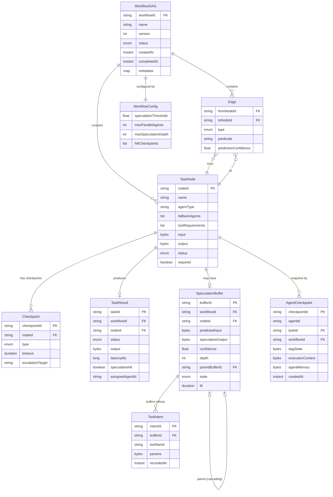
```mermaid
erDiagram
    WorkflowDAG ||--o{ TaskNode : contains
    WorkflowDAG ||--o{ Edge : contains
    WorkflowDAG ||--|| WorkflowConfig : "configured by"
    TaskNode ||--o{ Checkpoint : "has checkpoints"
    TaskNode ||--o| TaskResult : produces
    TaskNode ||--o| SpeculationBuffer : "may have"
    TaskNode ||--o{ AgentCheckpoint : "snapshot by"
    Edge }o--|| TaskNode : "from"
    Edge }o--|| TaskNode : "to"
    SpeculationBuffer ||--o{ ToolIntent : "buffers effects"
    SpeculationBuffer |o--o| SpeculationBuffer : "parent (cascading)"

    WorkflowDAG {
        string workflowId PK
        string name
        int version
        enum status
        instant createdAt
        instant completedAt
        map metadata
    }

    TaskNode {
        string nodeId PK
        string name
        string agentType
        list fallbackAgents
        list toolRequirements
        bytes input
        bytes output
        enum status
        boolean required
    }

    Edge {
        string fromNodeId FK
        string toNodeId FK
        enum type
        string predicate
        float predictionConfidence
    }

    SpeculationBuffer {
        string bufferId PK
        string workflowId FK
        string nodeId FK
        bytes predictedInput
        bytes speculativeOutput
        float confidence
        int depth
        string parentBufferId FK
        enum state
        duration ttl
    }

    AgentCheckpoint {
        string checkpointId PK
        string agentId
        string taskId FK
        string workflowId FK
        bytes dagState
        bytes executionContext
        bytes agentMemory
        instant createdAt
    }

    TaskResult {
        string taskId PK
        string workflowId FK
        string nodeId FK
        enum status
        bytes output
        long latencyMs
        boolean speculativeHit
        string assignedAgentId
    }

    Checkpoint {
        string checkpointId PK
        string nodeId FK
        enum type
        duration timeout
        string escalationTarget
    }

    ToolIntent {
        string intentId PK
        string bufferId FK
        string toolName
        bytes params
        instant recordedAt
    }

    WorkflowConfig {
        float speculationThreshold
        int maxParallelAgents
        int maxSpeculationDepth
        list hitlCheckpoints
    }
```

### 2.3 State Machines

#### Workflow Lifecycle

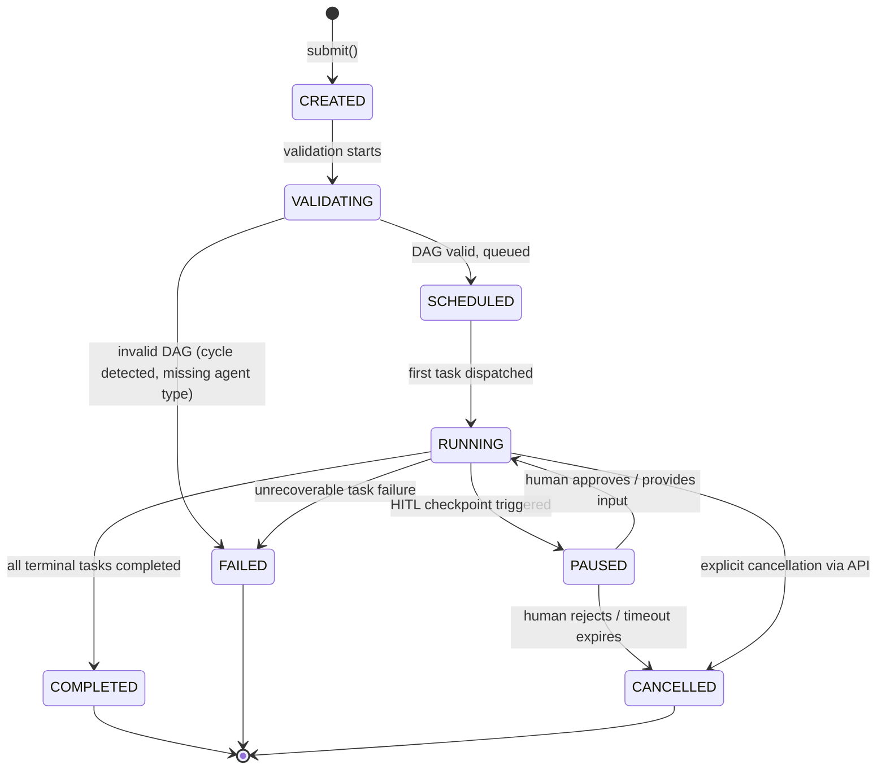
```mermaid
stateDiagram-v2
    [*] --> CREATED : submit()
    CREATED --> VALIDATING : validation starts
    VALIDATING --> SCHEDULED : DAG valid, queued
    VALIDATING --> FAILED : invalid DAG (cycle detected, missing agent type)
    SCHEDULED --> RUNNING : first task dispatched
    RUNNING --> COMPLETED : all terminal tasks completed
    RUNNING --> FAILED : unrecoverable task failure
    RUNNING --> PAUSED : HITL checkpoint triggered
    PAUSED --> RUNNING : human approves / provides input
    PAUSED --> CANCELLED : human rejects / timeout expires
    RUNNING --> CANCELLED : explicit cancellation via API
    COMPLETED --> [*]
    FAILED --> [*]
    CANCELLED --> [*]
```

#### Task Lifecycle

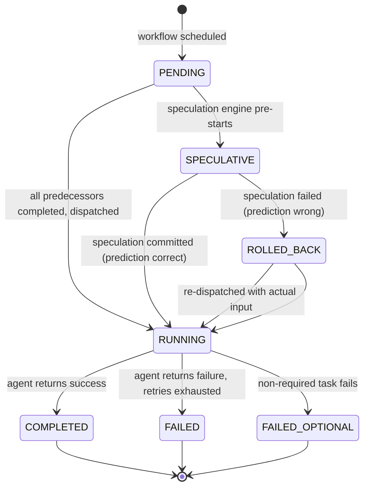
```mermaid
stateDiagram-v2
    [*] --> PENDING : workflow scheduled
    PENDING --> SPECULATIVE : speculation engine pre-starts
    PENDING --> RUNNING : all predecessors completed, dispatched
    SPECULATIVE --> RUNNING : speculation committed (prediction correct)
    SPECULATIVE --> ROLLED_BACK : speculation failed (prediction wrong)
    ROLLED_BACK --> RUNNING : re-dispatched with actual input
    RUNNING --> COMPLETED : agent returns success
    RUNNING --> FAILED : agent returns failure, retries exhausted
    RUNNING --> FAILED_OPTIONAL : non-required task fails
    COMPLETED --> [*]
    FAILED --> [*]
    FAILED_OPTIONAL --> [*]
    ROLLED_BACK --> RUNNING
```

#### Speculation Buffer Lifecycle

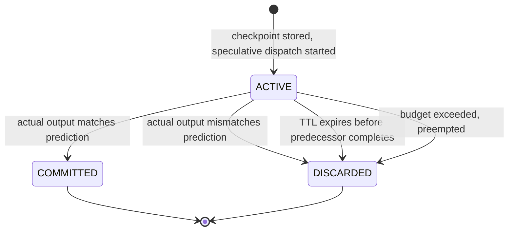
```mermaid
stateDiagram-v2
    [*] --> ACTIVE : checkpoint stored, speculative dispatch started
    ACTIVE --> COMMITTED : actual output matches prediction
    ACTIVE --> DISCARDED : actual output mismatches prediction
    ACTIVE --> DISCARDED : TTL expires before predecessor completes
    ACTIVE --> DISCARDED : budget exceeded, preempted
    COMMITTED --> [*]
    DISCARDED --> [*]
```

---

## Step 3: Back-of-the-Envelope Estimates

### Scenario: Enterprise AI Workflow Platform

An internal automation system processing multi-agent AI workflows — research pipelines, content generation with editorial review, and tool-augmented analysis tasks.

### Traffic Estimates

| Metric | Value | Derivation |
|---|---|---|
| Concurrent active workflows | 1,000 | Platform capacity target |
| Average tasks per DAG | 8 | Typical pipeline: research → enrich → analyze → fact-check → summarize → review → format → deliver |
| Speculative tasks per workflow | \~3 | 30% overhead: \~3 speculative pre-starts per 8-task DAG (top 3 highest-confidence branches) |
| Total task executions per workflow | \~11 | 8 real + 3 speculative |
| Workflows submitted per minute | 1,000 | \~17 workflows/sec |
| Task dispatches per second | **\~187** | 17 workflows/sec x 11 tasks/workflow |
| Average task latency | 5 seconds | LLM inference + tool calls + network |

### Speculation Cost-Benefit

| Metric | Value | Derivation |
|---|---|---|
| Speculative overhead | 30% extra tasks | 3 speculative out of 11 total |
| Speculation hit rate | \~70-85% | Historical benchmark; calibrated predictor |
| Misprediction waste (worst case) | 30% x 30% = **9%** | 30% speculative x 30% miss rate |
| Net latency reduction | **\~40%** | Sequential 8-task pipeline: 40s. With speculation: \~24s on critical path |

### Event Throughput (Kafka)

| Metric | Value | Derivation |
|---|---|---|
| Lifecycle events per task | 4 | CREATED → STARTED → COMPLETED/FAILED → COMMITTED/ROLLED_BACK |
| Events per second | **\~750** | 187 tasks/sec x 4 events/task |
| Average event size | 1 KB | Protobuf-serialized task lifecycle event |
| Kafka throughput | \~750 KB/sec | Well within single-partition capacity |
| 7-day retention | **\~450 GB** | 750 events/sec x 1 KB x 86,400 sec/day x 7 days |

### Memory Footprint (Redis)

| Component | Calculation | Size |
|---|---|---|
| Agent checkpoints | 1K workflows x 11 tasks x 10 KB/checkpoint | **110 MB** |
| Speculation buffers | 1K workflows x 3 speculative x 50 KB/buffer | **150 MB** |
| DAG execution context | 1K workflows x 5 KB/context | **5 MB** |
| **Total Redis memory** | | **\~265 MB** |

Redis 7 with 1 GB allocation provides comfortable headroom. Speculation buffers carry TTLs (default 5 minutes), so memory is self-regulating — expired buffers are evicted automatically.

### Latency Breakdown

**Sequential execution (baseline):**

```
Task 1 (5s) → Task 2 (5s) → Task 3 (5s) → ... → Task 8 (5s) = 40s total
```

**With speculative execution (AgentForge):**

```
Critical path with 80% hit rate:
- Task 1 executes (5s)
- Tasks 2, 3 pre-started speculatively while Task 1 runs
- On Task 1 completion: Task 2 already 80% done (hit) → commits in \~1s
- Cascading: Task 3 was speculative on Task 2's prediction
  - Effective confidence: 0.8² = 0.64 → below threshold, Task 3 waits
- Remaining tasks: some speculated, some sequential
- Effective critical path: \~24s (40% reduction)
```

**Latency budget per task:**

| Phase | Time | Notes |
|---|---|---|
| Queue wait | 50-200 ms | Agent pool dispatch + capability matching |
| Prediction inference | 100-200 ms | OutcomePredictor (LLM-mini or statistical) |
| Agent execution | 3-8 sec | LLM inference + MCP tool calls |
| Kafka event publish | 5-20 ms | Async, batched producer |
| Redis checkpoint write | 2-10 ms | Pipeline write, RedisJSON |
| Speculation validation | 10-50 ms | Output comparison (exact/embedding similarity) |

---

## Step 4: High-Level System Design

### 4.1 Unscaled Design (Why It Fails)

The naive approach: a single orchestrator processes workflows sequentially, dispatching one task at a time and blocking until the result arrives before dispatching the next.

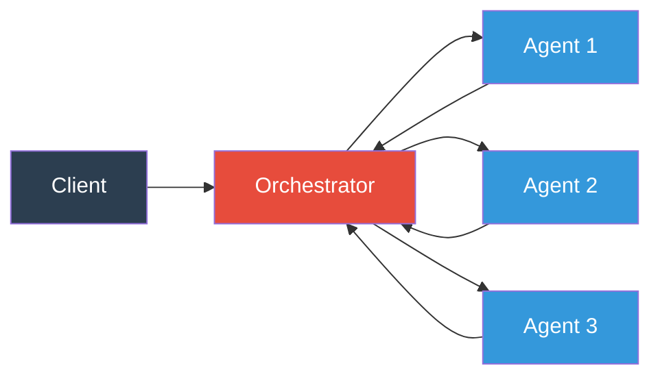
```mermaid
graph LR
    Client[Client] --> ORC[Orchestrator]
    ORC --> A1[Agent 1]
    A1 --> ORC
    ORC --> A2[Agent 2]
    A2 --> ORC
    ORC --> A3[Agent 3]
    A3 --> ORC

    style Client fill:#2C3E50,color:#fff
    style ORC fill:#E74C3C,color:#fff
    style A1 fill:#3498DB,color:#fff
    style A2 fill:#3498DB,color:#fff
    style A3 fill:#3498DB,color:#fff
```

**Why it fails:**

- **No parallelism.** Total latency = sum of all task latencies. An 8-task pipeline at 5s/task costs 40 seconds.
- **No prediction.** Every task blocks on its predecessor, even when the predecessor's output is highly predictable.
- **No fault tolerance.** Orchestrator crash loses all in-flight workflow state. No recovery without replay from scratch.
- **No observability.** Synchronous request-response provides no event stream for dashboards or audit.
- **Single point of failure.** One orchestrator handles all workflows; overload or crash halts the entire platform.

### 4.2 Scaled Design

The production architecture introduces four horizontal layers: API, Orchestration, Agent, and Infrastructure. Speculative execution, event-driven communication, and state externalization transform the sequential bottleneck into a parallel, fault-tolerant pipeline.

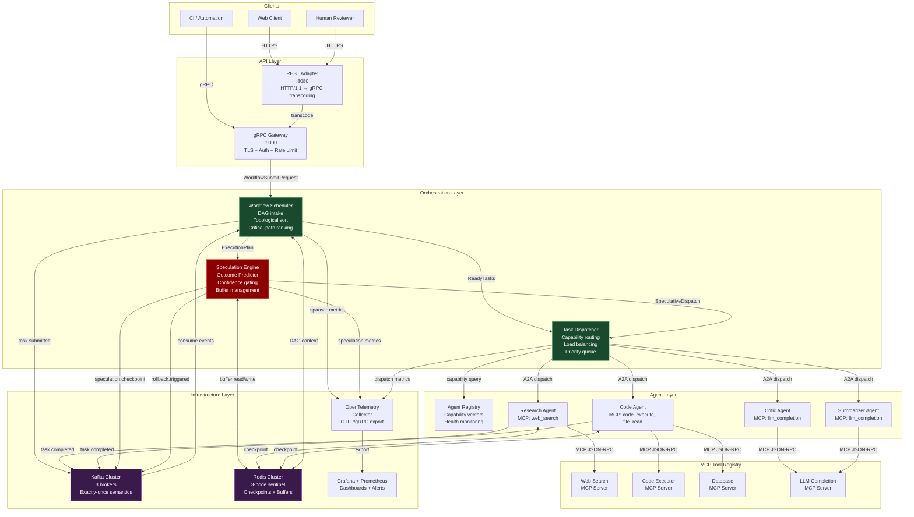
```mermaid
graph TB
    subgraph Clients["Clients"]
        C1[Web Client]
        C2[CI / Automation]
        C3[Human Reviewer]
    end

    subgraph API["API Layer"]
        GW_GRPC["gRPC Gateway\n:9090\nTLS + Auth + Rate Limit"]
        GW_REST["REST Adapter\n:8080\nHTTP/1.1 → gRPC transcoding"]
    end

    subgraph Orchestration["Orchestration Layer"]
        WS["Workflow Scheduler\nDAG intake\nTopological sort\nCritical-path ranking"]
        SE["Speculation Engine\nOutcome Predictor\nConfidence gating\nBuffer management"]
        TD["Task Dispatcher\nCapability routing\nLoad balancing\nPriority queue"]
    end

    subgraph Agents["Agent Layer"]
        AR["Agent Registry\nCapability vectors\nHealth monitoring"]
        A1["Research Agent\nMCP: web_search"]
        A2["Code Agent\nMCP: code_execute, file_read"]
        A3["Critic Agent\nMCP: llm_completion"]
        A4["Summarizer Agent\nMCP: llm_completion"]
    end

    subgraph Tools["MCP Tool Registry"]
        T1["Web Search\nMCP Server"]
        T2["Code Executor\nMCP Server"]
        T3["Database\nMCP Server"]
        T4["LLM Completion\nMCP Server"]
    end

    subgraph Infra["Infrastructure Layer"]
        KAFKA["Kafka Cluster\n3 brokers\nExactly-once semantics"]
        REDIS["Redis Cluster\n3-node sentinel\nCheckpoints + Buffers"]
        OTEL["OpenTelemetry\nCollector\nOTLP/gRPC export"]
        GRAFANA["Grafana + Prometheus\nDashboards + Alerts"]
    end

    C1 -->|HTTPS| GW_REST
    C2 -->|gRPC| GW_GRPC
    C3 -->|HTTPS| GW_REST
    GW_REST -->|transcode| GW_GRPC
    GW_GRPC -->|WorkflowSubmitRequest| WS

    WS -->|ExecutionPlan| SE
    WS -->|ReadyTasks| TD
    SE -->|SpeculativeDispatch| TD
    SE <-->|buffer read/write| REDIS

    TD -->|capability query| AR
    TD -->|A2A dispatch| A1
    TD -->|A2A dispatch| A2
    TD -->|A2A dispatch| A3
    TD -->|A2A dispatch| A4

    A1 -->|MCP JSON-RPC| T1
    A2 -->|MCP JSON-RPC| T2
    A2 -->|MCP JSON-RPC| T3
    A3 -->|MCP JSON-RPC| T4
    A4 -->|MCP JSON-RPC| T4

    WS -->|task.submitted| KAFKA
    A1 -->|task.completed| KAFKA
    A2 -->|task.completed| KAFKA
    KAFKA -->|consume events| WS
    SE -->|speculation.checkpoint| KAFKA
    SE -->|rollback.triggered| KAFKA

    A1 <-->|checkpoint| REDIS
    A2 <-->|checkpoint| REDIS
    WS <-->|DAG context| REDIS

    WS -->|spans + metrics| OTEL
    SE -->|speculation metrics| OTEL
    TD -->|dispatch metrics| OTEL
    OTEL -->|export| GRAFANA

    style WS fill:#1a4a2e,stroke:#4aaa6e,color:#fff
    style SE fill:#8B0000,stroke:#FF4444,color:#fff
    style TD fill:#1a4a2e,stroke:#4aaa6e,color:#fff
    style KAFKA fill:#3a1a4a,stroke:#9a4ad9,color:#fff
    style REDIS fill:#3a1a4a,stroke:#9a4ad9,color:#fff
```

**Why this works:**

1. **Speculation Engine** predicts task outputs and pre-starts dependents, converting sequential latency into parallel execution with bounded rollback cost.
2. **Kafka exactly-once** ensures no task is executed twice and no event is lost, even under broker failover or agent crash.
3. **Redis state externalization** decouples workflow state from orchestrator process memory, enabling crash recovery by replaying from the last checkpoint.
4. **Agent capability routing** matches tasks to the best-fit agent, with circuit breaker fallback to prevent cascading failures.
5. **OpenTelemetry instrumentation** provides end-to-end distributed traces across the full speculation lifecycle.

### 4.3 Request Flow (Happy Path)

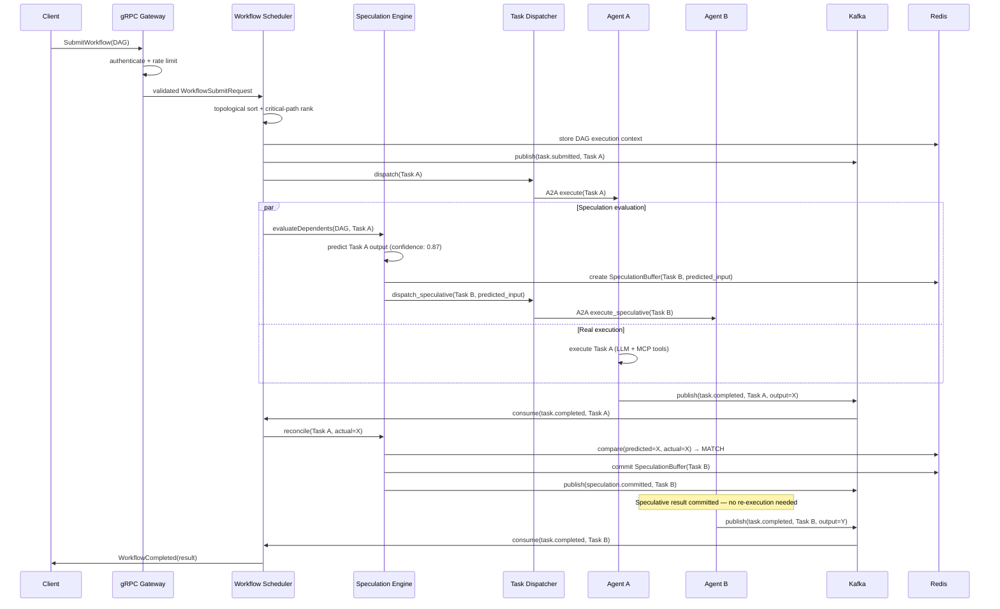
```mermaid
sequenceDiagram
    participant C as Client
    participant GW as gRPC Gateway
    participant WS as Workflow Scheduler
    participant SE as Speculation Engine
    participant TD as Task Dispatcher
    participant A1 as Agent A
    participant A2 as Agent B
    participant K as Kafka
    participant R as Redis

    C->>GW: SubmitWorkflow(DAG)
    GW->>GW: authenticate + rate limit
    GW->>WS: validated WorkflowSubmitRequest

    WS->>WS: topological sort + critical-path rank
    WS->>R: store DAG execution context
    WS->>K: publish(task.submitted, Task A)
    WS->>TD: dispatch(Task A)
    TD->>A1: A2A execute(Task A)

    par Speculation evaluation
        WS->>SE: evaluateDependents(DAG, Task A)
        SE->>SE: predict Task A output (confidence: 0.87)
        SE->>R: create SpeculationBuffer(Task B, predicted_input)
        SE->>TD: dispatch_speculative(Task B, predicted_input)
        TD->>A2: A2A execute_speculative(Task B)
    and Real execution
        A1->>A1: execute Task A (LLM + MCP tools)
    end

    A1->>K: publish(task.completed, Task A, output=X)
    K->>WS: consume(task.completed, Task A)
    WS->>SE: reconcile(Task A, actual=X)
    SE->>R: compare(predicted=X, actual=X) → MATCH
    SE->>R: commit SpeculationBuffer(Task B)
    SE->>K: publish(speculation.committed, Task B)

    Note over A2: Speculative result committed — no re-execution needed

    A2->>K: publish(task.completed, Task B, output=Y)
    K->>WS: consume(task.completed, Task B)
    WS->>C: WorkflowCompleted(result)
```

---

## Step 5: Design Components in Detail

### Deep Dive: Speculative Execution Engine

This is the defining innovation of AgentForge. The Speculation Engine transforms sequential agent pipelines into speculative parallel pipelines by predicting task outputs and pre-starting dependent agents before their predecessors finish.

### 5.1 CPU Branch Prediction Analogy

The design is a direct structural analog of speculative execution in modern out-of-order CPUs:

| CPU Concept | AgentForge Equivalent |
|---|---|
| Branch instruction | Predecessor task whose output determines successor input |
| Branch predictor (BTB/BHT) | OutcomePredictor (hybrid LLM + statistical classifier) |
| Reorder buffer | SpeculationBuffer in Redis |
| Pipeline flush on mispredict | RollbackCoordinator discards buffered effects, restores checkpoint |
| Architectural commit | Buffered side effects replayed to real state |
| Speculation depth limit | Cascading confidence decay: confidence^depth |
| Branch penalty | Rollback cost: checkpoint restore + re-execution + wasted compute |

Where the CPU speculates on *instruction-level branches*, AgentForge speculates on *task-level outputs*. The net effect is identical: on well-predicted branches, execution proceeds at near-zero branch penalty. The cost of misprediction is bounded and recoverable.

### 5.2 Architecture of the Speculation Engine

The engine is composed of six internal components:

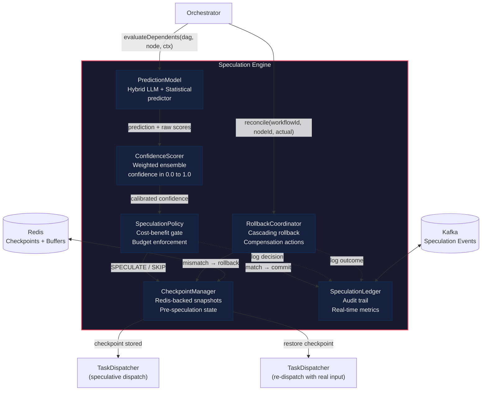
```mermaid
graph TB
    subgraph SpeculationEngine["Speculation Engine"]
        PM["PredictionModel\nHybrid LLM + Statistical\npredictor"]
        CS["ConfidenceScorer\nWeighted ensemble\nconfidence in 0.0 to 1.0"]
        SP["SpeculationPolicy\nCost-benefit gate\nBudget enforcement"]
        CM["CheckpointManager\nRedis-backed snapshots\nPre-speculation state"]
        RC["RollbackCoordinator\nCascading rollback\nCompensation actions"]
        SL["SpeculationLedger\nAudit trail\nReal-time metrics"]
    end

    ORC["Orchestrator"] -->|"evaluateDependents(dag, node, ctx)"| PM
    PM -->|"prediction + raw scores"| CS
    CS -->|"calibrated confidence"| SP
    SP -->|"SPECULATE / SKIP"| CM
    CM -->|"checkpoint stored"| DISPATCH["TaskDispatcher\n(speculative dispatch)"]

    ORC -->|"reconcile(workflowId, nodeId, actual)"| RC
    RC -->|"match → commit"| SL
    RC -->|"mismatch → rollback"| CM
    CM -->|"restore checkpoint"| REDISPATCH["TaskDispatcher\n(re-dispatch with real input)"]

    SP -.->|"log decision"| SL
    RC -.->|"log outcome"| SL

    REDIS[("Redis\nCheckpoints + Buffers")] <--> CM
    KAFKA[("Kafka\nSpeculation Events")] <--> SL

    style SpeculationEngine fill:#1a1a2e,stroke:#e94560,stroke-width:2px,color:#eee
    style PM fill:#16213e,stroke:#0f3460,color:#eee
    style CS fill:#16213e,stroke:#0f3460,color:#eee
    style SP fill:#16213e,stroke:#0f3460,color:#eee
    style CM fill:#16213e,stroke:#0f3460,color:#eee
    style RC fill:#16213e,stroke:#0f3460,color:#eee
    style SL fill:#16213e,stroke:#0f3460,color:#eee
```

| Component | Input | Output | Backing Store |
|---|---|---|---|
| **PredictionModel** | Task input, execution context, DAG position | Predicted output + raw scores | Model weights in memory; historical data in Redis |
| **ConfidenceScorer** | Raw scores, task type, historical accuracy | Calibrated confidence in [0.0, 1.0] | Accuracy statistics in Redis |
| **SpeculationPolicy** | Confidence, estimated savings, rollback cost | Boolean: speculate or skip | Policy config |
| **CheckpointManager** | Agent state, DAG context | Checkpoint ID (opaque handle) | Redis with TTL |
| **RollbackCoordinator** | Actual vs. predicted result | Commit or rollback + cascade | Reads checkpoints from Redis |
| **SpeculationLedger** | All decisions, predictions, outcomes | Structured audit log + metrics | Kafka topic `speculation.audit` |

### 5.3 OutcomePredictor

The predictor uses two strategies, selected per task type:

**Strategy 1: LLM-based prediction (semantic tasks).** A fine-tuned classifier (GPT-4o-mini by default) receives a structured prompt with the task description, predecessor input, and few-shot examples drawn from the nearest historical executions by embedding cosine similarity. Returns a predicted output category and self-reported confidence logprob. Used for tasks with semantic variability: summarization routing, intent classification, content categorization.

**Strategy 2: Statistical prediction (deterministic tasks).** A frequency-weighted histogram over historical outputs for the (workflow-type, node-position, input-hash-bucket) triple. The most frequent output is selected; confidence = frequency ratio. Used for tasks with low semantic variability: format conversions, schema mappings, fixed routing rules.

**Confidence calibration.** The ConfidenceScorer combines raw scores into a calibrated value:

```
confidence = w_llm * llmConfidence + w_hist * historicalAccuracy + w_sim * inputSimilarity
```

Where `w_llm`, `w_hist`, `w_sim` are tuned per workflow type via Bayesian optimization (defaults: 0.5, 0.3, 0.2). Platt scaling ensures that reported confidence of 0.85 corresponds to actual 85% prediction accuracy.

### 5.4 Confidence Gating

The SpeculationPolicy makes a binary speculate/skip decision using a cost-benefit inequality:

```
speculate if: confidence x savingsOnHit > (1 - confidence) x rollbackCost
```

Rearranging, the minimum confidence threshold:

```
threshold = rollbackCost / (savingsOnHit + rollbackCost)
```

For a task with `savingsOnHit = 2s` and `rollbackCost = 2.5s`, the threshold is `2.5 / 4.5 = 0.556`. A **floor threshold of 0.65** is enforced regardless of the cost-benefit result. The floor is dynamically adjusted: if rolling hit rate (exponential moving average, alpha=0.1) drops below 0.60, the floor increases by 0.05 per evaluation cycle until recovery.

**Budget enforcement:** At most `maxConcurrentSpeculations` (default: 8) may be active simultaneously per orchestrator pod. This bounds speculative resource waste to a configurable fraction of total compute.

### 5.5 Cascading Confidence Decay

For chains of speculative tasks, effective confidence decays exponentially with depth:

```
effectiveConfidence(depth) = baseConfidence ^ (depth + 1)
```

| Depth | Base Confidence 0.85 | Base Confidence 0.80 | Base Confidence 0.70 |
|---|---|---|---|
| 0 (first-level) | 0.850 | 0.800 | 0.700 |
| 1 (cascading) | 0.722 | 0.640 | 0.490 |
| 2 (deep cascade) | 0.614 | 0.512 | 0.343 |
| 3 (max depth) | 0.522 | 0.410 | 0.240 |

With a confidence floor of 0.65, even an 85%-confident prediction stops cascading at depth 2 (0.614 < 0.65). This naturally prevents runaway speculative pre-starts deep in nested conditional trees. The **maximum speculation depth is 3** (configurable), enforced as a hard limit regardless of confidence.

### 5.6 Speculation Buffer and Side Effect Isolation

The SpeculationBuffer in Redis stores the speculative execution's intermediate state with a TTL (default: 5 minutes). On predecessor completion, one of two paths executes:

**Commit path (prediction correct):**
1. Actual output matches prediction (exact match for categorical; embedding similarity > 0.92 for free-text).
2. BufferedMCPClient replays all buffered write-side-effects to real endpoints.
3. Cascading speculations rooted at this node are promoted from speculative to committed.
4. Checkpoint deleted from Redis. Ledger records HIT.

**Rollback path (prediction incorrect):**
1. Actual output differs from prediction.
2. BufferedMCPClient's write buffer is cleared without replay — no external effects leak.
3. CheckpointManager restores pre-speculation DAG state, execution context, and agent memory.
4. Cascading speculations rolled back recursively in reverse topological order.
5. Task re-dispatched with actual input in non-speculative mode.
6. Ledger records MISS with prediction delta for predictor retraining.

**Side effect isolation tiers:**

| Tier | Effect Type | Isolation Strategy |
|---|---|---|
| Tier 1: Pure computation | LLM inference, embeddings, in-memory transforms | No isolation needed; discard on cancel |
| Tier 2: MCP tool calls | DB writes, API calls, file operations | BufferedMCPClient intercepts writes; read-only calls pass through |
| Tier 3: A2A delegation | Sub-task delegation to other agents | `speculation-id` header propagates; delegated agents buffer their own effects |

### 5.7 Critical-Path Optimization

The Workflow Scheduler performs topological sort and identifies the **longest path** (critical path) in the DAG. Speculation is prioritized on critical-path tasks because those yield the maximum latency reduction:

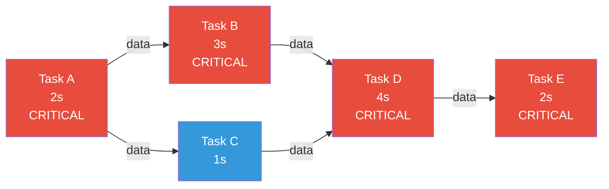
```mermaid
graph LR
    A["Task A\n2s\nCRITICAL"] -->|data| B["Task B\n3s\nCRITICAL"]
    A -->|data| C["Task C\n1s"]
    B -->|data| D["Task D\n4s\nCRITICAL"]
    C -->|data| D
    D -->|data| E["Task E\n2s\nCRITICAL"]

    style A fill:#E74C3C,color:#fff
    style B fill:#E74C3C,color:#fff
    style C fill:#3498DB,color:#fff
    style D fill:#E74C3C,color:#fff
    style E fill:#E74C3C,color:#fff
```

Critical path: A → B → D → E = 11s. Speculating on B and D (the two critical-path successors) reduces the critical path by up to 7s (the combined latency of B and D, minus prediction overhead). Task C is off the critical path; speculating on it provides no latency benefit even if correct.

### 5.8 Speculation Hit vs. Miss: Sequence Diagrams

**Speculation Hit (commit):**

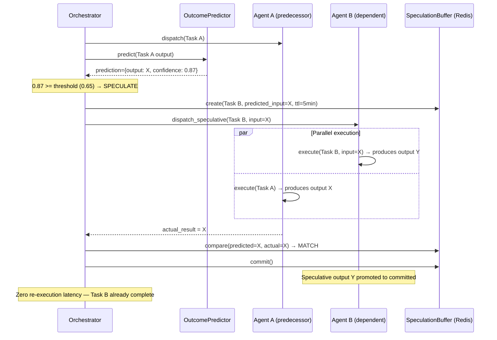
```mermaid
sequenceDiagram
    participant ORC as Orchestrator
    participant PRED as OutcomePredictor
    participant A1 as Agent A (predecessor)
    participant A2 as Agent B (dependent)
    participant BUF as SpeculationBuffer (Redis)

    ORC->>A1: dispatch(Task A)
    ORC->>PRED: predict(Task A output)
    PRED-->>ORC: prediction={output: X, confidence: 0.87}

    Note over ORC: 0.87 >= threshold (0.65) → SPECULATE

    ORC->>BUF: create(Task B, predicted_input=X, ttl=5min)
    ORC->>A2: dispatch_speculative(Task B, input=X)

    par Parallel execution
        A2->>A2: execute(Task B, input=X) → produces output Y
    and
        A1->>A1: execute(Task A) → produces output X
    end

    A1-->>ORC: actual_result = X
    ORC->>BUF: compare(predicted=X, actual=X) → MATCH
    ORC->>BUF: commit()

    Note over A2: Speculative output Y promoted to committed
    Note over ORC: Zero re-execution latency — Task B already complete
```

**Speculation Miss (rollback):**

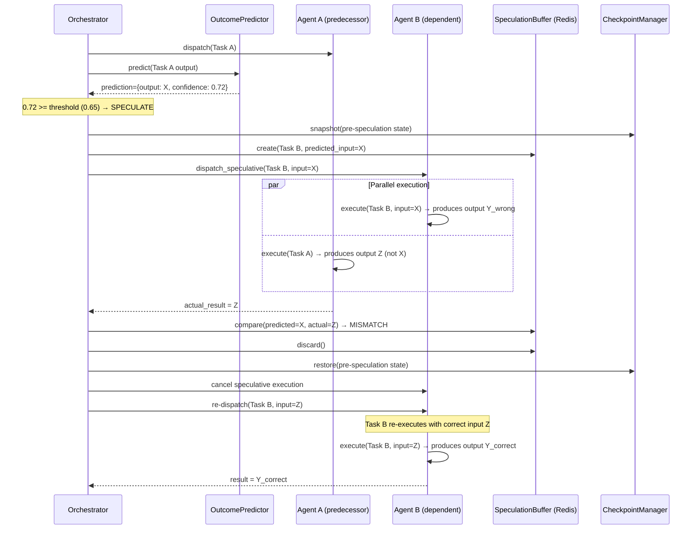
```mermaid
sequenceDiagram
    participant ORC as Orchestrator
    participant PRED as OutcomePredictor
    participant A1 as Agent A (predecessor)
    participant A2 as Agent B (dependent)
    participant BUF as SpeculationBuffer (Redis)
    participant CP as CheckpointManager

    ORC->>A1: dispatch(Task A)
    ORC->>PRED: predict(Task A output)
    PRED-->>ORC: prediction={output: X, confidence: 0.72}

    Note over ORC: 0.72 >= threshold (0.65) → SPECULATE

    ORC->>CP: snapshot(pre-speculation state)
    ORC->>BUF: create(Task B, predicted_input=X)
    ORC->>A2: dispatch_speculative(Task B, input=X)

    par Parallel execution
        A2->>A2: execute(Task B, input=X) → produces output Y_wrong
    and
        A1->>A1: execute(Task A) → produces output Z (not X)
    end

    A1-->>ORC: actual_result = Z
    ORC->>BUF: compare(predicted=X, actual=Z) → MISMATCH
    ORC->>BUF: discard()
    ORC->>CP: restore(pre-speculation state)
    ORC->>A2: cancel speculative execution
    ORC->>A2: re-dispatch(Task B, input=Z)

    Note over A2: Task B re-executes with correct input Z
    A2->>A2: execute(Task B, input=Z) → produces output Y_correct
    A2-->>ORC: result = Y_correct
```

### 5.9 DAG with Speculative vs. Committed Tasks

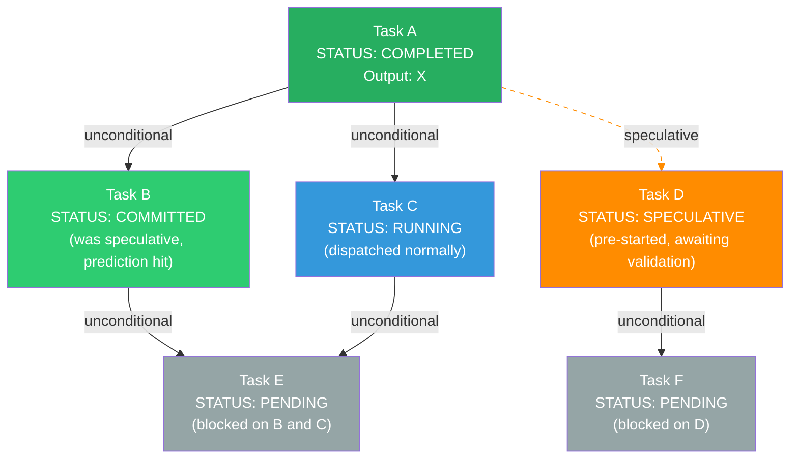
```mermaid
graph TD
    A["Task A\nSTATUS: COMPLETED\nOutput: X"] -->|unconditional| B["Task B\nSTATUS: COMMITTED\n(was speculative, prediction hit)"]
    A -->|unconditional| C["Task C\nSTATUS: RUNNING\n(dispatched normally)"]
    A -.->|speculative| D["Task D\nSTATUS: SPECULATIVE\n(pre-started, awaiting validation)"]
    B -->|unconditional| E["Task E\nSTATUS: PENDING\n(blocked on B and C)"]
    C -->|unconditional| E
    D -->|unconditional| F["Task F\nSTATUS: PENDING\n(blocked on D)"]

    style A fill:#27AE60,color:#fff
    style B fill:#2ECC71,color:#fff
    style C fill:#3498DB,color:#fff
    style D fill:#FF8C00,color:#fff
    style E fill:#95A5A6,color:#fff
    style F fill:#95A5A6,color:#fff
    linkStyle 2 stroke:#FF8C00,stroke-dasharray:5 5
```

**Legend:**
- Green: Completed / Committed (speculation hit)
- Blue: Running (normal execution)
- Orange: Speculative (pre-started, awaiting validation)
- Gray: Pending (blocked on predecessors)
- Dashed orange edge: Speculative dependency

---

## Step 6: Service Definitions, APIs, Interfaces

### 6.1 WorkflowService (gRPC — external-facing)

The primary entry point for workflow lifecycle management. Exposed through the gRPC Gateway with TLS, authentication, and rate limiting.

```protobuf
service WorkflowService {
    // Submit a new workflow DAG for execution
    rpc Submit(SubmitWorkflowRequest) returns (SubmitWorkflowResponse);

    // Query workflow execution status and progress
    rpc GetStatus(WorkflowStatusRequest) returns (WorkflowStatusResponse);

    // Cancel a running or paused workflow
    rpc Cancel(CancelWorkflowRequest) returns (CancelWorkflowResponse);

    // Stream real-time workflow events (completions, speculation decisions, checkpoints)
    rpc StreamEvents(StreamEventsRequest) returns (stream WorkflowEvent);
}

message SubmitWorkflowRequest {
    string workflow_name = 1;           // references a published WorkflowDefinition
    int32 version = 2;                  // 0 = latest version
    bytes input = 3;                    // serialized workflow input
    WorkflowConfig config = 4;         // runtime configuration overrides
    map<string, string> metadata = 5;  // user-defined tags
}

message SubmitWorkflowResponse {
    string workflow_id = 1;            // assigned ULID
    string status = 2;                 // CREATED | VALIDATING | SCHEDULED
    int32 dag_node_count = 3;
    int32 speculative_branches = 4;    // predicted speculative pre-starts
    int64 estimated_latency_ms = 5;    // estimated based on critical path + speculation
}

message WorkflowConfig {
    float speculation_threshold = 1;    // min confidence for speculation (default: 0.65)
    int32 max_parallel_agents = 2;      // concurrent agent limit
    int32 max_speculation_depth = 3;    // cascading depth limit (default: 3)
    repeated string hitl_checkpoints = 4; // checkpoint IDs requiring human review
}

message WorkflowStatusResponse {
    string workflow_id = 1;
    string status = 2;
    int64 elapsed_ms = 3;
    WorkflowProgress progress = 4;
    SpeculationMetrics speculation_metrics = 5;
    repeated TaskStatus task_statuses = 6;
}

message SpeculationMetrics {
    float hit_rate = 1;                // speculation hits / total speculations
    int32 total_speculations = 2;
    int32 hits = 3;
    int32 misses = 4;
    int64 estimated_time_saved_ms = 5; // cumulative latency saved by successful speculations
}
```

### 6.2 TaskService (gRPC — internal)

Internal service for task lifecycle management between the Orchestrator and Agent pool.

```protobuf
service TaskService {
    // Dispatch a task to the agent pool (real or speculative)
    rpc Dispatch(DispatchTaskRequest) returns (DispatchTaskResponse);

    // Report task completion from an agent
    rpc Complete(TaskCompleteRequest) returns (TaskCompleteResponse);

    // Trigger rollback of a speculative task
    rpc Rollback(RollbackTaskRequest) returns (RollbackTaskResponse);

    // Cancel a dispatched task
    rpc Cancel(CancelTaskRequest) returns (CancelTaskResponse);
}

message DispatchTaskRequest {
    string task_id = 1;
    string workflow_id = 2;
    string node_id = 3;
    bytes input = 4;
    CapabilityVector required_capabilities = 5;
    bool is_speculative = 6;
    string speculation_buffer_id = 7;  // set only if is_speculative = true
    int64 deadline_ms = 8;
    int32 priority = 9;               // higher = more urgent; real > speculative
}

message TaskCompleteRequest {
    string task_id = 1;
    string workflow_id = 2;
    string node_id = 3;
    bytes output = 4;
    TaskStatus status = 5;             // SUCCESS | FAILURE | TIMED_OUT
    int64 latency_ms = 6;
    int32 tool_calls_used = 7;
    string assigned_agent_id = 8;
}

message RollbackTaskRequest {
    string task_id = 1;
    string workflow_id = 2;
    string speculation_buffer_id = 3;
    bytes actual_input = 4;            // the real input to re-dispatch with
}
```

### 6.3 SpeculationService (internal — Kotlin interface)

Internal service within the Orchestration layer. Not exposed via gRPC — called directly by the Orchestrator via in-process Kotlin interfaces.

```kotlin
interface SpeculationService {
    /**
     * Evaluate all dependent nodes of a completed/dispatched predecessor.
     * Returns predictions for nodes above the confidence threshold.
     */
    suspend fun evaluateDependents(
        dag: WorkflowDag,
        predecessorNode: DagNode,
        context: ExecutionContext,
    ): List<Prediction>

    /**
     * Reconcile a predecessor's actual result against active speculation buffers.
     * Commits matched speculations, rolls back mismatched ones.
     */
    suspend fun reconcile(
        workflowId: WorkflowId,
        predecessorNodeId: NodeId,
        actualResult: TaskResult,
    ): ReconciliationOutcome

    /**
     * Commit a verified speculation — promote speculative output to committed.
     */
    suspend fun commitSpeculation(bufferId: BufferId): CommitResult

    /**
     * Roll back a mispredicted speculation — discard buffer, restore checkpoint.
     */
    suspend fun rollbackSpeculation(bufferId: BufferId): RollbackResult

    /** Real-time stream of speculation metrics (hit rate, active count, etc.) */
    fun metrics(): Flow<SpeculationMetrics>
}

data class Prediction(
    val nodeId: NodeId,
    val predictedInput: ByteArray,
    val confidence: Double,
    val strategy: PredictionStrategy,   // LLM_BASED | STATISTICAL
    val modelVersion: String,
    val inferenceLatencyMs: Long,
)

data class ReconciliationOutcome(
    val committed: List<NodeId>,        // speculation hits
    val rolledBack: List<NodeId>,       // speculation misses
    val skipped: List<NodeId>,          // below threshold, not speculated
)

enum class PredictionStrategy { LLM_BASED, STATISTICAL }
```

### 6.4 AgentService (gRPC — agent registration and execution)

```protobuf
service AgentService {
    // Register an agent with the orchestrator's agent registry
    rpc Register(AgentRegisterRequest) returns (AgentRegisterResponse);

    // Periodic health check heartbeat
    rpc Heartbeat(AgentHeartbeatRequest) returns (AgentHeartbeatResponse);

    // Execute a task (called by TaskDispatcher via A2A protocol)
    rpc Execute(TaskExecuteRequest) returns (TaskExecuteResponse);

    // Cancel an in-flight task execution
    rpc CancelTask(CancelTaskRequest) returns (CancelTaskResponse);
}

message AgentRegisterRequest {
    string agent_id = 1;
    CapabilityVector capabilities = 2;
    int32 max_concurrent_tasks = 3;
    int32 tool_call_budget_per_task = 4;
    int64 task_timeout_ms = 5;
}

message CapabilityVector {
    repeated string tags = 1;           // e.g., ["web_search", "summarization", "python"]
    repeated float embedding = 2;       // dense capability embedding for similarity matching
}

message TaskExecuteRequest {
    string task_id = 1;
    string workflow_id = 2;
    bytes input = 3;
    bool is_speculative = 4;
    string speculation_buffer_id = 5;
    int64 deadline_ms = 6;
    ExecutionContext context = 7;       // accumulated outputs from completed predecessors
}

message TaskExecuteResponse {
    string task_id = 1;
    TaskOutcome outcome = 2;           // SUCCESS | FAILURE | TIMED_OUT
    bytes output = 3;
    int32 tool_calls_used = 4;
    int64 latency_ms = 5;
}
```

### 6.5 HITLService (gRPC — human-in-the-loop)

```protobuf
service HITLService {
    // Create a checkpoint that pauses workflow execution
    rpc CreateCheckpoint(CreateCheckpointRequest) returns (CreateCheckpointResponse);

    // Approve a paused checkpoint — resume workflow execution
    rpc Approve(ApprovalRequest) returns (ApprovalResponse);

    // Reject a paused checkpoint — cancel the workflow
    rpc Reject(RejectRequest) returns (RejectResponse);

    // Provide structured input at an input-request checkpoint
    rpc ProvideInput(ProvideInputRequest) returns (ProvideInputResponse);

    // List pending checkpoints awaiting human review
    rpc ListPending(ListPendingRequest) returns (ListPendingResponse);
}

message CreateCheckpointRequest {
    string workflow_id = 1;
    string node_id = 2;
    CheckpointType type = 3;           // APPROVAL_GATE | INPUT_REQUEST | REVIEW_POINT
    bytes task_output = 4;             // the output to present for review
    string notification_target = 5;    // email, Slack channel, webhook URL
    int64 timeout_ms = 6;
    string escalation_target = 7;
    int64 escalation_delay_ms = 8;
}

message ApprovalRequest {
    string workflow_id = 1;
    string checkpoint_id = 2;
    string approved_by = 3;            // reviewer identity
    string comment = 4;                // optional review comment
}

message RejectRequest {
    string workflow_id = 1;
    string checkpoint_id = 2;
    string rejected_by = 3;
    string reason = 4;                 // mandatory rejection reason
}

enum CheckpointType {
    APPROVAL_GATE = 0;
    INPUT_REQUEST = 1;
    REVIEW_POINT = 2;
}
```

### 6.6 Kafka Topic Schema

| Topic | Producer | Consumer | Payload | Partitioning |
|---|---|---|---|---|
| `task.submitted` | Workflow Scheduler | Dashboard, Audit | TaskSubmittedEvent (workflowId, nodeId, agentType, isSpeculative) | By workflowId |
| `task.completed` | Agent Runtime | Workflow Scheduler, Speculation Engine | TaskCompletedEvent (workflowId, nodeId, output, latencyMs, speculativeHit) | By workflowId |
| `task.failed` | Agent Runtime | Workflow Scheduler, Alerting | TaskFailedEvent (workflowId, nodeId, errorCode, retriable) | By workflowId |
| `speculation.checkpoint` | Speculation Engine | Audit, Retraining Pipeline | SpeculationCheckpointEvent (bufferId, nodeId, confidence, prediction) | By workflowId |
| `speculation.committed` | Speculation Engine | Dashboard, Audit | SpeculationCommittedEvent (bufferId, nodeId, latencySavedMs) | By workflowId |
| `rollback.triggered` | Speculation Engine | Dashboard, Audit, Alerting | RollbackTriggeredEvent (bufferId, nodeId, predicted, actual, delta) | By workflowId |
| `hitl.approval` | HITL Service | Workflow Scheduler | HITLApprovalEvent (workflowId, checkpointId, approvedBy) | By workflowId |
| `agent.health` | Agent Runtime | Agent Registry, Alerting | AgentHealthEvent (agentId, status, queueDepth, memoryUsage) | By agentId |

All topics use **workflowId-based partitioning** (except `agent.health`) to ensure that all events for a single workflow land in the same partition, preserving ordering guarantees within a workflow's lifecycle.

### 6.7 Redis Key Schema

| Key Pattern | Type | TTL | Purpose |
|---|---|---|---|
| `dag:{workflowId}` | RedisJSON | Workflow lifetime | DAG execution context (node statuses, accumulated outputs) |
| `checkpoint:{checkpointId}` | RedisJSON | 5 min (configurable) | Agent state snapshot for speculation rollback |
| `speculation:{bufferId}` | RedisJSON | 5 min (configurable) | Speculation buffer (predicted input, speculative output, effect ledger) |
| `agent:{agentId}:state` | RedisJSON | Agent lifetime | Agent registration, capability vector, health status |
| `hitl:{checkpointId}` | RedisJSON | Checkpoint timeout | Human-in-the-loop checkpoint state (pending, approved, rejected) |
| `predictor:stats:{workflowType}:{nodePosition}` | Hash | 24 hours | Rolling accuracy statistics for the OutcomePredictor |
| `dispatch:queue:{agentType}` | Sorted Set | Until consumed | Priority queue for tasks awaiting dispatch to a specific agent type |

---

## Step 7: Scaling Problems and Bottlenecks

### 7.1 Misprediction Cascading in Deep DAGs

**Problem.** A wrong prediction at depth 0 wastes all speculative work at depths 1, 2, and 3. In a deep DAG with aggressive speculation, a single misprediction at the root can trigger a cascade of rollbacks, wasting compute proportional to the number of speculative descendants.

**Example:** If Task A's prediction is wrong at depth 0, and Tasks B (depth 1), C (depth 2), and D (depth 3) were all speculatively pre-started, all four tasks must be rolled back. With 5-second average task execution, this wastes up to 20 seconds of agent compute.

**Solution:**

1. **Cascading confidence decay** (`confidence^depth`) naturally limits speculation depth. At base confidence 0.80:
   - Depth 0: 0.80 (above threshold)
   - Depth 1: 0.64 (below 0.65 floor — stops here)
   
   This means most cascades are limited to depth 1 in practice.

2. **Hard depth limit** of 3 (configurable) prevents runaway cascading regardless of confidence.

3. **Early abort on low-confidence predictions.** When a predecessor's actual output arrives, the RollbackCoordinator immediately cancels all downstream speculative tasks before they consume more compute.

4. **Budget cap.** Max 8 concurrent speculations per orchestrator pod bounds the total resource waste from misprediction cascades.

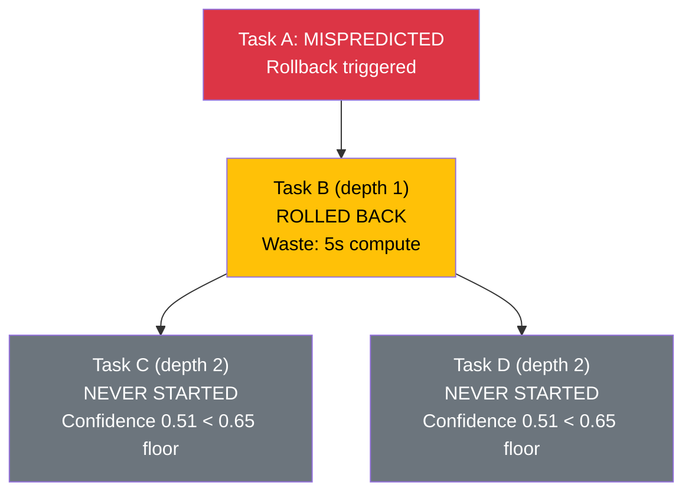
```mermaid
graph TD
    A["Task A: MISPREDICTED\nRollback triggered"] --> B["Task B (depth 1)\nROLLED BACK\nWaste: 5s compute"]
    B --> C["Task C (depth 2)\nNEVER STARTED\nConfidence 0.51 < 0.65 floor"]
    B --> D["Task D (depth 2)\nNEVER STARTED\nConfidence 0.51 < 0.65 floor"]

    style A fill:#DC3545,color:#fff
    style B fill:#FFC107,color:#000
    style C fill:#6C757D,color:#fff
    style D fill:#6C757D,color:#fff
```

**Net impact:** Confidence decay limits the blast radius of mispredictions. Worst-case waste is bounded at `maxConcurrentSpeculations x avgTaskLatency` = 8 x 5s = 40 seconds of agent compute, distributed across the pool.

### 7.2 Redis Speculation Buffer Memory Pressure

**Problem.** Many concurrent workflows with large speculative outputs can exhaust Redis memory. At 1K concurrent workflows x 3 speculations x 50 KB per buffer = 150 MB baseline, but bursty workloads or large payloads (e.g., document generation) could push this to multiple gigabytes.

**Solution:**

1. **TTL-based eviction.** All speculation buffers carry a 5-minute TTL. Expired buffers are automatically evicted by Redis. If a predecessor has not completed within TTL, the speculation is discarded — the orchestrator treats the node as unspeculated and waits for real completion.

2. **LRU for speculation buffers.** Redis `maxmemory-policy` set to `allkeys-lru` with a dedicated Redis instance for speculation state. Under memory pressure, the least-recently-accessed speculation buffers are evicted first — these are the oldest (most likely to have already committed or timed out).

3. **Spill to disk for large outputs.** When speculative output exceeds a configurable size threshold (default: 100 KB), only a reference pointer is stored in Redis; the actual payload is written to a local SSD-backed staging area. On commit, the payload is read from disk and flushed to the real state store.

4. **Per-workflow budget.** Each workflow is allocated a maximum speculation buffer budget (default: 500 KB). If the budget is exceeded, the lowest-confidence speculation is evicted to make room for higher-confidence ones.

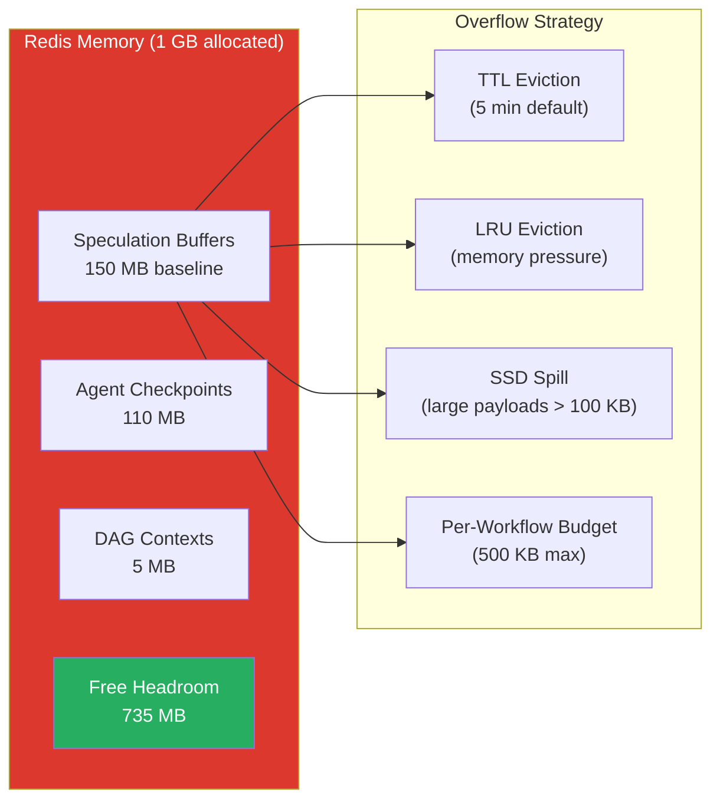
```mermaid
graph LR
    subgraph Redis["Redis Memory (1 GB allocated)"]
        BUF["Speculation Buffers\n150 MB baseline"]
        CP["Agent Checkpoints\n110 MB"]
        DAG["DAG Contexts\n5 MB"]
        FREE["Free Headroom\n735 MB"]
    end

    subgraph Overflow["Overflow Strategy"]
        TTL["TTL Eviction\n(5 min default)"]
        LRU["LRU Eviction\n(memory pressure)"]
        DISK["SSD Spill\n(large payloads > 100 KB)"]
        BUDGET["Per-Workflow Budget\n(500 KB max)"]
    end

    BUF --> TTL
    BUF --> LRU
    BUF --> DISK
    BUF --> BUDGET

    style Redis fill:#DC382D,color:#fff
    style FREE fill:#27AE60,color:#fff
```

### 7.3 Kafka Consumer Lag During Burst

**Problem.** Sudden spike in workflow submissions causes a flood of task lifecycle events. If Kafka consumers (Workflow Scheduler, Speculation Engine) cannot keep up, consumer lag increases, leading to delayed task dispatching and stale speculation decisions.

**Solution:**

1. **Kafka partition scaling.** Key topics (`task.completed`, `task.submitted`) are pre-partitioned with 32 partitions (adjustable). WorkflowId-based partitioning ensures ordering within a workflow while allowing parallel consumption across workflows.

2. **Consumer group auto-rebalance.** Orchestrator pods form a Kafka consumer group. Adding orchestrator pods automatically rebalances partitions across the group, increasing consumption throughput linearly with pod count.

3. **Backpressure propagation.** When consumer lag exceeds a threshold (default: 1,000 events), the Orchestrator signals the gRPC Gateway to activate backpressure:
   - New workflow submissions receive HTTP 429 (Too Many Requests) with a `Retry-After` header.
   - In-flight workflows continue processing; only new submissions are throttled.
   - The Gateway's rate limiter dynamically adjusts the admission rate based on the lag signal.

4. **Priority-based consumption.** Within each partition, events are consumed in priority order: `task.completed` events (unblock downstream tasks) > `speculation.checkpoint` events (audit) > `task.submitted` events (can wait). This ensures that the critical path — unblocking ready tasks — is not delayed by lower-priority events.

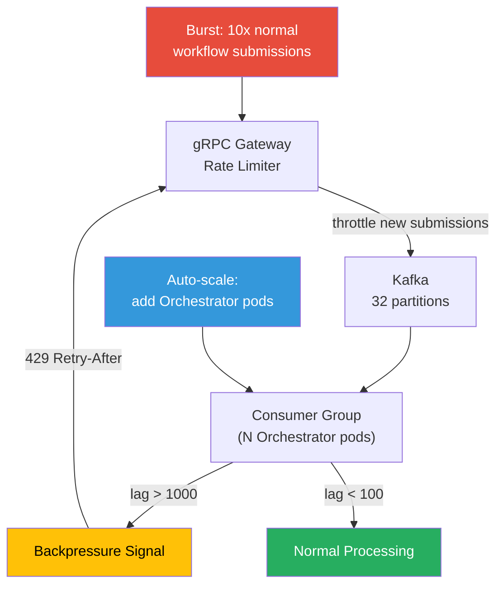
```mermaid
graph TD
    BURST["Burst: 10x normal\nworkflow submissions"] --> GW["gRPC Gateway\nRate Limiter"]
    GW -->|throttle new submissions| KAFKA["Kafka\n32 partitions"]
    KAFKA --> CG["Consumer Group\n(N Orchestrator pods)"]

    CG -->|lag > 1000| BP["Backpressure Signal"]
    BP -->|429 Retry-After| GW

    CG -->|lag < 100| NORMAL["Normal Processing"]

    SCALE["Auto-scale:\nadd Orchestrator pods"] --> CG

    style BURST fill:#E74C3C,color:#fff
    style BP fill:#FFC107,color:#000
    style NORMAL fill:#27AE60,color:#fff
    style SCALE fill:#3498DB,color:#fff
```

### 7.4 Agent Pool Exhaustion

**Problem.** All agents are busy with speculative work, blocking real (committed) tasks. Speculative tasks are lower priority — they might be rolled back — but if they consume all agent capacity, real tasks queue behind them, increasing latency instead of reducing it.

**Solution:**

1. **Agent pool partitioning.** Reserve 70% of agent capacity for committed (real) tasks, 30% for speculative tasks. This is enforced at the TaskDispatcher level via two separate dispatch queues with capacity limits.

2. **Preemption of speculative tasks.** When a real task arrives and the committed pool is at capacity, the dispatcher preempts the lowest-confidence speculative task:
   - The speculative task receives a cooperative cancellation signal.
   - Its checkpoint is preserved in Redis for potential re-speculation later.
   - The real task is dispatched to the freed agent.

3. **Priority queue dispatch.** All task dispatches flow through a priority-sorted queue. Priority ordering:
   - P0: Real tasks on the critical path
   - P1: Real tasks off the critical path
   - P2: Speculative tasks with confidence > 0.85
   - P3: Speculative tasks with confidence 0.65-0.85

4. **Dynamic pool sizing.** When the committed pool utilization exceeds 90% for more than 60 seconds, the orchestrator emits a `pool.pressure` metric. An external autoscaler (Kubernetes HPA) monitors this metric and scales the agent pool horizontally.

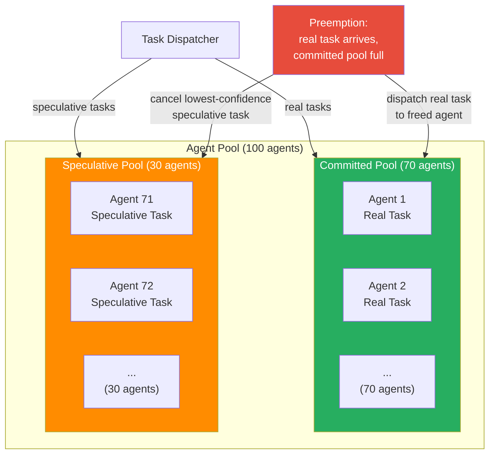
```mermaid
graph TB
    subgraph AgentPool["Agent Pool (100 agents)"]
        subgraph Committed["Committed Pool (70 agents)"]
            CA1["Agent 1\nReal Task"]
            CA2["Agent 2\nReal Task"]
            CA3["...\n(70 agents)"]
        end
        subgraph Speculative["Speculative Pool (30 agents)"]
            SA1["Agent 71\nSpeculative Task"]
            SA2["Agent 72\nSpeculative Task"]
            SA3["...\n(30 agents)"]
        end
    end

    TD["Task Dispatcher"] -->|real tasks| Committed
    TD -->|speculative tasks| Speculative

    PREEMPT["Preemption:\nreal task arrives,\ncommitted pool full"] -->|cancel lowest-confidence\nspeculative task| Speculative
    PREEMPT -->|dispatch real task\nto freed agent| Committed

    style Committed fill:#27AE60,color:#fff
    style Speculative fill:#FF8C00,color:#fff
    style PREEMPT fill:#E74C3C,color:#fff
```

### 7.5 Orchestrator as Single Point of Failure

**Problem.** The orchestrator is a stateful coordinator — it holds the dispatch loop, speculation state machine, and workflow lifecycle for all in-flight workflows. A crash loses all in-progress coordination.

**Solution:**

1. **State externalization.** All durable state lives in Redis (DAG context, checkpoints, speculation buffers) and Kafka (event log). The orchestrator process holds only transient coordination state (coroutine scope, in-memory ready-set cache).

2. **Workflow partitioning.** Workflows are partitioned across orchestrator pods by `workflowId` hash. Each orchestrator pod owns a subset of Kafka partitions and manages only the workflows whose events land in those partitions. Adding pods triggers Kafka consumer group rebalance, redistributing workflows automatically.

3. **Crash recovery.** On restart, the orchestrator:
   - Reads the latest Redis checkpoint for each assigned workflow.
   - Replays the Kafka event log from the checkpoint's offset to reconstruct current state.
   - Re-dispatches tasks that were in `DISPATCHED` state at crash time (agents are idempotent on task IDs).
   - Rolls back speculative pre-starts that were in progress (conservative default).

4. **Health check and failover.** Kubernetes liveness probe hits the orchestrator's `/health` endpoint. If unhealthy for 30 seconds, the pod is killed and replaced. Kafka consumer group rebalance reassigns its partitions to surviving pods within seconds.

### 7.6 Predictor Model Staleness

**Problem.** The OutcomePredictor is trained on historical task completions. When workflow patterns change (new task types, different input distributions), the predictor's accuracy degrades, leading to increased misprediction rates and wasted speculation.

**Solution:**

1. **Online retraining.** The SpeculationLedger streams all prediction outcomes (hit/miss with full context) to a Kafka topic consumed by the retraining pipeline. The predictor is retrained incrementally on a rolling 7-day window of outcomes.

2. **Dynamic confidence floor.** When the rolling hit rate (exponential moving average) drops below 0.60, the confidence floor automatically increases by 0.05 per evaluation cycle, throttling speculation until accuracy recovers. This is a self-correcting feedback loop.

3. **Canary rollout for predictor updates.** New predictor versions are deployed to a canary orchestrator pod. If the canary's hit rate is significantly worse than the baseline (> 5% regression over 100 predictions), the rollout is automatically halted.

4. **Fallback to statistical predictor.** When the LLM-based predictor's confidence is low, the system falls back to the statistical predictor (frequency histogram). The statistical predictor is inherently adaptive — its histogram updates on every task completion.

### 7.7 Observability at Scale

**Problem.** With 187 task dispatches/sec and 750 events/sec, the volume of telemetry data can overwhelm the observability stack if not managed carefully.

**Solution:**

1. **Tail-based sampling.** OpenTelemetry collector configured with tail-based sampling: sample 100% of traces that contain a speculation miss (rollback), a task failure, or latency > p99. Sample 10% of normal traces. This captures all interesting behavior while controlling volume.

2. **Pre-aggregated metrics.** Speculation hit rate, agent pool utilization, and queue depths are pre-aggregated in the orchestrator process and exported as Prometheus gauges/counters. Grafana dashboards query these aggregates, not raw traces.

3. **Dedicated dashboards.** Four key Grafana dashboards:
   - **Workflow Overview**: per-workflow latency breakdown (queue time, execution time, speculation overhead)
   - **Speculation Health**: hit rate trend, confidence distribution, rollback frequency by workflow type
   - **Agent Pool**: utilization, queue depth, circuit breaker states per agent type
   - **Kafka Health**: consumer lag per topic/partition, event throughput, producer latency

---

## Summary

AgentForge applies CPU speculative execution principles to multi-agent AI pipelines: predict task outputs, pre-start dependents, commit on match, rollback on miss. The key design decisions are:

1. **Speculation with confidence gating** — only speculate when the expected savings exceed the expected rollback cost.
2. **Cascading confidence decay** — prevent runaway speculation in deep DAGs by decaying confidence exponentially with depth.
3. **Side effect isolation** — buffer all write-side-effects during speculation; replay on commit, discard on rollback.
4. **Event-driven backbone (Kafka EOS)** — exactly-once semantics ensure correctness under crash-restart and broker failover.
5. **State externalization (Redis)** — decouple workflow state from orchestrator process memory for crash recovery and horizontal scaling.
6. **Dual protocol (MCP + A2A)** — separate tool integration (agent boundary) from task delegation (orchestration boundary) for independent replaceability.

The result is a **\~40% latency reduction** on multi-step AI pipelines with bounded misprediction cost (9% worst-case wasted compute at 70% hit rate), production-grade fault tolerance, and full observability via OpenTelemetry.

---

*References:*
- *Hacking the System Design Interview* — Stanley Chiang (seven-step methodology)
- *AI Engineering* — Chip Huyen (O'Reilly, 2025), Ch. 6: Agentic AI, Ch. 7: Compound AI Systems
- *Building Event-Driven Microservices* — Adam Bellemare (O'Reilly, 2020), Ch. 5, 9
- *Building Microservices* — Sam Newman (O'Reilly, 2021), Ch. 11: Resilience
- *Structured Concurrency* — Roman Elizarov (JetBrains), Kotlin Coroutines
