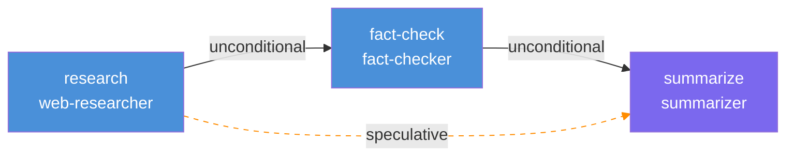
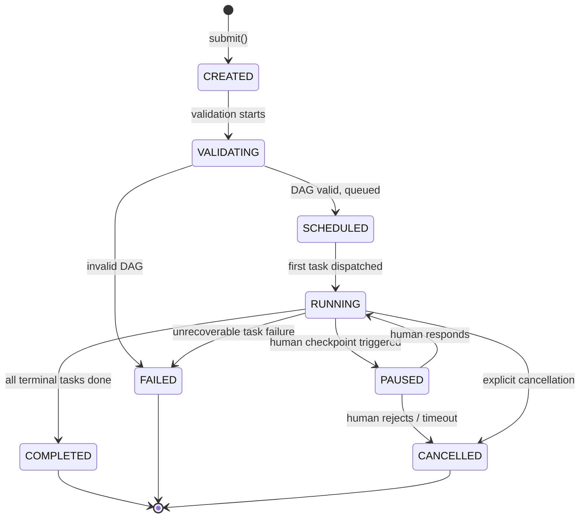
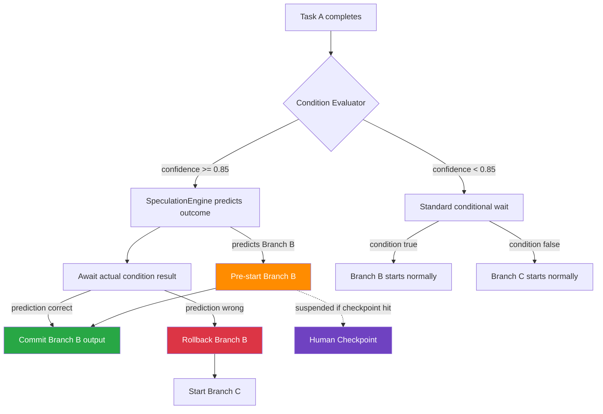
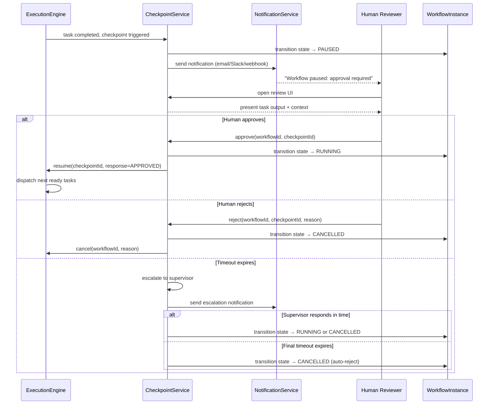

# AgentForge Workflow Engine

**Deep-dive technical reference for the DAG-based workflow execution engine.**

---

## Table of Contents

1. [DAG Workflow Model](#1-dag-workflow-model)
2. [DAG Execution Engine](#2-dag-execution-engine)
3. [Speculative Branch Resolution](#3-speculative-branch-resolution)
4. [Human-in-the-Loop Checkpoints](#4-human-in-the-loop-checkpoints)
5. [Error Handling and Recovery](#5-error-handling-and-recovery)
6. [Workflow Versioning and Migration](#6-workflow-versioning-and-migration)
7. [Design Decisions (ADR)](#7-design-decisions-adr)
8. [See Also](#8-see-also)

---

## 1. DAG Workflow Model

A workflow in AgentForge is represented as a **Directed Acyclic Graph (DAG)** where:

- **Nodes** are tasks — discrete units of work delegated to a specific agent type.
- **Edges** are dependencies — ordering constraints that determine when a task may begin execution.

This model provides a clean separation between *what* work is done (task definitions) and *when* work may start (dependency topology). The DAG structure also makes it straightforward to identify parallelizable work: any two tasks with no shared ancestry in the current execution path are independent and may run concurrently.

### 1.1 Edge Types

AgentForge defines three distinct edge semantics, each serving a different role in workflow control flow:

| Edge Type | Trigger Condition | Typical Use Case |
|---|---|---|
| **Unconditional** (`then`) | Always fires when predecessor completes successfully | Sequential pipeline steps |
| **Conditional** (`conditionalThen`) | Fires only when a predicate on the predecessor's output evaluates to `true` | Branch on agent decision outcome |
| **Speculative** (`speculativeThen`) | Fires *immediately* based on predicted outcome; rolled back if prediction is wrong | Latency optimization on high-confidence branches |

Conditional edges are the backbone of branching logic. Speculative edges are an optimization layer built on top of them — they do not change the *semantics* of the workflow, only its *execution schedule*. See [Section 3](#3-speculative-branch-resolution) for the full mechanics.

### 1.2 Workflow DSL

Workflows are defined using a type-safe Kotlin DSL. The DSL produces an immutable `WorkflowDefinition` that is validated and compiled to an internal graph representation at submission time.

```kotlin
val workflow = workflow("research-and-summarize") {
    val research = task("research") {
        agent = "web-researcher"
        timeout = 30.seconds
        retryPolicy = RetryPolicy(maxAttempts = 3, backoff = ExponentialBackoff(base = 2.seconds))
    }

    val factCheck = task("fact-check") {
        agent = "fact-checker"
        timeout = 20.seconds
    }

    val summarize = task("summarize") {
        agent = "summarizer"
        timeout = 15.seconds
        checkpoints = listOf(Checkpoint.approvalGate("editorial-review"))
    }

    // Unconditional edges: strict sequential ordering
    research then factCheck
    factCheck then summarize

    // Speculative shortcut: if research output looks conclusive,
    // pre-start summarize before fact-check completes
    research speculativeThen summarize
}
```

The `speculativeThen` edge does not bypass `factCheck` in the final committed execution — it pre-starts `summarize` speculatively. If fact-check invalidates the speculation, the pre-started summarize task is rolled back and re-executed after fact-check completes with the correct inputs. If the speculation was correct, the summarize task was already running and commits in place, saving the latency of waiting for fact-check to complete before starting it.

### 1.3 DAG Example



Solid edges are unconditional. The dashed orange edge is the speculative shortcut from `research` to `summarize`.

---

## 2. DAG Execution Engine

### 2.1 Workflow Lifecycle

Every workflow instance passes through a well-defined state machine. Transitions are atomic and durably persisted to Kafka before any execution side effects occur, ensuring crash recovery can always reconstruct the authoritative state.



State transitions carry a typed payload (e.g., `WorkflowPaused(checkpointId, taskId, notificationTimestamp)`) that downstream consumers (notification service, audit log, dashboard) subscribe to via Kafka topics.

### 2.2 Topological Execution

The execution engine continuously evaluates a **ready set** — the set of tasks whose every predecessor has reached `COMPLETED` status. This evaluation runs after every task state transition:

```
ReadySet = { t ∈ Tasks | ∀ predecessor p of t: state(p) == COMPLETED }
            ∩ { t ∈ Tasks | state(t) == PENDING }
```

Each task in the ready set is dispatched to the agent router for assignment. Tasks in the ready set are fully independent and are dispatched concurrently without any ordering guarantee between them.

### 2.3 Parallel Fan-Out

When multiple tasks become ready simultaneously (or near-simultaneously as predecessors complete), the engine fans out dispatches in parallel. There is no artificial serialization — the engine submits all ready-task assignments as concurrent coroutine launches within the workflow's supervision scope.

A common pattern is a "map" step: a single ingestion task feeds N independent processing tasks that all become ready at the same time.

```
         [ingest]
        /   |   \
  [proc1] [proc2] [proc3]   <-- parallel fan-out
        \   |   /
         [merge]            <-- fan-in join
```

### 2.4 Fan-In Join

A task with multiple predecessors (a "join" node) is only added to the ready set when **all** its predecessors have completed. There is no partial-completion join semantic — all-or-nothing join is the default.

For optional predecessors (e.g., optional enrichment tasks), the task definition declares which predecessors are required vs. optional. A join node with optional predecessors enters the ready set when all *required* predecessors have completed, even if optional ones are still running or have failed.

### 2.5 Structured Concurrency with Kotlin Coroutines

The execution engine uses Kotlin coroutines with structured concurrency to manage task lifetimes. Each workflow instance owns a `SupervisorScope` — all task coroutines are children of this scope. This provides:

- **Isolation**: failure of one task coroutine does not propagate cancellation to sibling tasks (supervisor semantics).
- **Clean cancellation**: cancelling the workflow scope cancels all in-flight task coroutines atomically.
- **Lifecycle coupling**: the workflow scope cannot complete until all child coroutines have completed or been cancelled.

```kotlin
class WorkflowExecutor(
    private val agentRouter: AgentRouter,
    private val stateStore: WorkflowStateStore,
    private val eventBus: KafkaEventBus
) {
    suspend fun execute(workflow: WorkflowInstance) {
        // SupervisorScope: child failures do not cancel siblings
        supervisorScope {
            val dispatchJobs = mutableMapOf<TaskId, Job>()

            // Initial dispatch: seed with tasks that have no predecessors
            dispatchReadyTasks(workflow, dispatchJobs, parentScope = this)

            // React to task completions and dispatch newly unblocked tasks
            workflow.taskCompletions.collect { completedTask ->
                stateStore.markCompleted(workflow.id, completedTask.id)
                eventBus.publish(TaskCompletedEvent(workflow.id, completedTask))

                val newlyReady = workflow.computeReadySet()
                for (task in newlyReady) {
                    dispatchJobs[task.id] = launch {
                        dispatchWithRetry(workflow, task)
                    }
                }

                if (workflow.isTerminal()) {
                    stateStore.markWorkflowCompleted(workflow.id)
                    this.cancel() // cleanly wind down the supervisor scope
                }
            }
        }
    }

    private suspend fun dispatchWithRetry(workflow: WorkflowInstance, task: TaskDefinition) {
        val policy = task.retryPolicy
        var attempt = 0
        while (attempt <= policy.maxAttempts) {
            try {
                val result = agentRouter.dispatch(task, workflow.contextFor(task))
                workflow.taskCompletions.emit(result)
                return
            } catch (e: TaskFailureException) {
                if (attempt == policy.maxAttempts) throw e
                delay(policy.backoff.delayFor(attempt))
                attempt++
            }
        }
    }
}
```

The `supervisorScope` from Kotlin's `kotlinx.coroutines` library provides the structured concurrency guarantee. Child jobs launched with `launch { }` inside the scope are tracked automatically. When the scope is cancelled (workflow terminal), all child coroutines receive cancellation cooperatively.

> **Reference**: *Building Event-Driven Microservices*, Ch5 "Event-Driven Workflows" — covers topological execution of DAG-based pipelines driven by event streams, directly analogous to the completion-event-driven dispatch loop above.

---

## 3. Speculative Branch Resolution

### 3.1 The Conditional Branch Latency Problem

Conditional edges introduce a fundamental latency hazard: all tasks downstream of an unresolved condition are blocked, regardless of how likely one branch outcome is. In a multi-stage pipeline where a high-confidence condition gates an expensive downstream task, this is wasteful — the downstream task sits idle waiting for a signal that is almost certainly going to be "proceed."

Consider a pipeline where task A produces output that is flagged as "sufficient" 94% of the time, gating a downstream task B that takes 45 seconds to run. The expected additional latency from blocking B is: `0.94 × 0 + 0.06 × 45s = 2.7s amortized`. But without speculation, *every* execution waits for the condition to resolve before starting B — adding the full condition evaluation time to the critical path.

### 3.2 SpeculationEngine

The `SpeculationEngine` component intercepts conditional edge evaluations and predicts outcomes using a combination of:

- **Historical outcome statistics** per (workflow type, task type, condition predicate) tuple, stored in a rolling window in Redis.
- **Output signal heuristics**: lightweight classifiers that inspect task output metadata (e.g., confidence scores emitted by the agent, output length, structured fields) to predict the condition outcome without waiting for the full condition evaluation.
- **Confidence threshold**: speculation only fires when the predicted probability exceeds a configurable threshold (default: `0.85`). Below threshold, the engine falls back to standard conditional execution.

### 3.3 Speculative Branch Flow



### 3.4 Commit and Rollback

**Commit path** (prediction correct):
1. Actual condition result confirms the predicted branch.
2. The speculatively pre-started task continues executing with no interruption.
3. Its outputs are promoted from "speculative" to "committed" state.
4. Downstream tasks of the committed branch are dispatched normally.

**Rollback path** (prediction wrong):
1. Actual condition result selects the non-predicted branch.
2. The speculative task receives a cooperative cancellation signal via its coroutine scope.
3. Any side effects performed by the speculative task are reversed via compensating transactions (agent-type-specific rollback handlers registered in the `CompensationRegistry`).
4. The correct branch task is dispatched with the actual condition output as input.
5. Rollback events are published to Kafka for audit and confidence model retraining.

### 3.5 Nested Conditionals and Confidence Decay

Speculative execution on nested conditional branches (a speculative branch that itself contains a conditional edge) applies **confidence decay**: the confidence score for a nested speculation is multiplied by the parent speculation's confidence score. If the decayed confidence falls below the speculation threshold, the nested branch is not pre-started.

Formally: `confidence(depth d) = confidence(depth 0) × decay_factor^d`

Default `decay_factor = 0.75`. At depth 2, even a 94%-confidence root speculation decays to `0.94 × 0.75² = 0.53`, which is well below the 0.85 threshold — preventing runaway speculative pre-starts deep in a nested conditional tree.

See [speculative-execution.md](./speculative-execution.md) for the full SpeculationEngine design, confidence model training pipeline, and rollback compensation patterns.

---

## 4. Human-in-the-Loop Checkpoints

### 4.1 Checkpoint Types

AgentForge supports three distinct human-in-the-loop checkpoint semantics:

| Type | Workflow State During Checkpoint | Human Action Required | Typical Use Case |
|---|---|---|---|
| **Approval Gate** | `PAUSED` | Approve or reject the workflow path | Legal/compliance review before irreversible action |
| **Input Request** | `PAUSED` | Provide structured data input | Workflow needs human-supplied context (e.g., a policy decision, a reference document) |
| **Review Point** | `PAUSED` | Review intermediate output, optionally provide feedback | Quality assurance on generated content; feedback is injected as input to next task |

Checkpoints are declared on task definitions in the workflow DSL:

```kotlin
val summarize = task("summarize") {
    agent = "summarizer"
    checkpoints = listOf(
        Checkpoint.approvalGate("editorial-review"),      // must approve before summarize output is committed
        Checkpoint.reviewPoint("quality-check")           // human reviews summarize output before next task starts
    )
}
```

### 4.2 Checkpoint Mechanics



### 4.3 Speculation Does Not Bypass Checkpoints

This is a critical safety invariant: **speculative execution never bypasses a human-in-the-loop checkpoint.**

If a speculatively pre-started task encounters a checkpoint on its execution path, the following happens:

1. The speculative task's execution is **suspended** at the checkpoint boundary.
2. The checkpoint is **not triggered** — no notification is sent and the workflow does not pause — because the speculative branch has not yet been confirmed as the execution path.
3. The speculative execution holds its suspension until the parent condition resolves.
4. If the speculative branch is confirmed: the checkpoint is triggered normally, the workflow pauses, and the human review process proceeds.
5. If the speculative branch is rolled back: the suspended speculative task is discarded, and the checkpoint on the speculative path is never surfaced.

This ensures that humans are never asked to review or approve outputs from a branch that may never actually be committed. It also prevents the speculation system from creating phantom approval gates that clog review queues.

### 4.4 Timeout and Escalation Policy

Each checkpoint has an independently configurable timeout policy:

```kotlin
Checkpoint.approvalGate("editorial-review") {
    timeout = 4.hours
    escalationTarget = "supervisor@example.com"
    escalationDelay = 1.hours          // escalate after 1h of no response
    autoRejectAfterFinalTimeout = true // reject workflow if no response by 4h
}
```

Escalation chains can be arbitrarily deep — each escalation level has its own timeout and target. The final level either auto-approves (for low-risk workflows) or auto-rejects (for high-risk workflows), as configured per checkpoint.

> **Reference**: *AI Engineering*, Ch10 "Evaluation and Monitoring" — human feedback loops in production AI systems. The book covers the integration of human judgment into automated pipelines, feedback latency vs. throughput tradeoffs, and structuring review queues to avoid reviewer fatigue — all directly applicable to the checkpoint design above.

---

## 5. Error Handling and Recovery

### 5.1 Task Retry Policy

Every task definition carries a retry policy. The execution engine applies retries transparently — the DAG topology is unaffected by retries; a task remains in `RUNNING` state (from the workflow graph's perspective) until it either succeeds or exhausts all retry attempts.

```
RetryPolicy {
    maxAttempts: Int            // total attempts = maxAttempts + 1
    backoff: BackoffStrategy    // ExponentialBackoff | LinearBackoff | FixedBackoff
    retryOn: Set<ErrorCode>     // only retry on these error codes; fail fast on others
    jitter: Duration            // add random jitter to avoid thundering herd
}
```

Default policy: `maxAttempts = 3`, `ExponentialBackoff(base = 2s, max = 60s)`, `jitter = 500ms`, retry on all transient errors.

Non-retryable errors (e.g., `INVALID_INPUT`, `SCHEMA_VIOLATION`) bypass the retry loop and immediately fail the task.

### 5.2 Circuit Breaker Per Agent Type

AgentForge maintains a circuit breaker per agent type to prevent cascading failures when an agent class degrades or becomes unavailable. The circuit breaker operates on a sliding window:

| State | Behavior | Transition |
|---|---|---|
| **CLOSED** | Normal dispatch | Opens after N failures in window W |
| **OPEN** | Reject all dispatches immediately; return `CIRCUIT_OPEN` error | Transitions to HALF_OPEN after cooldown |
| **HALF_OPEN** | Allow one probe dispatch | Closes if probe succeeds; re-opens if it fails |

Default thresholds: `N = 5 failures`, `W = 60 seconds`, `cooldown = 30 seconds`.

When a circuit is open for the primary agent type, the agent router falls back to the configured backup agent type (see Section 5.3) rather than failing the task immediately.

### 5.3 Fallback Agent Assignment

Each task declaration may specify a list of agent types in priority order. The agent router walks this list in order, skipping any type whose circuit breaker is currently OPEN:

```kotlin
val research = task("research") {
    agents = listOf("web-researcher-premium", "web-researcher-standard", "web-researcher-fallback")
    // router picks first available agent type with closed circuit breaker
}
```

The fallback assignment is transparent to the DAG execution engine — the task is still represented as a single node; the agent routing is an implementation detail of the dispatch layer.

### 5.4 Workflow Recovery After Crash

AgentForge is designed to survive orchestrator crashes without data loss or duplicate execution. The recovery model is:

1. **Kafka event log as source of truth**: every state transition (task dispatched, task completed, task failed, workflow paused, etc.) is written to a Kafka topic *before* the associated side effect occurs. This log is the authoritative record of workflow progress.

2. **Redis checkpoints for fast recovery**: at each successful task completion, a snapshot of the workflow's full state (completed tasks, pending tasks, speculative branch states, checkpoint statuses) is written to Redis. This avoids replaying the full Kafka log from the beginning on crash recovery.

3. **Recovery procedure**:
   - On startup, the orchestrator reads the latest Redis checkpoint for each in-progress workflow.
   - It then reads the Kafka log from the checkpoint's offset to find any events that occurred after the snapshot.
   - It reconstructs the current state by replaying these delta events.
   - Tasks that were in `DISPATCHED` state at crash time are re-dispatched (agents are expected to be idempotent on task IDs).
   - Speculative pre-starts that were in progress are rolled back (conservative default) and re-evaluated.

4. **Idempotency**: all agent task handlers must be idempotent on their task ID. The execution engine guarantees at-least-once dispatch; agents are responsible for exactly-once execution via task ID deduplication.

### 5.5 Partial Completion for Optional Branches

Workflows may declare certain branches as optional:

```kotlin
val enrichment = task("optional-enrichment") {
    agent = "enricher"
    required = false   // workflow can complete even if this task fails
}
```

When a non-required task exhausts its retries and fails, the execution engine marks it `FAILED_OPTIONAL` and continues processing. Downstream tasks that depend *only* on optional tasks are skipped. Downstream tasks with at least one required predecessor are unaffected.

The workflow reaches `COMPLETED` state if all *required* terminal tasks complete, regardless of optional task outcomes. The completion record includes a list of `FAILED_OPTIONAL` tasks for audit purposes.

> **Reference**: *Building Microservices*, Ch11 "Building Resilient Microservices" — circuit breaker and bulkhead patterns for microservice architectures. The agent-type circuit breaker above is a direct application of the circuit breaker pattern described there, with the agent router acting as the proxy layer. The bulkhead concept maps to agent-type isolation: a degraded agent type cannot exhaust resources needed by healthy agent types.

---

## 6. Workflow Versioning and Migration

### 6.1 Version Pinning

When a workflow instance is submitted, it is pinned to the exact version of the `WorkflowDefinition` that was active at submission time. The workflow engine stores the full definition snapshot alongside the instance record — it does not rely on being able to re-fetch the definition by name at execution time.

This means:
- A running workflow is unaffected by definition updates published while it is executing.
- Long-running workflows (hours or days) execute on their original definition to completion.
- New submissions always pick up the latest published version of the definition.

### 6.2 Schema Evolution

Workflow definitions evolve over time. Changes are classified as backward-compatible or breaking:

**Backward-compatible (safe to publish without migration):**
- Adding new optional fields to task definitions (e.g., new optional timeout, new optional checkpoint)
- Adding new tasks to the graph with no predecessors among existing tasks (purely additive)
- Relaxing existing retry policies
- Adding new fallback agent entries to an agent list

**Breaking changes (require explicit handling):**
- Removing existing tasks
- Changing the agent type of an existing task
- Adding new required predecessors to an existing task
- Changing input/output schema of a task in an incompatible way
- Removing or changing checkpoint configurations

### 6.3 Handling Breaking Changes

Two strategies are available for breaking changes:

**Version routing**: publish the new definition under a new version number. Add a version routing rule that routes new submissions to the new version. In-flight instances on the old version run to completion on the old definition. Once all old instances have drained, the old version can be retired.

**Explicit migration**: for workflows that must be migrated in-flight (e.g., a critical bug fix in a long-running workflow), write a `WorkflowMigration` that describes:
- Which running instance states are eligible for migration (e.g., "all instances in version 3 that have not yet started task X")
- The state transformation to apply (e.g., "inject task Y as a new predecessor of task X")
- The rollback procedure if migration fails

Migrations are applied atomically to a workflow instance's state store record after acquiring an exclusive lock. The Kafka event log records the migration event for audit.

### 6.4 Versioned Definition Storage

```
WorkflowDefinitionStore {
    latest(name: String): WorkflowDefinition
    get(name: String, version: Int): WorkflowDefinition
    publish(definition: WorkflowDefinition): Int  // returns assigned version number
    history(name: String): List<VersionMetadata>
}
```

Definitions are content-addressed (stored by SHA-256 hash of canonical JSON) to deduplicate identical re-publishes.

---

## 7. Design Decisions (ADR)

| Decision | Context | Choice | Consequences | Reference |
|---|---|---|---|---|
| **Orchestration over choreography** | Speculative execution requires a central authority to pre-start branches, track speculation state, and issue rollback compensations. A purely choreographed (event-driven, decentralized) model has no single place to make or undo speculative decisions. | Orchestrator-driven execution: a single `WorkflowExecutor` instance owns each workflow's dispatch loop and speculation state. | Clean, atomic rollback of speculative branches; deterministic checkpoint enforcement; centralized visibility. Orchestrator becomes a bottleneck and single point of failure — mitigated by partitioning workflows across orchestrator instances by workflow ID. | *Building Event-Driven Microservices*, Ch5 — contrasts orchestration and choreography models; recommends orchestration for complex, stateful workflows. |
| **Kotlin DSL over YAML** | Workflow definitions could be expressed as YAML/JSON documents (easier for non-engineers) or as code (type-safe, IDE-supported). The primary authors are engineers building agent pipelines. | Type-safe Kotlin DSL compiled to `WorkflowDefinition` at submission. | Full IDE support (autocomplete, refactoring, static type checking); workflow logic can reference shared Kotlin constants and utilities. Learning curve for non-Kotlin engineers; DSL changes require recompilation. | N/A — internal ergonomics decision. |
| **Structured concurrency for task lifecycle** | Unstructured coroutine launches (fire-and-forget) make it difficult to reason about which tasks are in flight at any moment, and make clean cancellation error-prone. | `supervisorScope` from Kotlin coroutines: all task coroutines are children of the workflow's supervisor scope. | Clean, guaranteed cancellation of all in-flight tasks when workflow is cancelled or fails. Coroutine scope tree mirrors the workflow instance hierarchy. Added complexity in scope management when tasks spawn sub-tasks (e.g., agent tool calls). | N/A — Kotlin coroutines best practice; aligns with structured concurrency principles from *Structured Concurrency* (Elizarov, JetBrains). |

---

## 8. See Also

- [architecture.md](./architecture.md) — System-wide component overview, including where the workflow engine fits in the broader AgentForge architecture.
- [speculative-execution.md](./speculative-execution.md) — Deep-dive on the SpeculationEngine: confidence models, rollback compensation registry, and nested speculation semantics.
- [agent-protocols.md](./agent-protocols.md) — Agent task dispatch protocol, input/output schema conventions, and idempotency requirements for agent handlers.
- [observability.md](./observability.md) — Workflow execution metrics, distributed tracing through DAG execution, and alerting on workflow health.
